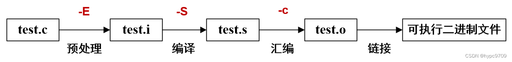
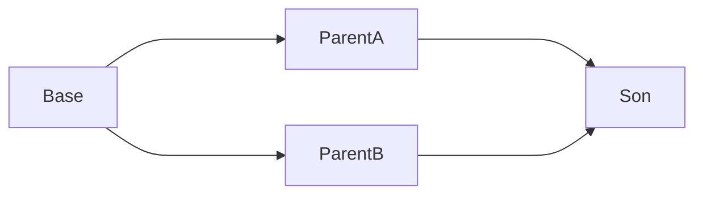
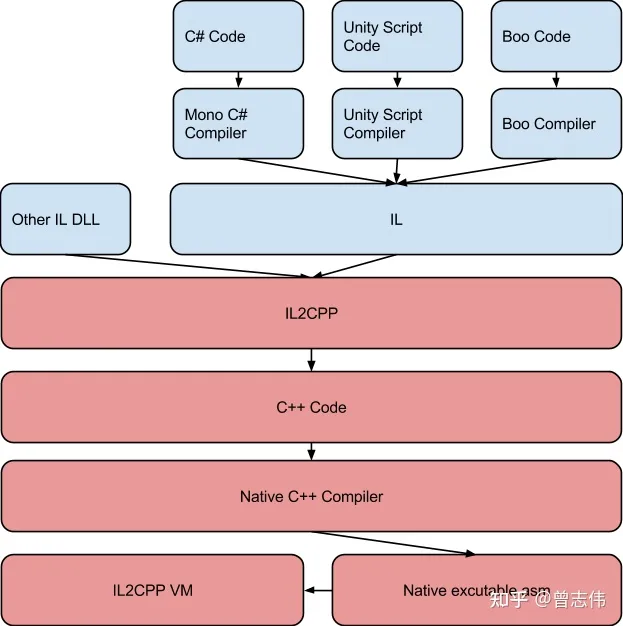
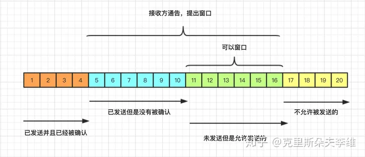
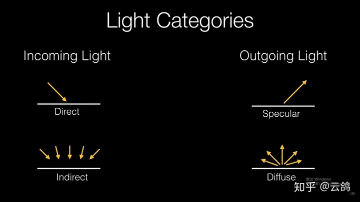
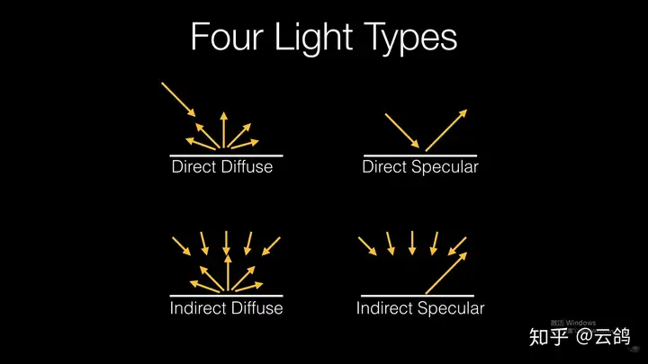

## 八股

### c++

#### 虚函数

https://blog.csdn.net/weixin_43798887/article/details/118196343

https://blog.csdn.net/weixin_43798887/article/details/118369498

虚函数：**即被virtual修饰的类成员函数称为虚函数。** 一旦定义了虚函数，该**基类的派生类中同名函数也自动成为了虚函数**。 虚函数只能是类中的一个成员函数，不能是静态成员或普通函数。

每个虚函数都会有一个与之对应的**虚函数表**，该虚函数表的实质是一个**指针数组**，存放的是每一个对象的**虚函数入口地址**。对于一个派生类来说，他会继承基类的虚函数表同时增加自己的虚函数入口地址，如果派生类重写了基类的虚函数的话，那么继承过来的虚函数入口地址将被派生类的重写虚函数入口地址替代。那么在程序运行时会发生**动态绑定**，将父类指针绑定到实例化的对象实现**多态**。 

- 虚函数表是基于**类**的

- 虚函数表存放于只读数据区（常量区）
- 虚函数指针每个实例有一个（其实也就是对象的引用的“地址”），指针内容同一个类的实例内容相同（同一张表）
- 即使没有重载虚函数，虚函数表也是独立的，只不过会指向父类虚函数表的内容
- 向上转型保留原类型虚函数指针内容（B->A,调用函数仍然是B的）

虚函数指针在**构造函数前、初始化列表之前**赋值

**哪些函数不能成为虚函数？**

1. 内联函数：我们都知道内联函数只是在函数调用点将其展开，它不能产生函数符号，所以不能往虚表中存放，自然就不能成为虚函数。

2. 静态函数：定义为静态函数的函数，这个函数只和类有关系，它不完全依赖于对象调用，所以也不能成为虚函数。

3. **构造函数**：虚函数是基于对象的，构造函数是用来产生对象的，若构造函数是虚函数，则需要对象来调用，但是此时构造函数没有执行，就没有对象存在，产生矛盾，所以构造函数不能是虚函数。
4. 友元函数：友元函数不属于类的成员函数，不能被继承。对于没有继承特性的函数没有虚函数的说法。

5. 普通函数：普通函数不属于成员函数，是不能被继承的。普通函数只能被重载，不能被重写，因此声明为虚函数没有意义。因为编译器会在编译时绑定函数。

**哪些函数可以成为虚函数呢？**

1. 普通的成员方法

2. **析构函数**，因为析构函数是为了释放对象的，所以之前我们的对象已经生成，而且析构函数可以取地址，所以可以成为虚函数。

当我们定义了一个基类指针，然后在堆上new了一个派生类的对象,让这个指针指向堆上开辟的这块内存。

```cpp
Base *p = new Derive(10);
delete p;
```

如果基类的析构函数没有写成虚函数，delete这个基类指针，就不能释放掉堆上的派生类对象。因为delete p会调用基类的析构。所以我们就要把基类的析构函数写成虚函数。写成虚函数后，当delete的时候，先会去基类调用析构函数，一看基类的析构函数是虚函数，就会自动的到派生类中调用派生类的析构函数。这时候派生类的对象就能释放了。

**动态多态**一般由虚函数实现。C++程序在编译时，遇到**virtual**关键字，会在生成一个对应此类的**虚函数表**，把虚函数存放到虚函数表中，类中只存放一个虚函数表指针，当对象调用此函数时，可以通过虚函数表指针进行访问。派生类在生成虚函数表的时候，会参考父类虚函数表，如果子类中有的虚函数，不管是新增还是重写父类虚函数，都优先写入自己的虚函数表，其他虚函数和普通成员函数一样，都会根据继承权限从基类继承下来。

**不要在构造函数中调用虚函数**，因为子类实例化时会调用父类的构造函数，子类的虚函数表指针还没初始化，此时执行虚函数并不会调用重写的虚函数，

##### 纯虚函数

有纯虚函数的类是抽象类，除非在派生类中完全实现基类中所有的的纯虚函数，否则，派生类也变成了抽象类，不能实例化对象。

作用

1. **定义接口规范**：纯虚函数定义了一个基类的接口，描述了派生类应该提供的行为。通过纯虚函数，基类可以规定一组行为，而具体的实现则留给派生类去完成。

2. **强制实现**：派生类必须提供对纯虚函数的具体实现，否则派生类也会变成抽象类。这样可以确保派生类提供了基类规定的行为。

3. **多态性支持**：纯虚函数是实现多态性的一种方式。在运行时，程序根据对象的实际类型调用相应的纯虚函数实现，实现了基类和派生类之间的多态性。

4. **代码组织**：使用纯虚函数可以使代码更加模块化和可维护，将基类中公共的接口和行为抽象出来，而将具体的实现交给派生类完成。

#### 默认的6个成员函数

- 构造函数
- 析构函数
- 拷贝构造函数：默认浅拷贝
- 赋值运算符重载

这四个一般自己写

- 取地址操作符重载
- const修饰的取地址操作符重载

这两个一般用默认的就行

#### 函数重载

在**同一作用域类**，一组函数的**函数名相同**，**参数列表不同（参数个数不同/参数类型不同）**，**返回值可同可不同**

编译器在编译.cpp文件中当前使用的作用域里的同名函数时，根据函数形参的类型和顺序会对函数进行重命名（不同的编译器在编译时对函数的重命名标准不一样）但是总的来说，他们都把文件中的同一个函数名进行了重命名；

- 在vs编译器中：

    - 根据返回值类型（不起决定性作用）+形参类型和顺序（起决定性作用）的规则重命名并记录在map文件中。
- 在linux g++ 编译器中：
    - 根据函数名字的字符数+形参类型和顺序的规则重命名记录在符号表中；从而产生不同的函数名，当外面的函数被调用时，便是根据这个记录的结果去寻找符合要求的函数名,进行调用；

#### 指针和引用的区别

- 引用**不能为空**，即不存在对空对象的引用，指针可以为空，指向空对象。
- 引用**必须初始化**，指定对哪个对象的引用，指针不需要。
- 引用初始化后**不能改变**，指针可以改变所指对象的值。
- 引用**没有const**，指针有const
- 引用访问对象是**直接访问**，指针访问对象是间接访问。
- 指针可以有多级，但是引用只能是一级
- 引用的大小是所**引用对象的大小**，指针的大小是**指针本身大小**，通常是**4/8字节**。
- 引用和指针的+自增运算符意义不同（一整块vs一个内存地址）。

指针是指向内存地址的实体，引用是内存块的别名，**在编程语言层面可以视作const指针**

##### 引用作为函数返回值

- **不能返回局部变量的引用**。离开作用域变量会被销毁，指向的东西不存在了。
- **不能返回函数内部new分配的内存的引用**。如果外部没有变量接住返回值会造成内存泄漏
- **可以返回类成员的引用**，但最好是const。

- 若返回栈变量
    - 不能成为其他引用的初始值 
    - 不能作为左值使用
- 若返回静态变量或全局变量：
    - 可以成为其他引用的初始值
    - 可作为右值使用，也可作为左值使用 

##### *和&

- *
    - 表示这是一个指针(声明变量时的等号左边)
    - 作为运算符来取值(赋值等号左边)。
- &
    - 表示这是一个引用
    - 作为取地址运算符

```c++
&B = 0x00000004;  //B本身的地址
B= 0x00000008;  //存放的地址
*B = "something";  //存放地址中的内容
```

**指针作为参数**： 传递变量的指针。形参是指针变量，实参是一个变量的地址，调用函数时，形参(指针变量)指向实参变量单元。这种通过形参指针可以改变实参的值。

**引用（地址）作为参数**：形参是引用变量，和实参是一个变量，调用函数时，形参(引用变量)指向实参变量
单元。这种通过形参引用可以改变实参的值。

**引用参数和指针参数的区别**：指针作为参数时，实参在定义的时候就是一个指针变量，形参类型也是一个指针类型，而引用作为参数的时候，实参不是指针变量，因为形参是地址，所以形参类型是引用类型，表示传进来的参数不用拷贝，直接用原来地址中的那份。

1. 语法和使用方式：
    - 指针作为参数：指针参数使用指针符号（\*）声明，在函数参数列表中需要使用解引用运算符（\*）来访问指针所指向的对象。
    - 引用作为参数：引用参数使用引用符号（&）声明，在函数参数列表中直接使用变量名，无需使用解引用运算符（*）。
2. 空值（null）处理：
    - 指针作为参数：指针参数可以接受 null 值，表示指向空对象或无效对象。
    - 引用作为参数：引用参数必须绑定到一个已存在的对象，不能为 null。
3. 参数修改：
    - 指针作为参数：指针参数可以通过解引用或重新分配内存来修改指针所指向的对象。
    - 引用作为参数：引用参数可以直接修改原始变量的值，而不需要通过解引用或重新分配内存来修改。
4. 传递方式：
    - 指针作为参数：指针参数可以通过按值传递（pass-by-value）或按指针传递（pass-by-pointer）来使用。前者传递的是指针的副本，后者传递的是指针本身。
    - 引用作为参数：引用参数在函数调用时使用的是按引用传递（pass-by-reference），即传递的是原始对象的别名，对参数的修改会影响原始对象。
5. 空间需求：
    - 指针作为参数：指针参数需要额外的内存空间来存储指针本身。
    - 引用作为参数：引用参数不需要额外的内存空间，它只是原始对象的别名。

#### 指针

##### 智能指针和野指针

- 智能指针：在构造的时候**分配内存**，当离开作用域的时候，自动**释放分配的内存**，这样的话开发人员就可以从手动动态管理内存的繁杂内容中解放出来。（重点注意！！）
- 野指针：指向非法的内存地址指针叫作野指针（Wild Pointer），也叫悬挂指针（Dangling Pointer），意为无法正常使用的指针。

- **野指针产生的原因**
    - 指针变量未初始化或者便赋值
    - 指针释放后未置空
    - 指针操作超出了变量的作用域
    - 指针在循环结束后未置空
- **如何避免野指针：**
    - 指针变量一定要初始化，可以初始化为 nullptr
    - 释放后置为 nullptr。

##### RAII

RAII 是 Resource Acquisition Is Initialization(资源获取即初始化)的缩写。RAII 是C++ 中常用的一种编程技术，具体是指必须在使用前获取的资源（如栈内存，线程，文件，锁，数据库连接，磁盘空间）的声明周期绑定在一个对象的生命周期，这样使用者就不需要自己去释放资源，避免资源泄露。

**实现原理**

利用对象的生命周期管理资源，在对象离开作用域时，会自动调用析构函数

**特征**

标准库提供几种 RAII包 装器以管理用户提供的资源：

- std::unique_ptr 及 std::shared_ptr 以管理动态分配的内存，或以用户提供的删除器管理任何以普通指针表示的资源；
- std::lock_guard 、 std::unique_lock 、 std::shared_lock 以管理互斥。

##### 四种智能指针

**auto_ptr**

可以随意复制，不安全，弃用

**unique_ptr**

两个unique_ptr 不能指向一个对象

不能赋值

```c++
unique_ptr<int> p(nullptr)//初始化
unique_ptr<int> p(new int(1));//初始化
unique_ptr<T,D> p(new int(1), D());// 用类型为 D 的对象替代默认删除器 std::default_delete,比如fclose()关文件和delete []a删数组

//unique_ptr<T,D> p1(p);//不能复制
//unique_ptr<T,D> p1 = p;//不能复制

//但是可以拿来接临时的函数返回值
unique_ptr<string> demo(const char* s) {
    unique_ptr<string> temp (new string(s))； 
    return temp；
}
unique_ptr<string> ps;
ps = demo("Uniquely special")；

int *pi = p.release();// 释放所有权
std::move()//转移所有权
p.reset(new int(1));// 销毁旧对象（如果有）然后绑定新对象
p2.reset(p1.release());// 转移所有权，p2置空
unique_ptr<int> p2 = std::move(p1);// 转移所有权，p1置空

p = nullptr;//显式销毁所指对象，同时智能指针变为空指针。与 p.reset() 等价
```

比auto_ptr的优点

- 能放在容器中
- 重载了[]，可以管理数组
- 可以自定义删除方式

**shared_ptr**

手撕：https://zhuanlan.zhihu.com/p/365904107

自带引用计数器，为0自动释放，创建时在引用计数管理区域new一个计数器，包含weak计数和shared计数

- shared_ptr 对象除了包括一个所拥有对象的指针外，还必须包括一个引用计数代理对象的指针。
- 时间上的开销主要在初始化和拷贝操作上， * 和 -> 操作符重载的开销跟 auto_ptr 是一样。
- 开销并不是我们不使用 shared_ptr 的理由,，永远不要进行不成熟的优化，直到性能分析器告诉你这一点
- 不是线程安全，因为拷贝非原子操作（计数++，传递指针），即使计数器是线程安全的

**weak_ptr**

为了解决循环引用问题，引入weak_ptr

不会增加引用计数，和shared_ptr配合使用，没有重载operator* 和 operator->，只有观测权

```c++
weak_ptr<T> w;	 	//创建空 weak_ptr，可以指向类型为 T 的对象
weak_ptr<T> w(sp);	//与 shared_ptr 指向相同的对象，shared_ptr 引用计数不变。T必须能转换为 sp 指向的类型
w=p;				//p 可以是 shared_ptr 或 weak_ptr，赋值后 w 与 p 共享对象
w.reset();			//将 w 置空
w.use_count();		//返回与 w 共享对象的 shared_ptr 的数量
w.expired();		//若 w.use_count() 为 0，返回 true，否则返回 false
w.lock();			//如果 expired() 为 true，返回一个空 shared_ptr，否则返回非空 shared_ptr
```

**实现原理**

- unique：出范围自动调用析构
- shared：增加计数器Counter(s = 0,w = 0)，s = 0自动销毁
- weak：获得Counter,w++，用lock获取shared_ptr

**线程安全**

- 使用智能指针访问资源不是线程安全的，需要手动加锁解锁。
- 智能指针的拷贝也不是线程安全的,要先复制指针，再增加计数

##### 指针++、--

对于int a[10] = {0, 1, 77, 88}而言，a的值是数组首元素的地址，而&a是整个数组的地址，a+1，就是第二个元素的地址，int类型占用4个字节，所以前后相差4。&a+1,就是向后移动(10*4)个单位，所以前后相差40。

##### 指针解引用

```c++
int x = 10;
int* p = &x; // p 是一个指向 x 的指针
int** pp = &p; // pp 是指向指针 p 的指针
int zz = *p;  // 解引用一次得到 p
int z = **pp;  //解引用两次得到 x; z 被赋值为 p 指向的值，即 x 的值
//pp 是一个多级指针，即指针的指针。解引用两次 **pp 可以获取 pp 指向的指针所指向的值，即 x 的值

void* ptrToVoid = &x;
//*ptrToVoid = 20; // 错误：不允许解引用 void 指针

void* voidPtr = &value;
int* intPtr = static_cast<int*>(voidPtr);
int dereferencedValue = *intPtr; // 合法的解引用操作

```

##### void*

特殊的指针类型, 可以存放任意对象地址. 通用指针

- 任何类型指针可以赋值给void*, 无需进行强制类型转换
- 需要显示转换赋值给其他类型指针
- void*作为函数的输入输出时, 表示可以接受任意类型的输入指针和输出任意类型的指针.
- 可以算术运算，按字节移动

##### 函数指针

```c++
class Sample {
public:
    void printSum(int a, int b){
        printf("%d + %d = %d\n", a, b, a+b);
    }
};

void printSum(int a, int b) {
    printf("%d + %d = %d\n", a, b, a+b);
}

int main() {
    
    void (*sum)(int, int); // 声明，变量名加括号是因为运算符优先级
    sum = &printSum; // 带不带&符号都一样效果，函数名也表示地址,和sum = printSum;一样
    sum(1, 2);//调用
    printf("%p %p %p %p", printSum, &printSum, sum, *sum);  // 打印出来的地址是一样的，所以上面加不加&符号效果都一样
    typedef void (*SUM)(int, int);
    SUM fun = printSum;
    
    
	//类成员函数
    Sample *ins = new Sample;
    void (Sample::*sum)(int, int);//类成员函数声明，要加类名
    sum = &Sample::printSum; // 这个必须加&，与普通函数不同
    (ins->*sum)(1, 2); // 调用，注意：这里需要加星*
    typedef void (Sample::*SUM)(int, int);
	SUM sum = &Sample::printSum;
    
    return 0;
}
```

#### 构造函数

- **默认构造函数**：如果没有人为指定就生成默认的，不带参数的也叫默认构造函数
- **一般构造函数**
- **拷贝构造函数**：默认的拷贝构造函数只会浅复制
- **移动构造函数**
- **赋值构造函数：**=运算符的重载，类似拷贝构造函数，将=右边的类对象赋值给类对象左边的对象，不属于构造函数，=两边的对象必须都要被创建。
- **类型转换构造函数：**有时候不想要隐式转换，用explict关键字修饰。一般来说带一个参数的构造函数，或者其他参数是默认的构造函数      

##### 移动、复制构造函数

```c++
class MyClass {
    public:
    int* data;

    // 默认构造函数
    MyClass() : data(nullptr) {
        std::cout << "Default constructor called." << std::endl;
    }

    // 带参数的构造函数
    MyClass(int value) : data(new int(value)) {
        std::cout << "Parameterized constructor called." << std::endl;
    }
    
    // 复制构造函数
    MyClass(MyClass& other) noexcept : data(new int(other.data)) {//理想情况，实际可能需要新分配内存和判空
        std::cout << "Copy constructor called." << std::endl;
    }
    
    MyClass& operator=(MyClass& other){
        if(this!=&other){
            if(other.data!=nullptr){
                data = new int(other.data);
            }
		}
        return *this;
    }

    // 移动构造函数
    MyClass(MyClass&& other) noexcept : data(other.data) {//理想情况，实际可能需要新分配内存和判空
        other.data = nullptr;
        std::cout << "Move constructor called." << std::endl;
    }
    
    MyClass& operator=(MyClass&& other){
        if(this!=&other){
            data = other.data;
            other.data = nullptr
		}
        return *this;
    }

    // 析构函数
    ~MyClass() {
        delete data;
        std::cout << "Destructor called." << std::endl;
    }
};
```

**什么情况下会调用拷贝构造函数？**

1. 对象以值传递的方式进入函数体
2. 对象以值传递的方式从函数返回
3. 一个对象需要另外一个对象初始化

##### 构造析构顺序

- 构造顺序为：先调用基类的构造函数，再调用派生类的构造函数，
    1. 虚基类的构造函数（如果有多个虚拟基类，按照它们**被继承的顺序**构造
    2. 非虚基类的构造函数（如果有多个非虚拟基类，按照它们**被继承的顺序**构造）
    3. 成员对象的构造函数（如果有多个成员类对象，按照它们**声明的顺序**调用）
    4. 本类构造函数。构造的过程是递归的。
- 析构顺序为：先调用派生类的析构函数，再调用基类的析构函数。

父子-子父

**必须在初始化列表中初始化的变量**

- 常量成员变量
- 引用类型成员变量
- 没有缺省构造函数的成员变量（放任他自己初始化的话，会调用不存在的缺省构造函数（通常发生在这个类的缺省构造函数被设为private或等于delete））

#### 成员函数

无论静态函数还是非静态函数,都是属于类的(这一点与数据成员的静态非静态不同),对象并不拥有函数的拷贝.两者的区别在于:非静态的函数由类对象(加.或指针加->;)调用,这时将向函数传递this指针.而静态函数由类名(::)(或对象名.)调用,但静态函数不传递this指针,不识别对象个体,所以通常用来对类的静态数据成员操作.

访问成员函数时通常会隐式携带this指针指向对应的对象

this指针初始化：和函数参数一样，但是先进后出，先于成员函数的形参初始化，出作用域后销毁

函数体内可以使用this指针，但不可以用于初始化列表。因为初始化列表时对象位置不完整

#### 左值右值

- 左值（lvalue）是一个具有持久性的、可寻址的表达式，它代表一个具体的对象或变量。简单来说，左值可以出现在赋值操作符的左边或右边，可以取得地址。例如，变量、数组元素和通过引用访问的对象都是左值。
- 右值（rvalue）是一个临时的、一次性的表达式，它代表一个临时的数值或对象。右值不能出现在赋值操作符的左边，不能取得地址。例如，常量、临时对象和表达式的结果都可以是右值。

##### std::move()

std::move作用主要可以将一个左值转换成右值引用，从而可以调用C++11右值引用的拷贝构造函数

- 传递的是左值，推导为左值引用，仍旧static_cast转换为右值引用。
- 传递的是右值，推导为右值引用，仍旧static_cast转换为右值引用。

https://www.jb51.net/article/254803.htm

#### c++新特性

- **C++11**：
    - 引入了 auto 关键字和 decltype 关键字，用于自动推导变量类型；
    - 引入了 lambda 表达式，用于定义匿名函数；
    - 引入了智能指针，例如 shared_ptr 和 unique_ptr，用于自动管理内存；
    - 引入了可变参数模板，允许模板参数数量可变；
    - 引入了右值引用和移动语义，用于提高代码效率。 
- **C++14**：
    - 改进了泛型编程，引入了泛型 lambda 表达式；
    - 引入了二进制字面量和通用的 lambda 捕获初始化；
    - 改进了 constexpr 函数，允许函数内包含控制流语句。
- **C++17**：
    - 引入了 if constexpr 语句，允许在编译期间进行条件判断；
    - 引入了折叠表达式，简化了变长参数模板的实现；
    - 改进了模板参数推导规则，支持类模板参数推导。
- **C++20：**
    - 引入了概念（Concepts），用于限定模板参数的类型；
    - 引入了协程（Coroutines），用于实现异步编程；
    - 引入了三向比较运算符（Three-way Comparison），用于简化比较操作；
    - 引入了格式化输出库（std::format），用于格式化输出字符串。

#### auto 和 decltype 区别

两者都是用于类型推断,区别在于auto用于变量声明时的类型推导，decltype适用于表达式的返回值类型的推断，实际上没有执行那个表达式

```c++
int i = 0;
const int ci = i, &cr = ci;  //ci 为整数常量,cr 为整数常量引用 
auto a = ci;     // a 为一个整数, 顶层const被忽略
auto b = cr;     // b 为一个整数，顶层const被忽略
auto c = &ci;    // c 为一个整数指针.
auto d = &cr;    // d 为一个指向整数常量的指针(对常量对象区地址是那么const会变成底层const)

const int ci = 42, &cj = ci;

decltype(ci) x = 0;   // x 类型为const int
auto z = ci;          // z 类型为int

decltype(cj) y = x;   // y 类型为const int&
auto h = cj;          // h 类型为int

int i = 42, *p = &i, &r = i;

decltype(i) x1 = 0;       //因为 i 为 int ,所以 x1 为int
auto x2 = i;              //因为 i 为 int ,所以 x2 为int

decltype(r) y1 = i;       //因为 r 为 int& ,所以 y1 为int&
auto y2 = r;              //因为 r 为 int& ,但auto会忽略引用，所以 y2 为int

decltype(r + 0) z1 = 0;   //因为 r + 0 为 int ,所以 z1 为int,
auto z2 = r + 0;          //因为 r + 0 为 int ,所以 z2 为int,

decltype(*p) h1 = i;      //这里 h1 是int&
auto h2 = *p;             // h2 为 int.
```

#### 顶层、底层const

指针既可以是底层const，也可以是顶层cosnt。指针是顶层const的含义是指针本身的值不能被改变，指针是底层const的含义是不能通过指针修改被指向的对象（但是被指向的对象可能是const，也可能不是cosnt）。

```c++
int i=0;
int *const p1=&i; //不能改变p1的值，顶层const
const int *p2=&ci;//允许改变p2的值，底层const
const int ci=42;  //不能改变ci的值，顶层const
```


#### const和define的区别

1. 就起作用的阶段而言： #define是在编译的预处理阶段起作用，而const是在 编译、运行的时候起作用                                             

2. 就起作用的方式而言： #define只是简单的字符替换，没有类型检查,存在边界的错误；const对应数据类型，进行类型检查；    
3. 就存储方式而言：#define只是进行展开，有多少地方使用，就替换多少次，它定义的宏常量在内存中有若干个备份,占用代码段空间；const定义的只读变量在程序运行过程中只有一份备份，占用数据段空间。   
4. 从代码调试的方便程度而言： const常量可以进行调试的，define是不能进行调试的，因为在预编译阶段就已经替换掉了。
5. 从是否可以再定义的角度而言： const不足的地方，是与生俱来的，const不能重定义，而#define可以通过#undef取消某个符号的定义，再重新定义。
6. 从某些特殊功能而言： define可以用来防止头文件重复引用，而const不能;

7. 从用于类中来看：const用于类成员变量的定义，只要一定义，不可修改。define 不可用于类成员变量的定义，但是可以用于全局变量。

8. const采用一个普通的常量名称，define可以采用表达式作为名称；

#### const实现原理（？）

在C++中，`const`关键字用于声明一个常量，即一个在程序执行过程中不可修改的值。`const`的实现原理涉及编译器和运行时环境。

在**编译阶段**，当编译器遇到一个使用`const`声明的变量时，它会将该变量标记为只读。这意味着编译器会在编译过程中对这些变量进行静态检查，以确保它们不会被修改。如果在编译期间发现对`const`变量的修改尝试，编译器将生成错误或警告。

在生成的可执行文件中，`const`变量通常被视为符号常量。编译器可能会将这些常量存储在可执行文件的常量数据段中，该段在程序加载时被加载到内存中，并且在运行时是只读的。这样，即使程序尝试修改`const`变量的值，由于内存区域被标记为只读，操作系统会阻止对该内存区域的写入操作。

通常情况下，const将变量的值保存到编译器的符号表中，并不为变量分配内存空间。在这样的处理下，变量就成为了一个编译期间的常量，没有了对变量的存储和读取内存的操作，使得代码执行的效率得到提高。同时，变量的值被保存到符号表中，在需要变量的地方用符号表中保存的值直接替换，从而保证了变量的值不被修改，提高了代码的安全性。

需要注意的是，`const`并不是绝对的保证，因为通过类型转换或指针操作，可能会绕过`const`限制。但是，大多数情况下，`const`提供了一种有效的方法来声明和使用常量，并且可以帮助编译器进行更好的优化。

- 被修饰的常量是基本类型且是局部变量
    - 编译器会预先替换变量的引用（常量折叠）
    - 持续占据内存空间（在栈上）
- 被修饰的常量是全局变量
    - 当全局const变量被取地址时，会导致全局const变量占用存储空间。

const不被修改的原理

- 编译器检查
- 操作系统将内存区设为只读

```c++
const int j=100;    
int *p=const_cast<int*>(&j);    
//int *p = (int *)&j;
*p=200;    
cout<<j<<endl;//100,被编译器替换成立即数了 
```

C语言中只是检查代码是否修改const，不是真正意义上的const

#### const作用

- 修饰变量，说明该变量不可以被改变;
- 修饰指针，分为指向常量的指针(pointer to const)和自身是常量的指针(常量指针，const pointer);
- 修饰引用，指向常量的引用(reference to const)，用于形参类型，即避免了拷贝，又避免了函数对值的修改;
- 修饰成员函数，说明该成员函数内不能修改成员变量。
- 修饰成员函数的返回值，说明返回值不能是左值

##### const int* 和 int* const

```c++
const int* p; //p可变,p指向的内容不可变
int const* p; //p可变,p指向的内容不可变
int* const p; //p不可变,p指向的内容可变
```

#### static的作用

https://blog.csdn.net/ypshowm/article/details/89030194

- c/c++共有
    - 修饰全局变量时，表明一个全局变量只对定义在同一文件中的函数可见。
        - 该变量在全局数据区分配内存； 
        - 未经初始化的静态全局变量会被程序自动初始化为0（自动变量的值是随机的，除非它被显式初始化）； 
        - 静态全局变量在声明它的整个文件都是可见的，而在文件之外是不可见的；       
    - 修饰局部变量时，表明该变量的值不会因为函数终止而丢失。
        - 该变量在全局数据区分配内存； 
        - 静态局部变量在程序执行到该对象的声明处时被首次初始化，即以后的函数调用不再进行初始化； 
        - 静态局部变量一般在声明处初始化，如果没有显式初始化，会被程序自动初始化为0； 
        - 它始终驻留在全局数据区，直到程序运行结束。但其作用域为局部作用域，当定义它的函数或语句块结束时，其作用域随之结束； 
    - 修饰函数时，表明该函数只在同一文件中调用。
        - 静态函数不能被其它文件所用； 
        - 其它文件中可以定义相同名字的函数，不会发生冲突； 
- c++独有：
    - 修饰类的数据成员，表明对该类所有对象这个数据成员都只有一个实例。即该实例归所有对象共有。
        - 静态数据成员存储在全局数据区。静态数据成员定义时要分配空间，所以不能在类声明中定义。
        - 静态数据成员和普通数据成员一样遵从public,protected,private访问规则；
    - 用static修饰不访问非静态数据成员的类成员函数。这意味着一个静态成员函数只能访问它的参数、类的静态数据成员和全局变量

#### static初始化

https://blog.csdn.net/duskymountain/article/details/133811006

1.静态初始化
static initialization：指的是用**常量**来对静态变量进行初始化，包括zero initialization和const initialization，

- zero initialization的变量会保存在.bss段（未初始化静态变量，以及初始化为0的静态变量）
- const initialization的变量保存在.data段(已经初始化为非0的静态变量)。

对于静态初始化的变量（请注意：包括在函数中采用静态初始化的静态变量），是在**程序编译时**完成的初始化。

2.动态初始化
dynamic initialization：指的是需要调用函数才能完成的初始化，比如类的构造函数。

- 对于全局变量或者类的静态成员变量，是在main()函数执行前的**加载阶段**时调用相应的代码进行初始化的。
- 对于局部静态变量，是在函数执行至此**初始化语句**时才开始执行的初始化。

1. 静态变量的**初始化**是在编译时进行，变量的**赋值**是在函数或程序运行时进行。
2. 静态变量只初始化一次，但可以通过赋值的方式多次修改静态变量的值。
3. 全局变量和静态变量 在进入 main 前被初始化
4. 局部静态变量是进入**函数执行至此初始化语句**时才开始执行的初始化

#### const初始化

- 类的const成员变量必须在构造函数的参数**初始化列表**中进行初始化。
- c语言中const全局变量存储在只读数据段，编译期最初将其保存在符号表中，第一次使用时为其分配内存，在程序结束时释放。
- 而const局部变量（局部变量就是在函数中定义的一个const变量，）存储在栈中，代码块结束时释放。


- 对于基础数据类型，也就是const int a = 10这种，编译器会把它放到符号表中，不分配内存，当对其取地址时，会分配内存
- 对于基础数据类型，如果用一个变量初始化const变量，如果const int a = b,那么也是会给a分配内存
- 对于自定数据类型，比如类对象，那么也会分配内存。

而c++中，一个const不是必需创建内存空间，而在c中，一个const总是需要一块内存空间。

在c++中是否要为const全局变量分配内存空间，取决于这个const变量的用途，如果是充当着一个值替换（即就是将一个变量名替换为一个值），那么就不分配内存空间，不过当对这个const全局变量取地址或者使用extern时，会分配内存，存储在只读数据段。也是不能修改的。

- const修饰的局部变量在栈上分配内存空间
- const修饰的全局变量在只读存储区分配内储存空间

| 数据类型/初始化 | 类内 | 类外  | 构造函数 | 初始化列表 |
| --------------- | ---- | ----- | -------- | ---------- |
| 非静态非常量    | X    | X     | √        | √          |
| 非静态常量      | X    | X     | X        | **√**      |
| 静态非常量      | X    | **√** | X        | X          |
| 静态常量        | √    | √     | X        | X          |

#### 内存分配模型


C++程序在执行时，将内存大方向划分为**5个区域**

- 代码区：存放函数体的二进制代码，由操作系统进行管理的
- 全局区：存放全局变量和静态变量
- 常量区：存放常量
- 栈区：由编译器自动分配释放, 存放函数的参数值,局部变量等
- 堆区：由程序员分配和释放,若程序员不释放,程序结束时由操作系统回收
- 运行前
    - C++中在程序运行前分为全局区和代码区
    - 代码区特点是共享和只读
    - 全局区中存放全局变量、静态变量（可以是局部静态变量）
    - **常量区**中存放 const修饰的全局常量 和 字符串常量
- 运行中
    -  栈区：由编译器自动分配释放, 存放函数的参数值,局部变量等
    -  堆区：由程序员分配释放,若程序员不释放,程序结束时由操作系统回收，在C++中主要利用new在堆区开辟内存

#### 栈与堆

**栈**

是一种连续储存的数据结构，具有先进后出的性质。

通常的操作有入栈（压栈），出栈和栈顶元素。想要读取栈中的某个元素，就是将其之间的所有元素出栈才能完成。

**堆**

是一种非连续的树形储存数据结构，每个节点有一个值，整棵树是经过排序的。特点是根结点的值最小（或最大），且根结点的两个子树也是一个堆。常用来实现优先队列，存取随意。

c++中的堆内存更像一个链表

##### 栈内存与堆内存的分配

**堆内存分配**：

- 堆内存的分配是在程序运行时通过**动态内存分配函数**（如`new`、`malloc`）或操作系统提供的相应系统调用（如`brk`、`sbrk`）来进行的。
- 当程序执行到动态内存分配语句时，会向操作系统请求一定大小的堆内存。操作系统会在堆区中找到合适大小的空闲内存，分配给程序，并返回一个指向该内存块的指针。
- 开发者在不再需要堆内存时，需要显式地通过动态内存释放函数（如`delete`、`free`）或系统调用来释放已分配的堆内存。

###### 堆内存慢的原因

堆的分配速度相对较慢主要是由于以下几个原因：

1. 内存碎片化：堆内存的分配和释放过程中会产生内存碎片，也就是已分配但未使用的小块内存。当需要分配内存时，系统需要搜索合适的空闲内存块，而碎片化会导致搜索时间增加，从而影响分配速度。
2. 分配算法的开销：堆内存的分配通常使用的是复杂的分配算法（如首次适应、最佳适应等），这些算法会增加分配过程的开销，包括搜索空闲块、更新内存管理数据结构等。
3. 系统调用的开销：堆内存的分配通常需要通过系统调用来申请更多的内存空间。系统调用涉及内核态和用户态之间的切换，会引入较大的开销，从而导致分配速度变慢。
4. 间接寻址：需要先找存放地址的指针再找实际对象，第一步将分配的地址放到寄存器，然后取出这个地址的值，然后放到目标地址。

为了解决堆的分配速度较慢的问题，可以考虑以下几种方案：

1. 内存池：使用内存池管理堆内存，通过预先申请一大块内存并进行划分，避免频繁的系统调用和内存碎片化。内存池可以提前分配一定数量的内存块，当需要分配内存时，直接从内存池中获取，提高了分配速度。
2. 自定义分配器：可以使用自定义的内存分配器来替代标准库提供的分配器。自定义分配器可以根据具体应用场景和需求设计更高效的内存分配算法，提高分配速度。
3. 内存复用：尽量复用已经分配过的内存块，避免频繁的分配和释放操作，从而减少内存碎片化和分配算法的开销。
4. 对象池：对于频繁创建和销毁的对象，可以考虑使用对象池技术。对象池预先创建一定数量的对象，当需要时直接从池中获取对象，使用完后放回池中，避免频繁的对象创建和销毁操作，提高性能。
5. 预分配内存：在程序初始化阶段或空闲时间段，预先分配一部分内存，并进行预处理，减少实际分配内存的开销。

###### 栈内存快的原因

- 栈指针，后进先出

- 栈结构，扩容收缩方便，

- 栈中数据cpu命中率更高，满足局部性原理。

- 寄存器指令：有寄存器直接对栈进行访问


**栈内存分配**：

- 栈内存的分配是在程序运行时由**编译器自动完成**的。
- 当程序执行到**函数调用**语句时，编译器将为函数分配一块新的栈帧（stack frame）用于存储函数的局部变量、函数参数和其他相关信息。
- 栈帧的大小在编译时就可以确定，通常在函数调用前就会为其分配栈空间。
- 函数执行完毕后，对应的栈帧会被销毁，释放栈内存。

###### 栈内存不支持动态扩容的原因

- 每个线程有独立栈，留很多预留空间就是浪费，全分了也浪费，不如写死
- 栈要求是连续空间，需求完全无法预测，防止用户爆栈导致oom

###### 函数调用

一个函数调用的过程通常包括以下步骤：

1. **函数调用语句**：在程序中遇到函数调用语句时，会触发函数的执行。函数调用语句包括函数名和参数列表，用于指定要调用的函数以及传递给函数的参数。
2. **保存返回地址**：在函数调用之前，当前函数的执行状态（包括下一条指令的地址）需要保存。为此，将返回地址（即当前函数调用后需要继续执行的下一条指令的地址）压入栈中。
3. **创建栈帧**：为被调用的函数创建一个新的**栈帧（stack frame）**，用于存储该函数的局部变量、函数参数和其他相关信息。栈帧通常由栈指针和帧指针来管理。
4. **传递参数**：将函数调用语句中的参数值传递给被调用函数。传递参数的方式可以是通过寄存器、栈或者混合使用。
5. **跳转到被调用函数**：程序将跳转到被调用函数的入口点，开始执行被调用函数的代码。
6. **函数执行**：被调用函数开始执行自己的代码。它可以使用传递的参数值、访问局部变量，并执行相应的计算和操作。
7. **返回值传递**：如果被调用函数有返回值，它会将返回值存储在特定的寄存器或内存位置中。
8. **恢复栈帧**：当被调用函数执行完毕后，将释放其所占用的栈帧，并恢复上一级函数的栈帧。
9. **恢复返回地址**：从栈中弹出返回地址，并将程序的执行状态恢复到调用函数的下一条指令，以继续执行。
10. **继续执行**：程序继续执行调用函数之后的指令，使用返回值（如果有）或进行其他操作。

- ESP：栈指针寄存器(extended stack pointer)，其内存放着一个指针，该指针永远指向系统栈最上面一个栈帧的栈顶。
- EBP：基址指针寄存器(extended base pointer)，其内存放着一个指针，该指针永远指向系统栈最上面一个栈帧的底部。

##### 栈回溯

https://blog.csdn.net/u013318019/article/details/104040516


- 寄存器ebp（base pointer ）可称为“帧指针”或“基址指针”，其实语意是相同的。
- 寄存器esp（stack pointer）可称为“ 栈指针”。

#### 栈和堆

- 栈内存连续，用完就释放，堆不连续，用完手动释放/GC
- 栈放变量，堆放对象，地址传给栈的变量

**区别**

- 申请方式的不同。栈由系统自动分配，而堆是人为申请开辟;
- 申请大小的不同。栈获得的空间较小，而堆获得的空间较大;
- 申请效率的不同。栈由系统自动分配，速度较快，而堆一般速度比较慢;
- 存储内容的不同。栈在函数调用时，函数调用语句的下一条可执行语句的地址第一个进栈，然后函数的各个参数进栈，其中静态变量是不入栈的。而堆一般是在头部用一个字节存放堆的大小，堆中的具体内容是人为安排;
- 底层不同。栈是连续的空间，而堆是不连续的空间。

##### 栈溢出

- 大量局部变量
- 死循环
- 无限递归

##### 栈溢出保护

https://blog.csdn.net/ATFWUS/article/details/104552315

#### 内存对齐

默认4字节对齐（？），可以通过**__attribute__((arg))**调整是否对齐，通过**#pragma pack(n)**调整对齐系数

好处就是加速寻址，提高读取效率

| 数据类型  | 32位                            | 64位                            |
| --------- | ------------------------------- | ------------------------------- |
| char      | 1                               | 1                               |
| short     | 2                               | 2                               |
| int       | 4                               | 4                               |
| float     | 4                               | 4                               |
| long      | 4                               | 8                               |
| double    | 8                               | 8                               |
| long long | 8                               | 8                               |
| pointer   | 4                               | 8                               |
| enum      | 4                               | 4                               |
| union     | 取 union 中最大一个变量类型大小 | 取 union 中最大一个变量类型大小 |

**结构体嵌套**：子结构体的成员变量**起始地址要视子结构体中最大变量类型决定**

union:取 union 中最大一个变量类型大小

```c++
struct stu2 {
    char x;
    int y;
    double z;
    char v[6];
};
struct stu1 {
    union u1 {
        int a1;
        char a2[5];
    }a;
    struct stu2 b;
    int c;
};
```


```c++
struct stu2 {
    char x;
    int y;
    double z;
    char v[6];
};
struct stu1 {
    char a;
    struct stu2 b;
    int c;
};
```


C#的结构体上可以选择特性**LayoutKind**，控制是否使用内存对齐

什么时候不希望进行内存对齐：内存紧缺的嵌入式设备，硬件支持情况

#### malloc/free&nbsp;和new/delete的区别

前者只分配内存空间，后者可以额外完成执行构造函数和析构函数，更好分配管理内存

只能对应用，交替用不合逻辑

- new操作符从自由存储区（free store）(由 operator new实现决定, 可以是堆也可以是静态存储区)上为对象动态分配内存空间，而malloc函数从堆上动态分配内存。
- new返回对象类型指针, malloc返回void*
- new无需指定分配内存大小, malloc需要指定大小
- new分配完成后调用构造函数, malloc不调用
- 分配失败, new抛出异常, malloc返回NULL

##### new关键字

```c++
// 重载全局的 operator new
void* operator new(size_t size) {
    std::cout << "Custom operator new called. Size: " << size << std::endl;
    void* ptr = malloc(size);  // 使用标准的 malloc 函数分配内存
    return ptr;
}

// 重载全局的 operator delete
void operator delete(void* ptr) noexcept {
    std::cout << "Custom operator delete called." << std::endl;
    free(ptr);  // 使用标准的 free 函数释放内存
}
```

```c++
void* buffer = malloc(sizeof(MyClass));  // 预分配内存块
MyClass* obj = new (buffer) MyClass(42);  // 使用 placement new
obj->~MyClass();  // 手动调用析构函数
free(buffer);  // 释放内存块
```

**delete如何知道该释放多大的空间，这些信息存在什么位置**

当使用`new`运算符分配内存时，会在内存中存储有关分配的大小信息。具体来说，`new`运算符通常会在分配的内存块前面存储一个额外的字节，其中包含了分配的内存大小。这个大小信息通常由操作系统或编译器提供，并且通常是以某种形式进行对齐。

**new delete，new[] delete[]一定要配对使用吗？为什么？**

- **new和delete**

    new和delete主要是为了为那些自定义类型的对象开辟空间，因为这些对象在创建的时候要自动执行构造函数，消亡的时候要执行析构函数，对于自定义类型对象如果不配对使用的话，可能会出现没有析构干净的情况

- **new[]和delete[]**

    我们再用new[]创建数组的时候，比如一个对象大小为N，则K个数组需要K*N个空间来构造。那当delete的时候如何知道这个数组空间的大小呢？我们会在new出来的这个空间的头部申请一个int类型的字节，4字节用来存储数组的长度，这样调用delete[]的时候就知道数组的大小，才会调用K次析构函数，释放K * N + 4字节大小的内存。

    下面针对自定义类型变量：

    如果new和delete[]使用，delete的时候会找前4个字节，看要释放的内存有多大。但是使用new导致没有设备区部分4个字节用来存放数组长度，这样会导致这4个字节是未定义的，因此会调用不定次的delete。同时比如说其实地址为A，应该从A开始释放，现在会从A-4开始释放。

    如果new[]和delete一起使用，程序会认为这是一个对象占用的空间，而不是数组，因此就析构一次。同时释放的是new[]中表示长度的前4个字节的地址，应该从A-4开始释放，如果不从头释放的话回出问题。

- 当new[]中的数组元素是基本类型时，通过delete和delete[]都可以释放数组空间；

- 但是当new[]中的数组元素是自定义类型时，只能通过delete[]释放数组空间。因为当数组中的元素是自定义类型时，delete在释放空间时只会调用数组中首个元素的析构函数，而delete[]在释放空间时会调用数组中所有元素的析构函数。


##### placement new

语法

```c++
Object * p = new (address) ClassConstruct(...);
//例如

//先分配一对内存
int* buff = new int;
memset(buff,0,sizeof(int));
 
//此处new的placement new，在buff的内存上构造int对象，不需要分配额外的内存
int *p = new (buff)int(3);

```

**让对象只能创建在栈/堆上**

只在栈上：重载new/delete并设为私有

只在堆上：将构造函数设为私有

##### alloc/allocate/deallocate

allocate 包装malloc，deallocate包装free

alloc在栈上分配内存，不会爆栈，但是会越界

#### 深浅复制

**深拷贝：**指的是拷贝一个对象时，不仅仅把对象的引用进行复制，还把该对象引用的值也一起拷贝。这样进行深拷贝后的拷贝对象就和源对象互相独立，其中任何一个对象的改动都不会对另外一个对象造成影响。

**浅拷贝：**指的是拷贝一个对象时，仅仅拷贝对象的引用进行拷贝，但是拷贝对象和源对象还是引用同一份实体。

c++中实现深拷贝主要靠拷贝构造函数中为新对象新分配内存，例如

```c++
Student::Student(const Student &s)
{
	name = new char(20);
	memcpy(name, s.name, strlen(s.name));  
	cout << "copy Student" << endl;
}
```

#### 强制类型转换cast

**static_cast**

实现C++种内置基本数据类型之间的相互转换，不能用于两个不相关类型进行转换。

- 用于类层次结构中基类和派生类之间引用或指针的转换。
- 进行上行转换（把派生类的指针或引用转换成基类表示）是安全的。
- 进行下行转换（把基类的指针或引用转换成派生类表示），由于没有动态类型检查，不安全。
- 用于基本数据类型之间的转换
- 把空指针转换成目标类型的空指针
- 把任何类型的表达式转换成void类型

```c++
int a = 8;
int b = 3;
double result = static_cast<double>(a) / static_cast<double>(b);
```

**dynamic_cast**

用于将一个父类对象的指针/引用转换为子类对象的指针或引用（动态转换）。**运行时完成，其他都是编译时完成**

- type_id 必须是类的指针、类的引用或者void*。
- 主要用于类层次间的上行转换和下行转换，还可以用于类之间的交叉转换。
- dynamic_cast只能用于含有虚函数的类；
- **进行上行转换的时候，与static_cast 的作用一样。下行转换的时候，具有类型检查的功能，比static_cast更安全。**
- dynamic_cast会先检查是否能转换成功，如果能则转换，不能则返回nullptr。

```c++
void func(B *pb)
{
    D *pd1 = static_cast(pb);
    D *pd2 = dynamic_cast(pb);
}
```

使用 dynamic_cast 进行转换的，**基类中一定要有虚函数**，因为虚函数表中有运行时类型信息，这样才知道能不能转

dynamic_cast和虚函数的区别：**dynamic_cast是为了使用子类的非虚方法或成员变量**

**const_cast**

const_cast 是用来强制去掉const这种不能被修改的常数特性。不是去除变量的常量性，而是去除指向常数对象的指针或引用的常量性，对象必须为指针或引用。

用来修改类型的const或volatile属性。

- 常量指针被转化成非常量指针，并且仍然指向原来的对象；
- 常量引用被转换成非常量引用，并且仍然指向原来的对象；常量对象被转换成非常量对象。

```c++
const int a = 10;
const int * p = &a;
int *q;
q = const_cast<int *>(p);
*q = 20;    //fine
```

**reinterpret_cast**

通常为操作数的位模式提供较低层次的重新解释，用于将一种类型转换为另一种不同的类型。

例如：double/float->int会变成奇怪的数，因为浮点数计数方式和int不同

type_id 必须是一个指针、引用、算术类型、函数指针、成员指针。

应用场景：

- 改变指针或引用的类型
- 将整形与指针或引用互相转换

```c++
int *a = new int;
double *d = reinterpret_cast<double *>(a);
```

##### RTTI

https://blog.csdn.net/weixin_43798887/article/details/118541570

Runtime Type Identification 运行时类型识别

（1）typeid运算符，该运算符返回其表达式或类型名的实际类型。返回指针和引用所指的实际类型；

（2）dynamic_cast运算符，该运算符将基类的指针或引用安全地转换为派生类类型的指针或引用。

为了获得一个对象的类型可以使用typeid函数，该函数反回一个对type_info类对象的引用，要使用typeid必须使用头文件`<typeinfo>`，因为typeid是一个返回类型为typ_info的引用的函数


#### 内存碎片

首先，我们要理解**内存碎片的类型**：内存碎片大致分为两类，外部碎片和内部碎片。

- 外部碎片是因为内存中分布了许多小的、不连续的空闲区域，导致无法满足较大的内存分配请求。
- 内部碎片是指分配给程序的内存块中未被利用的部分。

那么，就有处理内存碎片的方式有几个策略：

1. **使用内存池**：内存池是一种预先分配一大块内存，然后按需从中分配小块内存的策略。这样可以减少外部碎片的产生，因为内存是从一个连续的内存块中分配的。
2. **对象池**：对于频繁创建和销毁的小对象，可以使用对象池。对象池预先分配一定数量的对象，并在需要时重新使用这些对象，而不是频繁地创建和销毁。
3. **优化内存分配策略**：比如使用适合应用需求的内存分配器，例如 jemalloc 或 tcmalloc，这些分配器通常比默认的 malloc 更有效地管理内存，减少碎片化。
4. **避免小内存块的频繁分配**：尽可能地合并小内存块的分配请求，减少内存碎片的产生。
5. **内存压缩和重分配**：在长时间运行的应用中，可以考虑定期对内存进行压缩和重分配，将小的碎片合并成较大的连续空间。
6. **使用智能指针管理内存**：使用 C++ 的智能指针如 std::unique_ptr 和 std::shared_ptr 可以帮助自动管理内存，减少内存泄漏的风险，间接减少碎片化。

#### 泛型编程

https://blog.csdn.net/hansionz/article/details/83827329

##### C++ 模板和 C# 泛型之间的区别

C# 泛型和 C++ 模板都是用于提供参数化类型支持的语言功能。 然而，这两者之间存在许多差异。 在语法层面上，C# 泛型是实现参数化类型的更简单方法，不具有 C++ 模板的复杂性。 此外，C# 并不尝试提供 C++ 模板所提供的所有功能。 在实现层面，主要区别在于，C# 泛型类型替换是在运行时执行的，从而为实例化的对象保留了泛型类型信息。 有关更多信息，请参见 [运行时中的泛型（C# 编程指南）](https://technet.microsoft.com/zh-cn/library/f4a6ta2h(v=vs.120))。

1. C#泛型无法调用算术运算符，而C++模板可以。

    ```c#
    // C# 泛型示例
    class GenericClass<T>
    {
        public void Add(T a, T b)
        {
            // 无法调用算术运算符
            // 编译错误：Operator '+' cannot be applied to operands of type 'T' and 'T'
            T result = a + b; 
            // ...
        }
    }
    
    // C++ 模板示例
    template<typename T>
    class TemplateClass
    {
    public:
        void Add(T a, T b)
        {
            T result = a + b; // 可以调用算术运算符
            // ...
        }
    };
    ```

2. C#不允许非类型模板参数，如`template C<int i> {}`。

    ```c#
    // C++ 模板示例
    template<int i>
    class TemplateClass
    {
        // ...
    };
    
    // C# 泛型无法实现同样的功能
    ```

3. C#不支持显式专用化，即特定类型的模板的自定义实现。

    ```c#
    // C++ 模板示例
    template<typename T>
    class TemplateClass
    {
        // 通用实现
    };
    
    template<>
    class TemplateClass<int>
    {
        // int类型的专用实现
    };
    
    // C# 泛型无法实现同样的功能
    ```

4. C#不支持部分专用化：类型参数子集的自定义实现。

    ```c#
    // C++ 模板示例
    template<typename T, typename U>
    class TemplateClass
    {
        // 通用实现
    };
    
    template<typename U>
    class TemplateClass<int, U>
    {
        // 部分专用化
    };
    
    // C# 泛型无法实现同样的功能
    ```

5. C#不允许将类型参数用作泛型类型的基类。

    ```c#
    // C# 泛型示例
    class GenericClass<T> : T // 编译错误：Type parameter cannot be used as the base type of a class
    {
        // ...
    }
    
    // C++ 模板示例
    template<typename T>
    class TemplateClass : T // 可以将类型参数用作基类
    {
        // ...
    };
    ```

6. C#不允许类型参数具有默认类型。

    ```c#
    // C# 泛型示例
    class GenericClass<T = int> // 编译错误：The type or namespace name 'T' could not be found
    {
        // ...
    }
    
    // C++ 模板示例
    template<typename T = int>
    class TemplateClass
    {
        // ...
    };
    ```

7. C#泛型类型参数不能是泛型类型，而C++允许。

    ```c#
    // C# 泛型示例
    class GenericClass<T<U>> // 编译错误：The type or namespace name 'U' could not be found
    {
        // ...
    }
    
    // C++ 模板示例
    template<typename T, typename U>
    class TemplateClass<T<U>>
    {
        // ...
    };
    ```

8. C++允许在模板中编写可能并非对所有类型参数都有效的代码，而C#要求类中的代码适用于满足约束的任何类型。

    ```c#
    // C++ 模板示例
    template<typename T>
    class TemplateClass
    {
    public:
        void DoSomething(T obj)
        {
            obj.SomeMethod(); // 假设SomeMethod()只在部分类型中有效
        }
    };
    
    // C# 泛型示例
    class GenericClass<T> where T : ISomeInterface
    {
        public void DoSomething(T obj)
        {
            obj.SomeMethod(); // 只能在满足约束的类型中调用
        }
    }
    ```

- 语法：
    - C++模板：使用template <typename T>或template <class T>来声明模板，然后在代码中使用模板参数T来代表具体的类型。
    - C#泛型：使用尖括号`
        <>来声明泛型类型，例如List<T>、Dictionary<TKey, TValue>`等。
- 实例化：
    - C++模板：在C++中，模板是在编译时实例化的，每次使用不同的类型都会生成对应的代码。
    - C#泛型：在C#中，泛型类型只有一份字节码，在运行时会根据需要进行类型参数的实例化。
- 类型约束：
    - C++模板：C++模板没有直接的类型约束机制，可以接受任何类型作为模板参数。
    - C#泛型：C#泛型可以通过约束（constraint）来限制泛型参数的类型，例如where T : class表示T必须是引用类型，where T : struct表示T必须是值类型等。
- 性能：
    - C++模板：由于模板是在编译时实例化的，生成的代码会直接插入到调用处，因此没有额外的运行时开销。
    - C#泛型：泛型类型的实例化是在运行时进行的，会有一定的性能开销，但通常情况下是可以接受的。
- 功能：
    - C++模板：C++模板支持更高级的元编程功能，例如模板特化、模板偏特化、模板元编程等。
    - C#泛型：C#泛型相对简单，功能较为有限，但可以满足大多数常见需求。

##### 模板特化与萃取

https://blog.csdn.net/hansionz/article/details/85219139

- 特化：预先指定泛型的其中一部分（或全部）类型并给出对应实现
    - 偏特化：给出一部分类型
    - 全特化：给出全部类型
- 萃取：通过类模板中对不同的类型进行不同的特化区分（萃取）出需要执行不同操作的类型

```c++
//内置类型
class TrueType
{
public:
	static bool Get()
	{
		return true;
	}
};
//自定义类型
class FalseType
{
public:
	static bool Get()
	{
		return false;
	}
};
//通用模板，默认IsPodType是false
template<class T>
class TypeTraits
{
public:
	typedef FalseType IsPodType;
};
//使用所有内置类型对该模板特化
template<>
class TypeTraits<int>//float，double等实现相同，略
{
public:
	typedef TrueType IsPodType;
};
//实现一个真正的通用方法
template<class T>
void Copy(T* dst, T* src, size_t size)
{
	if (TypeTraits<T>::IsPodType::Get())
		memcpy(dst, src, sizeof(T)*size);
	else
	{
		for (int i = 0; i < size; i++)
		{
			dst[i] = src[i];
		}
	}
}
```

- **模板不支持分离编译**
- **解决方法：**
    - 将声明和定义放到一个文件 `xxx.hpp` 里面或者`xxx.h`
    - 模板定义的位置`显式实例化`，不常用，因为这样做就降低了模板的好处
    - 使用过程中`不要将声明和定义`分离


POD：Plain Old Data，平凡数据类型，指的是基本数据类型、指针、union、数组、构造函数是 trivial 的 struct 或者 class。换言之就是符合C语言风格的数据结构

如果一个类或结构是平凡的，具有标准布局的，且不包含任何非POD的非静态成员，那么它就被认定是POD。平凡的类或结构定义如下：

1.具有一个平凡的缺省构造器。（可以使用缺省构造器语法，如 SomeConstructor() = default;)

2.具有一个平凡的拷贝构造器。（可以使用缺省构造器语法)

3.具有一个平凡的拷贝赋值运算符。（可以使用缺省语法)

4.具有一个非虚且平凡的析构器。

一个具有标准布局的类或结构被定义如下：

1.所有非静态数据成员均为标准布局类型。

2.所有非静态成员的访问权限(public, private, protected) 均相同。

3.没有虚函数。

4.没有虚基类。

5.所有基类均为标准布局类型。

6.没有任何基类的类型与类中第一个非静态成员相同。

7.要么全部基类都没有非静态数据成员，要么最下层的子类没有非静态数据成员且最多只有一个基类有非静态数据成员。总之继承树中最多只能有一个类有非静态数据成员。所有非静态数据成员必须都是标准布局类型。

```c
class A
{
    ~A() = default;                    // trivially copyable
    A() {}                             // trivially copyable
    A(const A &) = default;            // trivially copyable
    A(A &&) = default;                 // trivially copyable
    A &operator=(const A &) = default; // trivially copyable
    A &operator=(A &&) = default;      // trivially copyable
};
```

区分是否平凡的作用：根据类型选取更高效的内存分配方式（调用 复制构造函数 vs memmove）

**SFINAE**

Substitution failure is not an error

https://zhuanlan.zhihu.com/p/21314708


#### 值传递和引用传递

值传递：

1. 参数的值被复制：在值传递中，调用函数时，实际参数的值被复制到函数的形式参数中。这意味着在函数内部对形式参数的修改不会影响到实际参数。
2. 独立的变量：在函数内部，形式参数是独立的变量，对其进行修改不会影响到实际参数。
3. 适用于简单数据类型：值传递适用于传递简单数据类型（如整数、浮点数、布尔值等）或者较小的数据结构。
    - 函数中直接使用栈上内容，不用二次寻址，效率高

引用传递：

1. 参数的引用被传递：在引用传递中，调用函数时，实际参数的引用（内存地址）被传递给函数的形式参数。这意味着在函数内部对形式参数的修改会影响到实际参数。
2. 共享同一变量：在函数内部，形式参数和实际参数引用的是同一个变量，对形式参数的修改会反映到实际参数上。
3. 适用于大型数据结构：引用传递适用于传递大型数据结构（如数组、对象、结构体等），避免了复制整个数据结构的开销。
    - 函数中通过地址找到引用内容，不用额外复制，效率高

#### struct和union的区别

**结构体 (`struct`)** 是一种能够同时存储不同类型的多个成员（字段）的数据类型。每个成员都有自己的内存空间，它们会依次存储在内存中。结构体的大小等于其所有成员的大小之和。

**联合体 (`union`)** 是一种特殊的数据类型，它允许在相同的内存空间中存储不同类型的数据，但只能同时存储其中一个成员（先存的会被覆盖）。联合体的大小等于其最大成员的大小（根据成员决定内存对齐，如int+char[13]=16,char+char[13]=13）。

#### 编译步骤

https://zhuanlan.zhihu.com/p/618037867



1. **预处理 (Preprocessing)**：预处理器会处理源文件中的预处理指令，如宏展开、头文件包含等。预处理的输出是一个经过宏替换和条件编译处理的新的源文件。后缀.i
    - 删除所有的#define，展开所有的宏定义。
    - 处理所有的条件预编译指令，如“#if"、"#endif"、"#ifdef"、"#elif"和"#else"。
    - 处理"#indude"预编译指令，将文件内容替换到它的位置，这个过程是递归进行的，文件中包含其他文件。
    - 删除所有的注释，"//"和"/**/。
    - 保留所有的#pragma 编译器指令，编译器需要用到他们，如:#pragma once 是为了防止有文件被重复引用。
    - 添加行号和文件标识，便于编译时编译器产生调试用的行号信息，和编译时产生编译错误或警告是能够显示行号。

2. **编译 (Compilation)**：编译器将预处理后的源文件翻译成汇编语言。它会对每个函数进行语法分析、语义分析、优化等操作，并生成相应的汇编代码文件。后缀.s/.asm
    - 词法分析:利用类似于"有限状态机"的算法，将源代码程序输入到扫描机中，将其中的字符序列分割成一系列的记号。
    - 语法分析:语法分析器对由扫描器产生的记号，进行语法分析，产生语法树。由语法分析器输出的语法树是一种以表达式为节点的树。
    - 语义分析:语法分析器只是完成了对表达式清法层面的分析，语义分析器则对表达式是否有意义进行判断，其分析的语义是静志语义--在编译期能分期的语义，相对应的动态语义是在运行期才能确定的语义。
    - 优化:源代码级别的一个优化过程。
    - 目标代码生成:由代码生成器将中间代码转换成目标机器代码，生成一系列的代码序列--汇编语言表示.。
    - 目标代码优化:目标代码优化器对上述的目标机器代码进行优化:寻找合适的寻址方式、使用位移来替代乘法运算、删除多余的指令等。

3. **汇编 (Assembly)**：汇编器将汇编代码文件转换为机器码指令的目标文件。它会将汇编代码转换为与特定硬件架构相关的机器指令。后缀.o/.obj
4. **链接 (Linking)**：链接器将编译器生成的目标文件与所需的库文件进行链接，生成最终的可执行文件。链接器解析函数调用、符号引用等，将目标文件和库文件中的代码、数据整合在一起，并生成可执行文件。后缀.exe

#### 动静链接

- 静态编译：编译器在编译可执行文件时，把需要用到的对应动态链接库(.so或.ilb)中的部分提取出来，链接到可执行文件中去，使可执行文件在运行时不需要依赖于动态链接库.
- 动态编译: 动态编译的可执行文件需要附带一个的动态链接库，在执行时，需要调用其对应动态链接库中的命令。所以其优点一 方面是缩小了执行文件本身的体积，另一方面是加快了编译速度，节省了系统资源。缺点一是哪怕是很简单的程序，只用到了链接库中的一两条命令，也需要附带一个相对庞大的链接库；二是如果其他计算机上没有安装对应的运行库，则用动态编译的可执行文件就不能运行。

动态链接库：
创建一个动态链接库,会生成x.dll,x.lib
动态链接库有两种加载方式:

1. 一种是静态加载，就是在编译的时候就载入动态链接库。此种方法可调用类方法.
    可执行程序静态加载动态链接库需要三个文件 x.dll, x.lib, x.h
    可执行程序的头文件加入：
    \#include "x.h"
    \#pragma comment(lib,"x.lib")
    编译时还要附加库目录，防止程序编译时无法找到x.dll。
2. 动态加载
    只需要x.dll文件。
    在程序执行需要该动态链接库的地方加载x.dll。
    然后获取需要的x.dll库里面的函数或数据.
    该方法不能调用类方法.

静态链接库：
创建一个静态链接库，会生成x.lib文件
想要调用静态链接库里面的内容需要x.lib文件和x.h文件
库中内容会直接编译到x.exe文件中。
可执行程序使用静态库编译成x.exe后，x.exe的运行就不在需要静态链接库了，可以独立运行了。

**区别**

1.时期：
静态库在编译时连接，在链接时拷贝
动态库在运行时连接
2.资源
静态库在每次使用时将全部连接进可执行程序，浪费资源。
动态库在使用时访问动态库中函数，节省资源。
3.更新升级
静态库更新，则每个使用该静态库的程序都需要更新，不易于更新升级
动态库仅更新自身，易于更新升级
4.包含其他库
静态链接库不能再包含其他动态链接库
动态链接库可以包含其他动态链接库

#### 内联函数

把函数展开，省去压栈操作，适用于常用的小型函数（语句数小于5）

- 优点
    - 内联函数同宏函数一样将在被调用处进行代码展开，省去了参数压栈、栈帧开辟与回收，结果返回等，从而提高程序运行速度。
    - 内联函数相比宏函数来说，在代码展开时，会做安全检查或自动类型转换（同普通函数），而宏定义则不会。
    - 内联函数在运行时可调试，而宏定义不可以。
    - 可以说inline函数不仅吸收了了C宏定义的，同时消除宏定义的缺点。
- 缺点
    - 代码膨胀。内联是以代码膨胀（复制）为代价，消除函数调用带来的开销。
    - inline 函数无法随着函数库升级而升级。inline函数的改变需要重新编译。
    - 万一又递归调用，代码量很大。（一般来说编译器会忽略复杂函数）

内联函数的函数体不建议放在 .cpp 文件里面，因为内联函数需要在每个调用它的地方进行代码插入，而编译器在编译每个源文件时只能看到该源文件中包含的内容。如果将内联函数的函数体放在 .cpp 文件中，则其他源文件无法访问到函数的定义，无法进行代码插入。

有些情况下内联函数的函数体也可以放在 .cpp 文件中，例如：

- 当内联函数只在某个特定的源文件中使用，并且不需要被其他源文件访问时，可以将函数体放在 .cpp 文件中。
- 在某些特殊的情况下，编译器可能能够根据整个程序的上下文进行函数的内联展开，即使函数体放在 .cpp 文件中也能够实现内联的效果。这通常取决于编译器的具体实现和优化策略。

#### O1、O2、O3优化

todo

#### #include<>和#include ""区别

- #include<>只查**系统类库目录**的头文件、
- #include ""先从项目当前目录查，再从项目配置的头文件引用目录查，最后从系统类库目录查

#### 宏

https://zhuanlan.zhihu.com/p/556952800

#### 位段

C语言允许在一个结构体中以位为单位来指定其成员所占内存长度，这种以位为单位的成员称为“位段”或称“位域”( bit field) 。利用位段能够用较少的位数存储数据。

```c
struct A
{
int _a:2; //开辟一个32个bit位，a占了2个
int _b:5; //在a开辟的bit位中占5个bit
int _c:10;//在a开辟的bit位中占10个bit
int _d:30;//另外开辟32个bit位，d占了30个
};

```

位段的成员可以是 int unsigned int signed int 或者是 char （属于整形家族）类型

1、位段不能跨字节存储
2、位段不能跨类型存储

https://blog.csdn.net/qq_44443986/article/details/110196939

#### extern

https://blog.csdn.net/qq_41709234/article/details/122984203

- 声明：用来告诉编译器变量的名称和类型，而不分配内存，不赋初值。
- 定义：为了给变量分配内存，可以为变量赋初值。

*不要在.h文件中直接定义或声明变量。前者会导致重定义错误，后者会导致歧义*


定义：extern是一种“外部声明”的关键字，字面意思就是在此处声明某种变量或函数，在外部定义。添加extern声明，可以让编译器把“寻找定义”这件事情推迟到链接阶段，而不会在编译阶段报“没有定义”的错误。

##### 调用C函数

```c++
// my_module.h
#pragma once
#include<stdio.h>
 
#ifdef __cplusplus
extern "C"{
#endif
 
	void func1();
	int func2(int a,int b);
 
#ifdef __cplusplus
}
#endif
// my_module.c
#include "my_module.h"
 
void func1() {
  printf("hello world.");
}
int func2(int a, int b) {
  return a+b;
}
// test.cpp
#include "my_module.h"
#include<iostream>
using namespace std;
 
int main() {
  func1();
  cout << func2(10, 20) << endl;
}
```

#### volatile

用它声明的类型变量表示可以被某些编译器未知的因素更改（多线程、汇编，存储器映射的硬件寄存器），强制其从内存读取变量的值

#### 二义性

https://www.cnblogs.com/sunada2005/p/3397090.html

**解决方案**

1. 显式指定

    ```c++
    int main()
    {
    	C c1;
    	c1.A::f();
    	c1.B::f();
    }
    
    ```

2. 同名覆盖

    ```c++
    class C:public A,public B{
    public:
        void f(){
            A::f();
        }
    };
    ```

3. 虚基类

    ```c++
    class B{
        public:
        int b;
    }
    class B1:virtual public B{
        priavte:
        int b1;
    }
     
    class B2:virutual public B{
        private:
        int b2;
    }
    class C:public A,public B{
    public:
        void g();
        void h();
    };
    ```

假设



若使用虚继承，ParentA，ParentB中对Base的构造函数不生效，需要在Son里对Base再次构造

如：

```c++
Son(int i, float f, char c) : ParentA(i, f), ParentB(i, c){}//错误
Son(int i, float f, char c) : ParentA(i, f), ParentB(i, c), Base(i) {}//正确
```

#### 原子操作

https://blog.csdn.net/what951006/article/details/78273903

```c++
#include <atomic>
std::atomic<int> a(0);//原子变量
atomic_int b(0);//原子变量
void fun1(){
    for(int i = 0;i<100000;i++){
        a++;
        b++;
    }
}

int main(){
    thread th1(fun);
    thread th2(fun);
    th1.detach();
    th2.detach();
    getchar();
    cout<<a<<" "<<b;
	return 0;
}
```

```c++
#include <atomic>
mutex x;//互斥锁
int c = 0;
void fun1(){
    for(int i = 0;i<100000;i++){
        x.lock();
        c++;
        x.unlock();
    }
}
int main(){
	thread th1(fun);
    thread th2(fun);
    th1.detach();
    th2.detach();
    getchar();
    cout<<c;
	return 0;
}
```

```c++
#include <thread>
#include <condition_variable>
#include <iostream>
using namespace std;

condition_variable g_CV;
mutex g_mtx;
void read_thread()
{
    while (true)
    {
        unique_lock<mutex> ul(g_mtx);
        g_CV.wait(ul);
        cout << g_value << endl;
    }
}
void write_thread()
{
    while (true)
    {
        Sleep(1000);
        lock_guard<mutex> lg(g_mtx);
        g_value++;
        g_CV.notify_all();
    }
}
int main()
{
    
    thread th2(write_thread);
    thread th1(read_thread);
    th1.detach();
    th2.detach();
    getchar();
    return 0;
}
```

#### 空类/结构体的大小

C++中默认是1字节，因为C++标准规定每个对象需要有独一无二的地址

若空基类被继承，则为0，因为有空基类优化(EBO)

C语言中空结构体大小为0

#### lambda表达式

lambda 表达式定义了一个匿名函数，并且可以捕获一定范围内的变量。lambda 表达式的语法形式简单归纳如下：

```c++
[capture](params) opt -> ret {body;};
```

- 捕获列表 [capture]

    捕获一定范围内的变量，有以下几种方式：

    1. [] - 表示不捕捉任何变量
    2. [&] - 捕获外部作用域中所有变量，并作为引用在函数体内使用 (按引用捕获)
    3. [=] - 捕获外部作用域中所有变量，并作为副本在函数体内使用 (按值捕获)
    4. [=, &foo] - 按值捕获外部作用域中所有变量，并按照引用捕获外部变量 foo
    5. [this] - 捕获当前类中的 this 指针，让 lambda 表达式拥有和当前类成员函数同样的访问权限

    ```c++
    void output(int x, int y)
    {
        auto x1 = [] {return m_number; };                      // error
        auto x2 = [=] {return m_number + x + y; };             // ok
        auto x3 = [&] {return m_number + x + y; };             // ok
        auto x4 = [this] {return m_number; };                  // ok
        auto x5 = [this] {return m_number + x + y; };          // error
        auto x6 = [this, x, y] {return m_number + x + y; };    // ok
        auto x7 = [this] {return m_number++; };                // ok
    }
    ```

    - 指定的值是按值传递，如x，y

- 参数列表 (params): 和普通函数的参数列表一样，如果没有参数参数列表可以省略不写

- opt 选项，不需要可以省略，一般有两个

    1. mutable: 可以修改按值传递进来的拷贝（注意是能修改拷贝，而不是值本身）
    2. exception: 指定函数抛出的异常，如抛出整数类型的异常，可以使用 throw ();

- 返回值类型

    很多时候，lambda 表达式的返回值是非常明显的，因此在 C++11 中允许省略 lambda 表达式的返回值。

- 函数体：函数的实现，这部分不能省略，但函数体可以为空。

##### sort 函数comparator

1. comparator 的签名必须为

```cpp
 bool cmp(const Type1 &a, const Type2 &b)
```

2. 对于相等的值永远返回 false

快速排序的时候piovt 使用的是三数取中的方式
在__unguarded_partition函数，如果相等值返回 true的话， 那么这个函数可能会出现越界情况

#### nullptr和null的区别

- 首先给出NULL在C和C++中的定义

    ```c++
    #ifdef __cplusplus  
    #define NULL    0  
    #else  
    #define NULL    ((void *)0)  
    #endif  
    ```

> 要明白一点儿，NULL是一个无类型的东西，而且是一个宏。而宏这个东西，从C++诞生开始，就是C++之父嗤之以鼻的东西，他推崇尽量避免宏。

下面看一段代码：

```c++
void f(void*){}

void f(int){}

int main()
{
    f(NULL); // what function will be called?
}
```

我们本来是想用NULL来代替空指针，但是在将NULL输入到函数中时，它却选择了int形参这个函数版本，所以是有问题的，这就是用NULL代替空指针在C++程序中的二义性。**而引入了nullptr，这个问题就得到了真正解决，会很顺利的调到void f(void*)这个版本。**

**nullptr，可以保证在任何情况下都代表空指针**

nullptr并非整型类别，甚至也不是指针类型，但是能转换成任意指针类型。nullptr的实际类型是std:nullptr_t。

#### C++ STL 6大组件


- 分配器(Allocators)
- 容器(Containers)
- 迭代器(Iterators)
- 适配器(Adapters)
- 泛型算法(Algorithms)
- 仿函数(Functors)

### c#

#### 与C++的区别

1. 类没有多继承
2. 万物都是对象
3. 数组是对象，放在堆里
4. 没有宏
5. C#有自动垃圾收集机制
6. 平时不给用指针
6. c++类和结构体除了默认访问权限之外完全相同，c#中两者差别很大

#### 面向对象概念

##### 三大概念

**继承**

提高代码重用度，增强软件可维护性的重要手段，符合**开闭原则**（软件中的对象扩展是开放的，修改是关闭的）。继承就是把子类的公共属性集合起来（变量，方法等）共同管理，这些公共属性设置为父类，C#的继承是单继承，但继承有传递性：A继承B，B继承C，A可以调用C#中的方法。

**封装**

封装是将数据和行为相结合，通过行为约束代码修改数据的程度，增强数据的安全性，属性是C#封装实现的最好体现。将一些复杂的逻辑包装起来，程序员不管内部是如何实现的，只负责使用里面的数据或者逻辑，目的是保护或者防止代码被无意修改。

**多态**

多态性是指**同名的方法在不同环境下，自适应的反应出不同得表现**，是方法动态展示的重要手段。例如叫声，在鸟这个类中是“鸣啼”在狗这个类中是“犬吠”。

- 静态的多态：**函数重载,看起来调用同一个函数却有不同的行为。静态：原理是编译时实现。**
- 动态的多态：**一个父类的引用或指针去调用同一个函数，传递不同的对象，会调用不同的函数。动态：原理是运行时实现。**

##### 五大原则

- 单一职责原则：一个类，最好只做一件事，只有一个引起它的变化。
- 开放-封闭原则：对于扩展是开放的，对于更改是封闭的。
- 里氏替换原则：子类必须能够替换其基类。
- 依赖倒置原则：设计应该依赖于抽象而不是具体实现。
- 接口隔离原则：使用多个小的专门的接口而不要使用一个大的总接口。

##### 静态构造函数

1. 静态构造函数既没有访问修饰符，也**没有参数**。

2. 在创建第一个类实例或任何**静态成员被引用**时，.NET将自动调用静态构造函数来初始化类。
3. 一个类**只能有一个**静态构造函数。
4. 无参数的构造函数可以与静态构造函数共存。
5. 最多**只运行一次**。
6. 静态构造函数**不可以被继承**。
7. 如果没有写静态构造函数，而类中包含带有初始值设定的**静态成员**，那么编译器会自动生成默认的静态构造函数。
8. 如果静态构造函数引发异常，运行时将不会再次调用该构造函数，并且在程序运行所在的应用程序域的生存期内，类型将保持未初始化。

#### 数据类型

- 值类型：int，bool，float，char，struct，enum。
- 引用类型：string，object，delegate，interface，class，array。

区别

- 值类型存储在**栈**中，引用类型存储在**堆**中。
- 值类型存储**快**，引用类型存储**慢**。
- 值类型表示**实际数据**，引用类型表示指向在内存堆中的**指针和引用**。
- 值类型在栈中可以**自动释放**，引用类型在堆中需要**GC**来释放
- 值类型继承与 System.ValueType，（System.ValueType继承于System.Object)，引用类型继承于System.Object。
- 值类型在栈中存储的是直接的值，引用类型数据本身实在堆中，栈中存放的是一个引用的地址。

#### **string**

- string内容相同时指的是同一个地址
- string内容改变时是开辟新空间存储
- 当频繁堆一个字符串进行修改时，利用StringBuilder代替String，不用GC
    - 不一定StringBuilder就更好，因为要初始化
- 结构体里的引用：放在堆里，所有同结构体共享（string也是，但是因为更改时是开辟新空间所以看起来不共享）
- 类里的值：放在堆里

##### string内容相同是否是同一个引用

字符串有一个缓存池(Intern Pool)（一个哈希表），特定情况下会检查池内是否存在对应字符串

- 利用字面量值创建string对象
- 利用string.Intern()创建string对象
- 字面量值+字面量值拼接创建string对象
- 多个charArray.ToString()之间

```c#
string a = "qwer";
string b = "qwer";

string c = a + b;
string d = a + b;

string e = "qwerqwer";

string f = "12345";
string g = "123" + "45";

Console.WriteLine(System.Object.ReferenceEquals(a, b));//true，编译阶段字面量相等
Console.WriteLine(System.Object.ReferenceEquals(c, d));//false，运行阶段非字面量拼接
Console.WriteLine(System.Object.ReferenceEquals(d, e));//false，运行阶段非字面量拼接
Console.WriteLine(System.Object.ReferenceEquals(f, g));//true，字面量拼接
```

-  驻留池由CLR来维护，其中的所有字符串对象的值都不相同。
-  只有编译阶段的文本字符常量会被自动添加到驻留池。
-  运行时期动态创建的字符串不会被加入到驻留池中。（new，toString，带非字面量的拼接）
-  string.Intern()可以把动态创建的字符串加入到驻留池中。

#### GC

**常见GC算法**

- **标记-清除**

    - 优点
        - 实现简单
        - 与保守式GC算法兼容（保守式GC在后面介绍）
    - 缺点
        - 碎片化：如上图所示，在回收的过程中会产生被细化的分块，到后面，即使堆中分块的总大小够用，但是却因为分块太小而不能执行分配。
        - 分配速度：因为分块不是连续的，因此每次分块都要遍历空闲链表，找到足够大的分块，从而造成时间的浪费。
        - 与写时复制技术不兼容

- **标记-压缩**

    - 例如分代算法
    - 唯一缺点：效率不高，移动对象需要耗费更多时间

- **引用计数**

    - 优点

        - 可即时回收垃圾：在该方法中，每个对象始终知道自己是否有被引用，当被引用的数值为0时，对象马上可以把自己当作空闲空间链接到空闲链表。

        - 最大暂停时间短。

        - 没有必要沿着指针查找

    - 缺点

        - 计数器值的增减处理非常繁重

        - 计算器需要占用很多位。

        - 实现繁琐。

        - 循环引用无法回收。

- **复制算法**：没清除的复制到堆内存的另一半

    - 优点
        - 优秀的吞吐量。
        - 可实现高速分配：复制算法不用使用空闲链表。这是因为分块是连续的内存空间，因此，调用这个分块的大小，只需要这个分块大小不小于所申请的大小，移动指针进行分配即可。
        - 不会发生碎片化。
        - 与缓存兼容。
    - 缺点
        - 堆的使用效率低下。
        - 不兼容保守式GC算法。
        - 递归调用函数。

##### c#

https://blog.csdn.net/qq_41719595/article/details/121016454

GC总体可以分为三个步骤：

1.  标记（Mark）。从Root开始进行引用标记，未被标记到的为不可达内存，不可达内存为GC对象。
    - GC搜索roots的地方包括**全局对象**、**静态变量**、**局部对象**、**函数调用参数**、**当前CPU寄存器中的对象指针（还有finalization queue）等**。主要可以归为2种类型：**已经初始化了的静态变量**、**线程仍在使用的对象（stack+CPU register）** 。 
2.  重新分配地址（Relocate）。更新所有活动对象列表中的所有对象的引用，以便它们指向对象将在压缩阶段重定位到的新位置。
    - 指针修复是因为compact过程移动了heap对象，对象地址发生变化，需要修复所有引用指针，包括stack、CPU register中的指针以及heap中其他对象的引用指针。
3.  压缩（Compact）。当部分内存被清除后，原本的内存空间变得不连续，因此剩余的存活对象需要按照原始顺序从基址开始重新排列。  


分代算法：有内存整理，避免碎片化。有压缩。越老说明

- ​    0代，未被标记回收的新分配对象
- ​    1代，上次垃圾回收中没有被回收的对象
- ​    2代，在一次以上的垃圾回收之后任然没有被回收的对象

**详细流程**

1. 当新建立引用类型对象时，检查0代储存空间是否有充足的空间使得新的引用类型对象存储。若没有，将0代对象进行遍历检查（**暂时只检查第零代**），是否有被调用（激活），没有被调用的对象被标记“可回收”。
2. 遍历完成后，将所有被“可回收”的对象进行垃圾回收，释放的空间返回给0代储存区，其他的对象的对象 迁移 到1代储存区，标记为“1代对象”，此时该对象是分散分布的，要进行 **压缩** 操作，使得1代对象顺序紧密排列。新对象存储于0代储存空间，标记为0代对象。
3. 当1代空间满了时，将1代对象按照上述操作遍历，迁移，压缩到2代储存区，标记为2代对象，**收集一代意味着收集该一代及其所有年轻一代的对象，因此第 2 代垃圾回收也称为完整垃圾回收**

**触发方法**

- 手动触发
- 自动触发
- 堆内存分配时出现内存不足

##### unity

- unity内部有两个内存管理池:**堆内存和栈内存**。栈内存(stack)主要用来存储较小的和短暂的数据，堆内存(heap)主要用来存储较大的和存储时间较长的数据。unity中的变量只会在堆栈或者堆内存上进行内存分配，变量要么存储在栈内存上，要么处于堆内存上。

- 只要变量处于激活状态，则其占用的内存会被标记为使用状态，则该部分的内存处于被分配的状态。
- **处于栈上的内存回收及其快速**，处于堆上的内存并不是及时回收的，此时其对应的内存依然会被标记为使用状态。不再使用的内存只会在GC的时候才会被回收。
- 垃圾回收主要是指堆上的内存分配和回收，unity中会定时对堆内存进行GC操作。当GC的时候，以全局数据区和当前寄存器中的对象为根节点，按照引用关系进行遍历，对于遍历到的每一个对象，将其标记为活的（alive）

**分配流程**

1. 首先，unity检测是否有足够的闲置内存单元用来存储数据，如果有，则分配对应大小的内存单元；
2. 如果没有足够的存储单元，unity会触发垃圾回收来释放不再被使用的堆内存。这步操作是一步缓慢的操作，如果垃圾回收后有足够大小的内存单元，则进行内存分配。
3. 如果垃圾回收后并没有足够的内存单元，则unity会扩展堆内存的大小，这步操作会很缓慢，然后分配对应大小的内存单元给变量。

**回收流程**

1. GC会检查堆内存上的每个存储变量;
2. 对每个变量会检测其引用是否处于激活状态;
3. 如果变量的引用不再处于激活状态，则会被标记为可回收;
4. 被标记的变量会被移除，其所占有的内存会被回收到堆内存上。

**造成的问题**

- 卡顿
- **内存碎片化**

**如何避免**

- 缓存公共对象，用对象池
- 少new
- 大量字符串拼接用StringBuilder
- 容器提前指定长度
- 减少装箱拆箱

##### 有了 GC 还会不会发生内存泄漏？

- 循环引用

- 非托管资源


##### 非托管资源

IDispose接口

可以用**using(object){}**用完就扔

非托管内存、文件句柄、socket连接需要及时释放

**GC是可以释放非托管资源的**，做法是在托管资源的析构函数里释放

https://www.cnblogs.com/Leo_wl/p/7423935.html

```c#
public class SampleClass : IDisposable
{
    //演示创建一个非托管资源
    private IntPtr nativeResource = Marshal.AllocHGlobal(100);
    //演示创建一个托管资源
    private AnotherResource managedResource = new AnotherResource();
    private bool disposed = false;

    /// <summary>
    /// 实现IDisposable中的Dispose方法，用于手动调用
    /// </summary>
    public void Dispose()
    {
        //必须为true
        Dispose(true);
        //通知垃圾回收机制不再调用终结器（析构器）因为我们已经自己清理了，没必要继续浪费系统资源
        //即：从等待终结的Finalize队列中移除this
        GC.SuppressFinalize(this);
    }

    /// <summary>
    /// 必须，以备程序员忘记了显式调用Dispose方法
    /// </summary>
    ~SampleClass()
    {
        //必须为false，跳过托管资源的清理，只手动清理非托管的资源，垃圾回收器会自动清理托管资源
        Dispose(false);
    }

    /// <summary>
    /// 非密封类修饰用protected virtual
    /// 密封类修饰用private
    /// </summary>
    /// <param name="disposing"></param>
    protected virtual void Dispose(bool disposing)
    {
        if (disposed)
        {
            return;
        }
        if (disposing)
        {
            // 清理托管资源
            if (managedResource != null)
            {
                managedResource.Dispose();
                managedResource = null;
            }
        }
        // 清理非托管资源
        if (nativeResource != IntPtr.Zero)
        {
            Marshal.FreeHGlobal(nativeResource);
            nativeResource = IntPtr.Zero;
        }
        //让类型知道自己已经被释放
        disposed = true;
    }
}
```

#### 装箱拆箱

装箱是将**值类型**转换为 **object 类型**

步骤

- 去堆内存new一个Object类对象
- 把值类型的数据存入到堆中的Object对象中
- 将堆上创建的对象的地址返回给引用类型变量。

拆箱是从 **object 类型**到**值类型**

步骤

- 获取已装箱的对象的地址检查对象实例，以**确保它是给定值类型的装箱值**。（int装箱后拆箱成double行不通）
- 将该值从实例复制到值类型变量中。

装箱拆箱会产生临时对象导致内存垃圾和GC

**泛型**介绍：处理多个代码对不同的数据类型执行相同指令的操作。也可以理解为：多个类型共享一组代码。泛型类不是实际的类，而是类的**模板**。泛型不会进行装箱拆箱，所以性能很高

**所以少用ArrayList和HashTable（会转成Object），多用List\<T>和Dictionary\<T>**

#### **修饰符**

##### 权限

1. public:对任何类和成员都公开，无限制访问
2. private:仅对该类公开
3. protected:对该类和其派生类公开
4. internal:只能在包含该类的程序集中访问该类

- sealed 防止被继承，通常和override搭配

##### 形参ref 与 out

解决值类型和引用类型在函数内部改值或者重新申明能够影响外部传入的变量让其也被修改。

- ref传入的变量必须初始化但是在内部可改可不改。**传地址**
- out传入的变量不用初始化但是在内部必须修改该值(必须赋值）。**传入的形参会被清空**

##### 泛型in 与 out

指定泛型是在形参或者返回值，**只有泛型接口和泛型委托能使用**

- 协变(out):
    - 和谐、自然的变化
    - 里式替换原则中，父类容器可以装载子类对象，子类可以转换成父类。比如string转object，感受是和谐的。

- 逆变(in):
    - 逆常规、不正常的变化
    - 里式替换原则中，父类容器可以装载子类对象，但是子类对象不能装载父类。所以父类转换为子类，比如object转string，感受是不和谐的。

#### 结构体和类的区别

**区别**

1. 结构体是**值**类型，类是**引用**类型。

2. 结构体存在**栈**中，类存在**堆**中。
3. 结构体变量和类对象进行类型传递时,结构体变量进行的就是**值传递**,而类对象进行的是**引用传递**
4. **结构体**类型定义时，成员是**不能初始化**的,这样就导致了，定义结构体变量时,变量的所有成员都要自己赋值初始化。但对于类，在定义类时,就可以初始化其中的成员变量,所以在定义对象时,对象本身就已经有了初始值,你可以自己在重新给个别变量赋值。(注意在C++中，类的定义中是不能初始化的，初始化要放在构造函数中)
5. **结构体不能申明无参**的构造函数，而类可以。
6. 声明了结构类型后，可以使用**new运算符**创建构造对象，也可以不使用new关键字。如果不使用new，那么在初始化所有字段之前，字段将保持未赋值状态且对象不可用。
7. 结构体申明**有参构造函**数后，无参构造不会被顶掉。
8. 结构体不能申明**析构函数**，而类可以。
9. 结构体不能被**继承**，而类可以。
10. 结构体需要在构造函数中**初始化所有成员变量**，而类随意。
11. 结构体不能被静态**static修饰(**不存在静态结构体)，而类可以。

**应用**

- 结构体
    - 传递数据集合
    - 传递轻量数据
    - 传递数据的拷贝而非指针
- 类
    - 复杂逻辑
    - 需要用到继承和多态

**默认访问级别**

class和struct 本身成员的默认访问级别不同，是最本质的特点（这块我之前有知道，但是具体的不同忘记了，就谈了pubilc、protect、private）。**结构体的成员和成员函数在默认情况下的访问级别是公有的（public），类的成员和成员函数在默认情况下的访问级别是私有的（private）。**

**两者在赋值上存在不同**

```c++
struct A{char c1; int n2; float db3;};A a = {'a',1,3.14};
```

**这样可以直接给结构体赋值，没有任何错误，但是并不可以给类赋值。**我们平时使用{}来对结构赋值，是一个初始化列表形式进行初始化，这样简单的初始化只能用在简单的数据结构上，如果加上构造函数，那么struct会表现出一种对象的特性，因此再使用这种方式赋值就会失效。也就是说当我们在一个结构中加入构造函数后，结构体的内部结构会发生变化；但加入一个普通函数，结构体内部结构依旧不变；因此可以理解为普通函数是一种对数据结构的算法，并不会打破原本数据的特性。

#### 接口和抽象类

**区别**

- 接口不能被**实例化**，抽象类可以间接实例化（可以被继承，有构造函数，可以实例化子类的同时间接实例化抽象类这个父类）。

- 接口只能做**方法申明**，抽象类中可以做方法申明，也可以做方法实现。
- 抽象类中可以有实现成员，接口只能包含抽象成员。因此接口是**完全抽象**，抽象类是部分抽象。
- 抽象类要被子类**继承**，接口要被类**实现**。
- 抽象类中所有的成员修饰符都能使用，**接口**中的成员都是**对外**的，所以不需要修饰符修饰。
- 接口可以实现**多继承**，抽象类只能实现单继承，一个类只能继承一个类但可以实现多个接口。
- 抽象方法要被实现，所以不能是静态的，也不能是私有的。

应用

- 使用抽象类是为了代码的复用，而使用接口的动机是为了实现多态性。
- 抽象类适合用来定义某个领域的固有属性，接口适合用来定义某个领域的扩展功能。

抽象类

- 当2个或多个类中有重复部分的时候，我们可以抽象出来一个基类，如果希望这个基类**不能被实例化**，就可以把这个基类设计成抽象类。
- 当需要为一些类提供**公共的实现代码**时，应优先考虑抽象类。因为抽象类中的非抽象方法可以被子类继承下来，使实现功能的代码更简单。

接口

- 当注重代码的**扩展性**跟**可维护性**时，应当优先采用接口。
- 接口与实现它的类之间可以**不存在任何层次关系**，接口可以实现毫不相关类的相同行为，比抽象类的使用更加方便灵活;
- 接口只关心对象之间的**交互的方法**，而不关心对象所对应的具体类。接口是程序之间的一个协议，比抽象类的使用更安全、清晰。一般使用接口的情况更多。

#### 不安全代码与非托管代码

- 托管代码: 在公共语言运行时(CLR)控制下运行的代码。
    - 有GC

- 非托管代码: 不在公共语言运行时(CLR)控制下运行的代码。
    - 应用程序、程序员自己管内存
    - Unsafe，IDispoose接口

- 不安全(Unsafe)代码: 不安全代码可以被认为是介于托管代码和非托管代码之间的。不安全代码仍然在公共语言运行时(CLR)控制下运行，但它将允许您直接通过指针访问内存。**可以使用unsafe关键字**

####  委托

委托是约束集合中的一个**类**，而不是一个方法，相当于**一组方法**列表的引用，可以便捷的使用委托对这个方法集合进行操作。委托是对函数指针的封装。

**委托和接口的区别**

- 接口
    - 无法继承的场所
    - 完全抽象的场所
    - 多人协作的场所
- 委托
    - 多由于事件的处理

**委托**delegate和**事件**event的区别

- 事件可以看做成委托中的一个**变量**。
- 事件是基于委托的存在，事件是委托的安全包裹，让委托的使用更具有安全性。
- **委托可以用“=”来赋值**，事件不可以。
- 委托可以在声明它的**类外部**进行调用，而事件只能在类的内部进行调用。
- 委托是一个**类型**，事件修饰的是一个对象。

Action:delegate的封装，写法方便，泛型填形参类型，按顺序，最多16个

Func:delegate的封装，但是有返回值，泛型最后一个是返回值，返回**最后添加**的事件的返回值

#### New的实现

 rPoint1 = new RefPoint(1);

- 在应用程序堆上创建一个**引用类型对象的实例**，并为它**分配内存地址**。

- 自动传递该实例的**引用**给**构造函数**(正因如此，在构造函数中才能使用**this**来访问这个实例)。
- 调用该类型的**构造函数**。
- **返回该实例的引用内存地址**，赋值给 rPoint1 变量，该rPoint1 引用对象保存的数据是指向在**堆**上创建该类型的实例地址。

#### 反射

可以在加载程序运行时，动态获取和加载**程序集**，并且可以获取到程序集的信息反射即在运行期动态获取类、对象、方法、对象数据等的种重要手段。

**反射面向对像体现**

之前了解的面向对象是基于类实现，而反射中就是基于程序集实现，只不过把类再用程序集包裹了一下，封装是把一些属性方法封装到一个类中，限制其数据修改的程度，那多加一层皮（程序集）就是一个道理了，继承多态就是和类一样，把类换成程序集去理解。

- 优点
    - 允许在运行时发现并使用编译时还**不了解的类型以及成员**。
- 缺点
    - 根据目标类型的字符串搜索**扫描程序集**的元数据的过程耗时。
    - 反射**调用方法或属性**比较耗时。(首先必须将实参打包成数组，在内部，反射必须将这些实参解包到线程栈上。可以使用多态避免反射操作)

**通过反射去获取对象的一个实例**

反射可以直接访问类的构造，直接通过getConstructor,去访问这个构造函数，然后通过不同的参数列表，就河以具体的定位到哪一个构造的重载，通过这个方法，去得到类的实例，把对像就拿到了。

#### 重载、重写、隐藏

- 重载：使用不同参数表的同名函数
- 重写：使用override关键字重写父类的virtual虚函数，即使发生向上转型也是调用子类函数
- 隐藏：使用new关键字重写父类的函数，与父类函数独立，发生向上转型时调用父类函数

```c#
public class Animal
{
    protected void Start()
    {
        Eat();
    }
    protected void OnEnable()
    {
        say();
    }
    protected virtual void Eat()
    {
        Console.WriteLine("Animal Eat");
    }

    protected virtual void say()
    {
        Console.WriteLine("Animal say");
    }
}
public class Dog : Animal
{

    public Dog()
    {
        OnEnable();//输出Animal say
        Start();//输出Dog Eat
    }
    protected override void Eat()
    {
        Console.WriteLine("Dog Eat");
    }
    private new void say()
    {
        Console.WriteLine("Dog say");
    }
}
```

#### static、readonly与const

csharp里const带static属性

区别

- 声明及初始化
    - readonly常量只能声明为类字段，支持实例类型或静态类型，可以在声明的同时初始化或者在构造函数中进行初始化，初始化完成后便无法更改。
    - const常量除了可以声明为类字段之外，还可以声明为方法中的局部常量，默认为静态类型(无需用static修饰，否则将导致编译错误)，但必须在声明的同时完成初始化。
- 数据类型
    - 由于const常量在编译时将被替换为字面量，使得其取值类型受到了一定限制。const常量只能被赋予数字(整数、浮点数)、字符串以及枚举类型。
- 可维护性
    - readonly以引用方式进行工作，某个常量更新后，所有引用该常量的地方均能得到更新后的值。
    - const的情况要稍稍复杂些，特别是跨程序集调用：
- 性能比较
    - const直接以字面量形式参与运算，性能要略高于readonly，但对于一般应用而言，这种性能上的差别可以说是微乎其微。

#### 闭包

https://blog.csdn.net/mnilz/article/details/104221272

闭包是指一个函数能够捕获其定义范围外部的变量，并在之后的调用中继续访问和修改这些变量

内层的函数可以引用包含在它外层的函数的变量，即使外层函数的执行已经终止。但该变量提供的值并非变量创建时的值，而是在**父函数范围内的最终值**。

因此会有一些陷阱，例如：

```c#
List<UserModel> userList = new List<UserModel>
{
    new UserModel{ UserName="jiejiep", UserAge = 26},
    new UserModel{ UserName="xiaoyi", UserAge = 25},
    new UserModel{ UserName="zhangzetian", UserAge=24}
};

for(int i = 0 ; i < 3; i++)
{
    ThreadPool.QueueUserWorkItem((obj) =>
                                 {
                                     Thread.Sleep(1000);
                                     UserModel u = userList[i];//这里的i始终为3
                                     Console.WriteLine(u.UserName);
                                 });
}
//正确做法
List<UserModel> userList = new List<UserModel>
{
    new UserModel{ UserName="jiejiep", UserAge = 26},
    new UserModel{ UserName="xiaoyi", UserAge = 25},
    new UserModel{ UserName="zhangzetian", UserAge=24}
};

for(int i = 0 ; i < 3; i++)
{
    UserModel u = userList[i];//临时变量缓存
    ThreadPool.QueueUserWorkItem((obj) =>
                                 {
                                     Thread.Sleep(1000);
                                     //UserModel u = userList[i];
                                     Console.WriteLine(u.UserName);
                                 });
}
```

#### 序列化

- 使用BinaryFormatter进行串行化；
- 使用XmlSerializer进行串行化。

- 可以使用[Serializable]属性将类标志为可序列化的

- 可以使用[NonSerialized]属性来标志
- 可以使用[XmlIgnore]来标志

使用System.Runtime.Serialization.Formatters.Binary命名空间下的**BinaryFormatter 和 XmlSerializer**二进制序列化

#### 扩展方法

```c#
public static class Expand{
    public static string Add(this string stringName)
    {
    	return stringName+ "a";
    }
}
```

- 类是static
- 方法是public static
- 形参使用this修饰
- 形参类型是想拓展的类型

#### 异步编程

https://blog.csdn.net/weixin_38601677/article/details/111317136

- delegate
- async/await
- Task

#### 线程同步

https://blog.csdn.net/qq_43360872/article/details/108081628

c++：volatile

#### HashTable和Dictionary的区别

- HashTable不支持泛型，而Dictionary支持泛型。
- Hashtable 的元素属于 Object 类型，通常发生装箱和拆箱的操作
- 单线程程序中推荐使用 Dictionary, 有泛型优势, 且读取速度较快, 容量利用更充分。多线程程序中推荐使用 Hashtable, 默认的 Hashtable 允许单线程写入, 多线程读取, 对 Hashtable 进一步调用 Synchronized() 方法可以获得完全线程安全的类型. 而 Dictionary 非线程安全, 必须人为使用 lock 语句进行保护, 效率大减。
- key是整数型Dictionary的效率比Hashtable快，如果key是字符串型，Dictionary的效率没有Hashtable快。

### 数据结构

#### Stack栈和Queue队列

- 相同点：

    - 都是线性结构。
    - 插入操作都是限定在表尾进行。
    - 都可以通过顺序结构和链式结构实现。
    - 插入与删除的时间复杂度都是O（1），在空间复杂度上两者也一样。
    - 多链栈和多链队列的管理模式可以相同。
    - 底层都是由泛型数组实现。
- 不同点：
    - 栈先进后出，队列先进先出：删除数据元素的位置不同，栈的删除操作在表尾进行，队列的删除操作在表头进行。
    - 顺序栈能够实现多栈空间共享，而顺序队列不能。
    - 应用场景不同

#### 链表和数组

- 链表
    - 查找难，增删简单
    - 多一个存地址的空间
    - 内存地址离散
- 数组
    - 查找容易，增删难
    - 内存连续

#### 二叉树

- 前序遍历：（根左右）先访问根节点，再访问左节点，再访问右节点。
- 中序遍历，（左根右）先访问左节点，再访问根节点，再访问右节点。
- 后序遍历，（左右根）先访问左节点，再访问右节点，再访问根节点。


**平衡二叉树**

定义：任意节点的子树的高度差都小于等于 1

#### 列表List

本质上是数组，容量不足会扩容到**两倍**

应对方法

- 预先指定长度
- list.TrimExcess();
- list.AddRange(collection);
- 使用`LinkedList<T>`替代`List<T>`

线程不安全，需要加锁

**增**

- Add()

    - 大小不够，整体搬家，长度加倍

    - 容易造成GC，建议初始指定长度

- Insert()

    - 后方整体后移，O(n)


**删**

- Remove()

    - 线性查找IndexOf()，然后删除RemoveAt(),剩余数组左移，O(2n)

- RemoveAt(),后面元素前移，O(n)

- Clear()

- O(n)，size标记为0，清除引用，方便GC


**查**

- []：O(1)

- IndexOf()：O(n)

- Contains()：O(n)

- Find()遍历，O(n)

- Enumerator:会创建迭代器，有GC


**改**

**排序**

此方法使用 [introsort (introsort](https://en.wikipedia.org/wiki/Introsort)) 算法，如下所示：

- 如果分区大小小于或等于 16 个元素，则它使用 [插入排序](https://en.wikipedia.org/wiki/Insertion_sort) 算法。
- 如果分区数超过 2 * LogN，其中 *N* 是输入数组的范围，则它使用 [堆排序](https://en.wikipedia.org/wiki/Heapsort) 算法。
- 否则，它使用 [快速排序](https://en.wikipedia.org/wiki/Quicksort) 算法。

**转数组**

少用，容易有垃圾

#### 字典Dictionary

本质上是一个int数组bucket+一个数据数组entries+一个(伪)链表freeList

- bucket下标是hash取余的结果，值是第一个数据的下标，通常是新的（头插法）
- entries负责存放数据，用结构体内的next指向桶内下一个元素
- freeList只是一个int代表最近被删除的元素

```csharp
private struct Entry {
    public int hashCode;    // Lower 31 bits of hash code, -1 if unused
    public int next;        // Index of next entry, -1 if last
    public TKey key;        // Key of entry
    public TValue value;    // Value of entry
}
private int[] buckets; // Hash桶
private Entry[] entries; // Entry数组，存放元素
private int count; // 当前entries的index位置
private int version; // 当前版本，防止迭代过程中集合被更改
private int freeList; // 被删除Entry在entries中的下标index，这个位置是空闲的
private int freeCount; // 有多少个被删除的Entry，有多少个空闲的位置
private IEqualityComparer<TKey> comparer; // 比较器
private KeyCollection keys; // 存放Key的集合
private ValueCollection values; // 存放Value的集合
```

可以指定初始长度，但是并不会实际分配空间，只是表明bucket和entries的大概大小（因为要根据传入值判离他最近的最小质数）

质数扩大为至少两倍

**增**

Add():把Insert套了一层

Insert()

- key判空
- 判初始化
    - 获取质数决定bucket大小
- 对key进行hash，取余
- 判断bucket是否为空
    - 不为空就把新元素的next指向当前头
- bucket值修改，freeList值后移

**删**

不是真正释放内存，只是置空

插入freeList头

**查**

ContainsKey()把FindEntry()包了一层，后者返回值entries为数组下标，只需要判是否大于-1

**HashCode**

不同数据类型使用不同比较器，防止装箱拆箱

对象的hashcode是基于**内存地址**计算的

##### 哈希冲突

- 开放定址法：寻找一个新的空闲的哈希地址
    - 线性探测法：找下一个
    - 平方探测法（二次探测）：$h(x)=(Hash(x) +i)mod (Hashtable.length)$;（i依次为$+(i^2)和-(i^2)$）
- 再哈希法：同时构造多个不同的哈希函数，等发生哈希冲突时就使用第二、三、四个
- 开链法：指针数组+链表

##### 哈希构造函数

https://blog.csdn.net/u011037053/article/details/82080023

#### 红黑树

https://www.jianshu.com/p/e136ec79235c

- 性质1：每个节点要么是黑色，要么是红色。
- 性质2：根节点是黑色。
- 性质3：每个叶子节点（NIL）是黑色。
- 性质4：每个红色结点的两个子结点一定都是黑色。
- **性质5：任意一结点到每个叶子结点的路径都包含数量相同的黑结点。**

**平衡二叉树**

它的左子树和左子树的高度之差(平衡因子)的绝对值不超过1，且它的左子树和右子树都是一颗平衡二叉树。

红黑树（Red-Black Tree）和AVL树是两种常见的自平衡二叉搜索树，它们在平衡性维护和性能方面存在一些区别，下面是它们之间的主要区别：

1. 平衡条件：红黑树和AVL树具有不同的平衡条件。红黑树的平衡条件是通过节点的颜色标记和一组约束条件来实现的，如每个节点是红色或黑色，从任意节点到其每个叶子的简单路径都包含相同数目的黑色节点等。而AVL树通过要求任意节点的左子树和右子树的高度差不超过1来保持平衡。
2. 插入和删除操作的性能：AVL树在插入和删除节点时要求保持严格的平衡条件，可能需要进行更多的旋转操作来调整树的结构，以满足平衡条件。相比之下，红黑树通过旋转和重着色操作来维护平衡，它的平衡性维护操作相对较少，因此在插入和删除操作上的性能可能略优于AVL树。
3. 内存消耗：AVL树在每个节点中需要额外存储平衡因子（balance factor）来记录左子树和右子树的高度差，以便进行平衡调整。这导致AVL树在存储上需要更多的额外空间。而红黑树只需要存储颜色信息，相对来说更加节省内存。
4. 查询操作的性能：由于红黑树和AVL树都是二叉搜索树，它们在查找操作上具有相同的时间复杂度，即O(log n)，其中n是树中节点的数量。因此，在只涉及查找操作的情况下，它们的性能相当。

#### c++中的STL容器

https://blog.csdn.net/qq_40156159/article/details/115464132

##### vector

- 内存可2倍增长的动态数组
- 数据结构：线性连续空间
- 三个迭代器：start、finish、end_of_storage
- 在尾部插入和删除快，随即查找快。在前面或中间插入慢。
- capability：为降低空间配置时的速度成本，vector实际配置的大小可能比初始化所需要的大，以便将来的扩充。

vector中的扩容机制

当 vector 的大小和容量相等也就是满载时，如果再向其添加元素，那么 vector 就需要扩容。

vector 容器扩容的过程需要经历以下 3 步： 

1. 完全弃用现有的内存空间，重新申请更大的内存空间； 

2. 将旧内存空间中的数据，按原有顺序移动到新的内存空间中； 

3. 最后将旧的内存空间释放。 

因为vector扩容需要申请重新申请新的空间，但是扩容以后它的内存地址会发生变化，这样进行扩容是非常耗时的，为了降低时间车成本，每次扩容时候都会申请比用户需求更多的内存空间，以便后期使用。

```c++
sizeof(vector<int>) = 24;//貌似是因为有三个指针pointer _M_start、pointer _M_finish;、pointer _M_end_of_storage;
```

**resize()**

调整容器的长度大小，使其能容纳n个元素。

- 如果n小于容器的当前的size，则删除多出来的元素。
- 否则，添加采用值初始化的元素。

resize(n，t)

多一个参数t，将所有新添加的元素初始化为t。

**reserve()**

仅仅分配空间，不初始化对象

##### deque

- 允许常数时间内对起首端进行元素的插入和删除。
- deque没有所谓的容量概念，因为它是以分段连续空间组合而成，随时可以增加一段新的空间并连接起来。


deque的中控器

中控器（map）保存着一组指针，每个指针指向一段数据空间的起始位置，通过中控器可以找到所有的数据空间。如果中控器的数据空间满了，会重新申请一块更大的空间，并将中控器的所有指针拷贝到新空间中。

deque采用一块所谓的map（注意，不是STL的map容器）作为主控。这里所谓map是一小块连续空间，其中每个元素（此处称为一个节点，node）都是指针，指向另一段（较大的）连续线性空间，称为缓冲区。缓冲区才是deque的储存空间主体


deque的迭代器

deque是分段连续空间，维持其"整体连续"假象的任务，落在了迭代器的operator++ 和 operator-- 两个运算符重载身上。
deque的迭代器由四个属性组成，这四个属性是我们随机访问一个容器内元素的必要成分。

迭代器内部包含 4 个指针，它们各自的作用为：

- cur：指向当前正在遍历的元素；

- first：指向当前连续空间的首地址；
- last：指向当前连续空间的末尾地址；
- node：它是一个二级指针，用于指向 map 数组中存储的指向当前连续空间的指针。


deque的数据结构

deque除了维护一个指向map的指针外，也维护start、finish两个迭代器，分别指向第一缓冲区的第一个元素和最后缓冲区的最后一个元素（的下一位置）。此外，也必须记住目前的map大小，因为一旦map的所提供的空间不足，它将需要重新配置一个更大的空间，依然是经过三个步骤：**配置更大的、拷贝原来的、释放原空间。**

##### list

- 数据结构：双向环状链表
- 插入(insert)和接合(splice)操作都不会造成原来list的迭代器失效
- 删除（erase）操作仅仅使“指向被删除元素”的迭代器失效，其它迭代器不受影响
- 随机访问比较慢
- 任何位置元素的插入和删除，list是常数时间

链表较长（单元数量很多）又无法提前知道数量，只能一个个 push_back，这时如果用 vector 效率受影响，因为 vector 增长过程中会不时的重新分配内存，每重新分配一次就要把 vector 中已有的数据都 copy 一遍。

链表中按值保存一个自定义结构，结构中有资源指针（不是智能指针），虽然结构的析构函数会释放资源，但这时只能用 list，如果用 vector，出现 vector 重新分配内存后就会出错。如果实在想用 vector，可以给自定义结构写拷贝构造函数或在 vector 里保存结构的智能指针。

链表中间位置频繁插入删除元素，用 list。

##### stack

**底层实现：deque**

可以使用list和vector

##### queue

**底层实现：deque**

可以使用list

##### priority_queue

普通的队列是一种先进先出的数据结构，元素在队列尾追加，而从队列头删除。在优先队列中，元素被赋予优先级。当访问元素时，具有最高优先级的元素最先出队的行为特征。

优先队列实现了类似堆的功能（其实底层就是用堆实现的）。

STL默认使用 <操作符来确定对象之间的优先级关系（也就是从大到小排序，默认大根堆）

优先队列的底层是用堆实现的。 在优先队列中默认存放数据的容器是vector，在声明时也可以用deque(双向队列)
没有迭代器，不提供遍历功能

##### set

数据结构：底层使用平衡的搜索树——红黑树实现

- set中的元素都是排序好的
- set中的元素都是唯一的，没有重复的
- 插入删除操作时仅仅需要指针操作节点即可完成，不涉及到内存移动和拷贝
- set中元素都是唯一的，而且默认情况下会对元素自动进行升序排列
- 支持集合的交(set_intersection),差(set_difference) 并(set_union)，对称差 (set_symmetric_difference) 等一些集合上的操作

- set内部元素也是以键值对的方式存储的，只不过它的键值与实值相同
- set中不允许存放两个实值相同的元素
- 迭代器是被定义成constiterator的，说明set的键值是不允许更改的，并且不允许通过迭代器进行修改set里面的值

- hash_set：底层hashtable，没有排序
- multiset：允许重复

##### map

- map中key的值是唯一的
- 数据结构：红黑树变体的平衡二叉树数据结构
- 提供基于key的快速检索能力
- 元素插入是按照排序规则插入的，不能指定位置插入
- 对于迭代器来说，可以修改实值，而不能修改key。
- 根据key值快速查找,查找的复杂度基本是log2n

multimap：允许重复

##### hash_map

底层：hashtable

- map的元素有自动排序功能而hash_map没有

- 底层数组+链表实现，可以存储null键和null值，线程不安全
- 初始size为16，扩容：newsize = oldsize*2，size一定为2的n次幂
- 扩容针对整个Map，每次扩容时，原来数组中的元素依次重新计算存放位置，并重新插入
- 插入元素后才判断该不该扩容，有可能无效扩容（插入后如果扩容，如果没有再次插入，就会产生无效扩容）
- 当Map中元素总数超过Entry数组的75%，触发扩容操作，为了减少链表长度，元素分配更均匀 计算index方法：index = hash& (tab.length – 1)

##### unordered_map

无序

hashtable

- 底层数组+链表实现，无论key还是value都不能为null，线程安全，实现线程安全的方式是在修改数据时锁住整个HashTable，效率低，ConcurrentHashMap做了相关优化
- 初始size为11，扩容：newsize = olesize*2+1
- 计算index的方法：index = (hash &0x7FFFFFFF) % tab.length

##### map、hash_map、unordered_map比较

- 运行效率方面：unordered_map最高，hash_map其次，而map效率最低单提供了有序的序列。
- 占用内存方面：hash_map内存占用最低，unordered_map其次(数量少时优于hash_map），而map占用最高。
- 需要无序容器时候用unordered_map，有序容器时候用map。

##### 其他

erase返回被删除元素的后一个元素的迭代器

### 设计模式

https://www.runoob.com/design-pattern/design-pattern-tutorial.html

#### 单例

```c#
//Unity版
public class Singleton<T> : MonoBehaviour where T : Singleton<T>
{
  private static T instance;
  public static T Instance
  {
    get { return instance; }
  }
  protected virtual void Awake()
  {
    if (instance != null)
    {
      Destroy(gameObject);
    }
    else
    {
      instance = (T)this;
    }
  }
  protected virtual void OnDestroy()
  {
    if (instance == this)
    {
      instance = null;
    }
  }
}
```

```c#
public sealed class Singleton5//懒汉式
{
    Singleton5()
    {
        Console.WriteLine("An instance of Singleton5 is created.");
    }

    public static Singleton5 Instance
    {
        get
        {
            return Nested.instance;
        }
    }

    class Nested
    {
        static Nested()
        {
        }

        internal static readonly Singleton5 instance = new Singleton5();
    }
}
```

```c#
public sealed class Singleton3//加锁
{
    private Singleton3()
    {
    }

    private static object syncObj = new object();

    private static Singleton3 instance = null;
    public static Singleton3 Instance
    {
        get
        {
            if (instance == null)
            {
                lock (syncObj)
                {
                    if (instance == null)
                        instance = new Singleton3();
                }
            }

            return instance;
        }
    }
}
```

```c++
//c++加锁懒汉式
#include <iostream>
#include <memory>
#include <mutex>

class Singleton {

public:

    static std::shared_ptr<Singleton> getSingleton();

    void print() {
        std::cout << "Hello World." << std::endl;
    }

    ~Singleton() {
        std::cout << __PRETTY_FUNCTION__ << std::endl;
    }

private:

    Singleton() {
        std::cout << __PRETTY_FUNCTION__ << std::endl;
    }
};

static std::shared_ptr<Singleton> singleton = nullptr;
static std::mutex singletonMutex;

std::shared_ptr<Singleton> Singleton::getSingleton() {
    if (singleton == nullptr) {
        std::unique_lock<std::mutex> lock(singletonMutex);
        if (singleton == nullptr) {
            volatile auto temp = std::shared_ptr<Singleton>(new Singleton());
            singleton = temp;
        }
    }
    return singleton;
}

```


#### 工厂


#### 观察者

观察者模式（又被称为发布-订阅（Publish/Subscribe）模式，属于行为型模式的一种，它定义了一种一对多的依赖关系，让多个观察者对象同时监听某一个主题对象。这个主题对象在状态变化时，会通知所有的观察者对象，使他们能够自动更新自己。

观察者模式的效果有以下的优点：

1. 观察者模式在被观察者和观察者之间建立一个抽象的耦合。被观察者角色所知道的只是一个具体观察者列表，每一个具体观察者都符合一个抽象观察者的接口。被观察者并不认识任何一个具体观察者，它只知道它们都有一个共同的接口。
    - 由于被观察者和观察者没有紧密地耦合在一起，因此它们可以属于不同的抽象化层次。如果被观察者和观察者都被扔到一起，那么这个对象必然跨越抽象化和具体化层次。
2. 观察者模式支持广播通讯。被观察者会向所有的登记过的观察者发出通知，

 

观察者模式有下面的缺点：

1. 如果一个被观察者对象有很多的直接和间接的观察者的话，将所有的观察者都通知到会花费很多时间。
2. 如果在被观察者之间有循环依赖的话，被观察者会触发它们之间进行循环调用，导致系统崩溃。在使用观察者模式是要特别注意这一点。
3. 如果对观察者的通知是通过另外的线程进行异步投递的话，系统必须保证投递是以自恰的方式进行的。
4. 虽然观察者模式可以随时使观察者知道所观察的对象发生了变化，但是观察者模式没有相应的机制使观察者知道所观察的对象是怎么发生变化的。

 

观察者模式的应用场景： 
1、 对一个对象状态的更新，需要其他对象同步更新，而且其他对象的数量动态可变。 
2、 对象仅需要将自己的更新通知给其他对象而不需要知道其他对象的细节。

#### 状态机

#### 行为树


#### 策略

#### 命令

#### MVC

https://zhuanlan.zhihu.com/p/101038664

主要采用**封装（分层）的思想，来降低耦合度**

#### ECS

- Entity
- Component
- System

https://zhuanlan.zhihu.com/p/30538626

### 算法

#### 如何判断链表中是否有环

可以利用快慢指针来实现，让慢指针每次向下移动一个节点，让快指针每次向下移动两个节点，如果快慢指针可以重合表示在链表中有环，否则则表示无环。

#### 排序算法

https://www.runoob.com/w3cnote/ten-sorting-algorithm.html


##### 堆排序

https://blog.csdn.net/u010452388/article/details/81283998

- 每个结点的值都大于其左孩子和右孩子结点的值，称之为大根堆；
- 每个结点的值都小于其左孩子和右孩子结点的值，称之为小根堆。


#### 判断二叉平衡树

```c++
struct BinaryTreeNode
{
	int data;
	struct BinaryTreeNode* pleft;
	struct BinaryTreeNode* pright;
};
/*******************************************************
我们用后序遍历的方式遍历整棵二叉树。在遍历某结点的左右子结点
之后，我们可以根据它的左右子结点的深度判断它是不是平衡的，并
得到当前结点的深度。当最后遍历到树的根结点的时候，也就判断
了整棵二叉树是不是平衡二叉树。
********************************************************/
bool IsBalanced(BinaryTreeNode* proot, int *depth)
{
	if(proot == NULL)
	{
		*depth = 0;
		return true;
	}
 
	int left, right;
	if(IsBalaced(proot->pleft, &left) && IsBalanced(proot->pright, &right))
	{
		int diff = left - right;
		if(diff <=1 && diff >= -1)
		{
			*depth = 1 + left > right ? left : right;
			return true;
		}
	}
	return false;
}
 
bool IsBalanced(BinaryTreeNode* proot)
{
	int depth = 0;
	return IsBalanced(proot, &depth);
}
```

#### 二叉树的非递归遍历

```c++
public void preOrder(Node root) {
    Stack<Node> s = new Stack<Node>();
    s.push(root);
    Node p = null;
    while (!s.empty()) {
        p = s.pop();
        if (p != null) {
            //处理节点
            s.push(p.right);
            s.push(p.left);
        }
    }
}

public void inOrder(Node root) {
    Stack<Node> s = new Stack<Node>();
    Node p = root;
    do {
        while (p != null) {
            s.push(p);
            p = p.left;
        }
        p = s.pop();
        //处理节点
        if (p.right != null) {
            p = p.right;
        }
        else p = null;
    } while(p != null || !s.empty());
}

public void postOrder(Node root) {

    Stack<Node> s = new Stack<Node>();
    Node p = root;
    while (p != null || !s.empty()) {
        while(p != null) {
            s.push(p);
            p = p.left;
        }
        p = s.pop();
        //处理节点
        if (!s.empty() && p == s.peek().left) {//判断是否为栈顶的左节点，是的话先访问右节点，否则访问根节点
            p = s.peek().right;
        }
        else p = null;
    }
}
```

#### STL的sort


- 快排
- 插入排序
- 堆排序

#### KMP算法

https://blog.csdn.net/dark_cy/article/details/88698736

### **Unity**

#### 生命周期函数

- Awake 用于在游戏开始之前初始化变量或游戏状态。在脚本整个生命周期内它仅被调用一次，当脚本设置为不可用时，运行时Awake方法仍然会执行一次。Awake在所有对象被初始化之后调用，所以你可以安全的与其他对象对话或用诸如 GameObject.FindWithTag 这样的函数搜索它们。每个游戏物体上的Awke以随机的顺序被调用。因此，你应该用Awake来设置脚本间的引用，并用Start来传递信息 ,Awake总是在Start之前被调用。它不能用来执行协同程序。
    - 在初始化使用Instantiate创建GameObject之后会调用

- OnEnable当对象变为可用或激活状态时被调用事件监听。
- Start 在behaviour的生命周期中只被调用一次。它和Awake的不同是Start只在脚本实例被启用时调用。你可以按需调整延迟初始化代码。Awake总是在Start之前执行。这允许你协调初始化顺序。
- FixedUpdate 当MonoBehaviour启用时，其在每一帧被调用。处理Rigidbody时，需要用FixedUpdate代替Update。例如:给刚体加一个作用力时，你必须应用作用力在FixedUpdate里的固定帧，而不是Update中的帧。(两者帧长不同)。
- Update 是实现各种游戏行为最常用的函数。
- LateUpdate 每帧调用一次（在 在所有Update函数调用后被调用） 用于更新游戏场景和状态，和摄像机相关的更新。 官网上例子是摄像机的跟随，都是所有的Update操作完才进行摄像机的跟进，不然就有可能出现摄像机已经推进了，但是视角里还未有角色的空帧出现。
- OnGUI 渲染和处理GUI事件时调用。这意味着你的OnGUI程序将会在每一帧被调用。要得到更多的GUI事件的信息查阅Event手册。如果Monobehaviour的enabled属性设为false，OnGUI()将不会被调用。
- OnDisable 不能用于协同程序。当对象变为不可用或非激活状态时此函数被调用。
- OnDestroy 当对象被销毁时调用。


#### unity编译原理

分为Mono和IL2CPP，两者有各自的虚拟机

- Mono
    - C#$\rightarrow$IL$\rightarrow$机器码
    - 兼容性不佳，每个平台独立适配
    - Mono虚拟机负责解释和运行
    - 效率低
    - 构建快
- IL2CPP
    - C#$\rightarrow$IL$\rightarrow$C++$\rightarrow$机器码
    - 兼容性良好，都用的C++
    - IL2CPP虚拟机只负责运行
    - 效率高

IL2CPP也要走Mono翻译成中间代码，最后在自己的虚拟机或平台编译器执行


开发用Mono，打包用IL2CPP




**编译模式**

- Just-in-time:即时编译，运行时把中间代码CIL转为机器码
- Ahead-of-Time:预先编译，将中间代码IL转为机器码储存在文件，静态
- 完全静态编译（Full Ahead-of-Time）：程序运行前，将所有源码编译成目标平台的原生码。


#### 合批

批量渲染是通过减少CPU向GPU **发送渲染命令（DrawCall）的次数，以及减少GPU切换渲染状态的次数**，尽量让GPU一次多做一些事情，来提升逻辑线和渲染线的整体效率。但这是建立在GPU相对空闲，而CPU把更多的时间都耗费在渲染命令的提交上时，才有意义。

Draw Call性能消耗原因是 命令从Runtime到Driver的过程中，CPU要发生**从用户模式到内核模式**的切换。

**合批只是对CPU的优化，与GPU没有任何关系**

合批后，经过VS,PS，尝试测试，模板测试后，此时已没有了纹理，顶点，索引的概念，只剩下一个个孤立的像素，各像素间没有任何关系了。像素送到GPU后进行批量处理，呈现到屏幕硬件上。因此合批与GPU没有任何关系，也几乎没有影响。不管是一批还是多批，最终在此帧送到GPU的像素数量是相等的，数据是相同的。合批与否，对GPU的影响仅是像素到达的慢了还是快了，几乎不影响GPU的性能

**离线合批**

离线合批就是在游戏运行前，先用工具把相关资源做合批处理，以减轻引擎实时合批的负担。

适合离线合批的是静态模型和场景物件。如场景地表装饰面：石头/砖块等等。

离线合批方式有：

1. 美术利用专业建模工具合批。如3D Max/Maya等。
2. 利用引擎插件或工具。如Unity的插件MeshBaker和DrawCallMinimizer，可以将静态物体进行合批。
3. 自制离线合批工具。如果第三方插件无法满足项目需求，就要程序专门实现离线合批工具。

**实时合批**

**静态**

静态合批是勾选Static，Unity在Build的时候，会自动下生成合并的网格，并将它以文件形式存储合并后的数据，这样在当场景被加载时，一次性提交整个合并模型的顶点数据，根据引擎的场景管理系统判断各个子模型的可见性。然后设置一次渲染状态，调用多次Draw call分别绘制每一个子模型SubMesh。

**要在PlayerSettings中开启static batching，对需要静态合批物体的Static打钩即可**

- 前提
    - 不能移动
    - 材质球相同
- 优点
    - 预先把所有的子模型的顶点变换到了世界空间下，并且这些子模型共享材质，所以在多次Draw call调用之间并没有渲染状态的切换，渲染API会**缓存绘制命令**，起到了渲染优化的目的。另外，在运行时所有的顶点位置处理不再需要进行计算，节约了计算资源。
- 缺点
    - 打包之后体积增大，应用运行时所占用的内存体积也会增大。
    - 需要额外的内存来存储合并的几何体。
    - 注意如果多个GameObject在静态批处理之前共享相同的几何体，则会在编辑器或运行时为每个GameObject创建几何体的副本，这会增大内存的开销。例如，在密集的森林级别将树标记为静态可能会产生严重的内存影响。
    - 静态合批在大多数平台上的限制是64k顶点和64k索引

**动态**

Unity自动处理

- 前提
    - 相同材质球
- 限制
    1. 900个顶点数据（顶点坐标，法线，UV，UV0，UV1，切线等）以下的模型。
    2. 如果两个模型缩放大小不同，不能被合批的，即模型之间的缩放必须一致。
    3. 合并网格的材质球的实例必须相同。即材质球属性不能被区分对待，材质球对象实例必须是同一个。
    4. 如果他们有Lightmap数据，必须相同的才有机会合批。
    5. 使用多个pass的Shader是绝对不会被合批。因为Multi-pass Shader通常会导致一个物体要连续绘制多次，并切换渲染状态。这会打破其跟其他物体进行Dynamic batching的机会。
    6. 延迟渲染是无法被合批。

**GPU Instancing**

与动态和静态合批不同的是，GPU Instancing 并不通过对网格的合并操作来减少Drawcall，GPU Instancing 的处理过程是只提交一个模型网格让GPU绘制很多个地方，这些不同地方绘制的网格可以对缩放大小，旋转角度和坐标有不一样的操作，材质球虽然相同但材质球属性可以各自有各自的区别。

用于将同一模型渲染在不同地方且可以有参数上的差异，通过shader中的InstancingID区分

#### TextMeshpro和text区别

Text是像素渲染放大之后就会模糊，使用Text父物体的放大缩小会影响子物体Text的清晰度， TMPText不会，它是网格渲染TMPText会把字体生成一个类似于贴图的东西然后读取贴图的坐标来获取对应的文字，更换文字的消耗会比Text大。
TMPText更适用于不会变动的文字，特别是在量大的情况下，性能比Text高一些，需要经常变动的问题用Text好点，TMPText在字体库很大的情况下查找更换会比较慢。

#### image和sprite的区别

- 渲染上
    - Image 通过UGUI的Image和CanvasRenderer组件组件来渲染
    - Sprite 通过SpriteRenderer组件来渲染
- 使用上
    - Image需要位于某个Canvas下才能显示出来
    - Sprite可以像普通的3D游戏物体一样对待，
- 处理上
    - Image为一个矩形的Sprite生成两个三角形拼成的矩形几何体，
    - Sprite则会根据显示内容，裁剪掉元素中的大部分透明区域，最终生成的几何体可能会有比较复杂的顶点结构。

**渲染管线的基本流程进行推断：**
1.Sprite由于顶点数据更加复杂，在进行顶点计算时会比Image效率更低；
2.Sprite会比Image执行较多的顶点着色器运算；
3.Image会比Sprite执行更多的片段着色器运算（Sprite会裁剪掉多余的像素，减少了片段着色器的计算并降低了overdraw，在绝大多数情况下，反而比Image拥有更好的效率）

#### image和rawimage区别

- Image
    - 开销大
    - 只能使用Sprite
    - 可以打图集，可以参与合批
- RawImage
    - 开销小
    - 图片类型任意
    - 不能打图集，不能参与合批

RawImage就放单独展示的图片就可以，或者是太大进不了图集或偶尔用一两次的图片，性能会比Image好很多

#### mask和rectmask2d区别

- Mask
    - 采用着色器重绘
    - Mask主要处理不规则图形遮罩效果
    - Mask需要一个Image来当作遮罩区域,子节点在Image[渲染区域]才会显示
    - 会产生额外drawcall，即使多个Mask之间可以进行合批(头和头合批, 子对象和子对象合批, 尾和尾合批),需要同渲染层级(depth), 同材质, 同图集
    - Mask内外不能进行合批.
- rectmask2d
    - 采用顶点重构
    - RectMask2D只能做矩形遮罩
    - RectMask2D以自身RectTransform为裁剪区域,子节点在[RectTransform区域]内显示
    - RectMask2D本身不产生drawcall.
    - 不同RectMask2D的子对象不能合批.

**根据UGUI源码, 嵌套Mask不能超过9层, 超过部分会使用默认材质, 超出部分遮罩失效.**

#### ui框架

提供统一的接口开、关、初始化、销毁、查找、事件响应

#### 图集

- **合并多张图，减少drawcall**
- 太大会导致空间浪费导致IO时间太长得不偿失
- 大图不打图集
- OpenGL每张贴图都需要设置为2的N次方才能使用

##### 压缩方式

https://www.cnblogs.com/strawberryPudding/p/16250365.html

- DXT：PC	
- ETC：安卓
- ASTC 安卓、IOS

#### Animation和Animator 的区别


#### ugui优化

- 动静分离
- 少移动开关
- 减少重叠
- 打图集

#### Astar算法

- 优化
    - 离线计算
    - hcost权重
    - 开列表排序方式
    - 闭列表set
        - findindex替代isclosed，全局版本index，被取出把格子的设为index
    - 拆分区域

#### 资源加载

- Resources.Load()

- StreamingAssets

- AssetBundle

    - 优化：封装操作，加入引用计数器（类似智能指针），计数为0在随机秒数范围内销毁

    - ```c#
        public class CreateAssetBundles
        {
            [MenuItem("Assets/Build AssetBundles")]
            static void BuildAllAssetBundles()
            {
                string dir = "AssetBundles";
                if (Directory.Exists(dir) == false)
                {
                    Directory.CreateDirectory(dir);
                }
                //BuildTarget 选择build出来的AB包要使用的平台
                BuildPipeline.BuildAssetBundles(dir, BuildAssetBundleOptions.None, BuildTarget.StandaloneWindows64);
            }
        }
        ```

    - 加载方法

        - AssetBundle.LoadFromFile 从本地加载
        - AssetBundle.LoadFromMemory 从内存加载
        - WWW.LoadFromCacheOrDownload 下载后放在缓存中备用(该方法逐渐被弃用)
        - UnityWebRequestAssetBundle 从服务器下载

    - 加载资源

        - AssetBundle.LoadAsset(assetName)
        - AssetBundle.LoadAllAssets() 加载AB包中所有的对象，不包含依赖的包
        - AssetBundle.LoadAssetAsync() 异步加载，加载较大资源的时候
        - AssetBundle.LoadAllAssetsAsync() 异步加载全部资源
        - AssetBundle.LoadAssetWithSubAssets 加载资源及其子资源

    - 卸载资源

        - AssetBundle.Unload(true) //卸载AB文件的内存镜像，且包含所有Load创建出来的对象
        - AssetBundle.Unload(false) //卸载AB文件的内存镜像，但是除了Load创建出来的对象
        - Reources.UnloadAsset(Object) //释放已加载的资源Object
        - Resources.UnloadUnusedAssets //卸载所有没有被场景引用的资源对象

##### 资源路径

Resource：加密

StreamingAsset：不加密

AssetBundle：

https://blog.csdn.net/appppppen/article/details/51396256


#### 网络编程

socket
异步收发数据-双队列，多线程
请求-顺序发，异步发，混合发，合并发

#### 帧同步与状态同步	

| 1                  | 状态同步                                                     | 帧同步                                                       |
| ------------------ | ------------------------------------------------------------ | ------------------------------------------------------------ |
| 流量               | 相对高                                                       | 相对低                                                       |
| 回放（离线）       | 可以支持回放，但是逻辑比较复杂，需要不断记录状态信息，同时回放时候需要读取合适的时间。回放文件大 | 本身收集了所有玩家的输入信息进行逻辑推进，天然支持回放，且回放文件比较小 |
| 回放（实时）       | 相对容易，可以方便的记录快照信息，并按照录制内容随时播放     | 比较复杂，客户端需要本地对全场状态进行序列化，才能回到目标时间。播完回放后还需要加速追上实时游戏状态 |
| 安全性             | 服务器实现逻辑，安全性高                                     | 逻辑在客户端，反外挂压力大、无法避免开图挂                   |
| 服务器压力         | 大                                                           | 小                                                           |
| 战斗校验           | 协议加密，内存混肴，误差校验，无法彻底解决。                 | 服务器可以重启跑一遍战斗。                                   |
| 网络卡顿的表现     | 瞬移，回位，莫名掉血                                         | 战斗卡顿                                                     |
| 中途加入和断线重连 | 容易。由于实时记录了各个对象的状态信息，所以重连的时候，直接创建这些对象，并同步信息即可 | 比较复杂。可以在断线的时候，通过快捷播放服务器同步的帧数据来快速跟上游戏(追帧，太慢了就用**内存快照**) |
| 实现               | 调优状态同步方式，客户端需要做插值处理。                     | 客户端按照单机方式开发，保证逻辑层和表现层分离。逻辑层不要用到浮点数，不要用不确定顺序的逻辑结构。对于物理引擎和浮点数计算要不能使用Unity的。 |
| 网络延迟适应性     | 适应性较高，方便做各种插值优化。当然高延迟下，也容易产生位置突变 | 要求较低的延迟。如果延迟较高，所有玩家体验都不好。即使采用乐观帧锁定优化，高延迟下也容易产生卡顿 |

实现帧同步的流程一般是：

1.  同步随机数种子。(一般游戏中都设计随机数的使用， 通过同步随机数种子，可以保持随机数一致性)
2.  客户端上传操作指令。(指令包括游戏操作和当前帧索引)
3.  服务器广播所有客户端的操作。(如果没有操作， 也要广播空指令来驱动游戏帧前进)。

断线检测：**心跳包**

##### 定点数

```c#
class FixVal{

    const int total_bit_cnt = 64;//总位数
    const int f_bit_cnt = 16;//小数位数
    const int i_bit_cnt = total_bit_cnt - f_bit_cnt;//整数位数
    const long f_mask = (long)(ulong.MaxValue >> i_bit_cnt);//小数部分掩码
    const long i_mask = (long)(-1L & ~f_mask);//整数部分掩码
    const long f_range = f_mask + 1;//进位范围
    public const long min_val = long.MinValue >> f_bit_cnt;//最小值
    public const long max_val = long.MaxValue >> f_bit_cnt;//最大值
    long mRaw;

    public FixVal(int intVal):this(((long)intVal) << f_bit_cnt){
        
    }

    public FixVal(long raw){
        mRaw = raw;
    }

    public long GetRaw(){
        return mRaw;
    }

    public static FixVal operator +(FixVal a, FixVal b){
        return new FixVal(a.mRaw + b.mRaw);
    }

    public static FixVal operator -(FixVal a, FixVal b){
        return new FixVal(a.mRaw - b.mRaw);
    }

    public static FixVal operator *(FixVal a, FixVal b){
        return new FixVal((a.mRaw * b.mRaw + (f_range >> 1)) >> f_bit_cnt);//结果右移，因为是小数相乘
    }

    public static FixVal operator /(FixVal a, FixVal b){
        return new FixVal((a.mRaw << f_bit_cnt) / b.mRaw);//被除数左移，因为是小数相除
    }

    public static explicit operator double (FixVal fixVal){
        return (double)(fixVal.mRaw >> f_bit_cnt) + (fixVal.mRaw & f_mask) / (double)f_range;//右移得到整数部分，取与除以进位得到小数范围
    }

}

```


#### Protobuf

二进制传输

```protobuf
message Person { 

  required string name = 1;  // (位置1)
  required int32 id = 2;  
  optional string email = 3;  // (位置2)

  enum PhoneType {  //电话类型枚举值 
    MOBILE = 0;  //手机号  
    HOME = 1;    //家庭联系电话
    WORK = 2;    //工作联系电话
  } 
  
  //电话号码phone消息体
  //组成包括号码number、电话类型 type
  message PhoneNumber {
    required string number = 1;    
    optional PhoneType type = 
          2 [default = HOME]; // (位置3)
  }  
  
  repeated PhoneNumber phones = 4; // (位置4)
} 

// 通讯录消息体，包括一个Person类的people
message AddressBook { 
  repeated Person people = 1; 

}
```

#### 摄像机渲染顺序

https://zhuanlan.zhihu.com/p/55762351

- Camera Depth：摄像机深度，越小越优先
- Sorting Layer：层级排序，越小越优先
- Order in Layer：层内排序，越小越优先
- RenderQueue：渲染队列。越小越优先
- RenderQueue 相等，RenderQueue 2500已下（含2500）由近到远排序优先（**2500已上由远到近排序优先**）
- 即渲染时RenderQueue大的会挡住RenderQueue小的，不论它的Sorting Layer和Order in Layer怎么设置都是不起作用的。

#### 摄像机参数

1. Clear Flags:清除标记。决定屏幕的哪部分将被清除。一般用户使用对台摄像机来描绘不同游戏对象的情况，有3中模式选择：
    Skybox：天空盒。默认模式。在屏幕中的空白部分将显示当前摄像机的天空盒。如果当前摄像机没有设置天空盒，会默认用Background色。
      　　Solid Color：纯色。选择该模式屏幕上的空白部分将显示当前摄像机的background色。
      　　Depth only：仅深度。该模式用于游戏对象不希望被裁剪的情况。
      　　Dont Clear：不清除。该模式不清除任何颜色或深度缓存。其结果是，每一帧渲染的结果叠加在下一帧之上。一般与自定义的shader配合使用。

2. Background：背景。设置背景颜色。在镜头中的所有元素渲染完成且没有指定skybox的情况下，将设置的颜色应用到屏幕的空白处。
3. Culling Mask：剔除遮罩，选择所要显示的layer。
4. Projection：投射方式。
    Perspective：透视。摄像机将用透视的方式来渲染游戏对象。
    　　　　　　　　　　　　　　　　　　　　　　　　　　　　　　　　　　　　　　　　　　　　　　　　　　　　　　　　　　　　　　　　　　　　　　　　　　　　　　　　　　　　　　　　**Field of view**：视野范围。用于控制摄像机的视角宽度以及纵向的角度尺寸。
    　　　　　　　　　　　　　　　　　　　　　　　　　　　　　　　　　　　　　　　　　　　　　　　　　　　　　　　　　　　　　　　　　　　　　　　　　　　　　　　　　　　　　　Orthographic：正交。摄像机将用无透视的方式来渲染游戏对象。
    　　　　　　　　　　　　　　　　　　　　　　　　　　　　　　　　　　　　　　　　　　　　　　　　　　　　　　　　　　　　　　　　　　　　　　　　　　　　　　　　　　　　　　　　Size：大小。用于控制正交模式摄像机的视口大小。
5. Clipping Planes： 剪裁平面。摄像机开始渲染与停止渲染之间的距离。
    Near：近点。摄像机开始渲染的最近的点。
    　　　　　　　　　　　　　　　　　　　　　　　　　　　　　　　　　　　　　　　　　　　　　　　　　　　　　　　　　　　　　　　　　　　　　　　　　　　　　　　　　　　　　　Far：远点。摄像机开始渲染的最远的点。
6. Viewport Rect：标准视图矩形。用四个数值来控制摄像机的视图将绘制在屏幕的位置和大小，使用的是屏幕坐标系，数值在0~1之间。坐标系原点在左下角。
7. Depth：深度。用于控制摄像机的渲染顺序，较大值的摄像机将被渲染在较小值的摄像机之上。
8. Rendering Path：渲染路径。用于指定摄像机的渲染方法。
    Use Player Settings：使用Project Settings-->Player中的设置。
    　　　　　　　　　　　　　　　　　　　　　　　　　　　　　　　　　　　　　　　　　　　　　　　　　　　　　　　　　　　　　　　　　　　　　　　　　　　　　　　　　　　　　　Vertex Lit：顶点光照。摄像机将对所有的游戏对象座位顶点光照对象来渲染。
    　　　　　　　　　　　　　　　　　　　　　　　　　　　　　　　　　　　　　　　　　　　　　　　　　　　　　　　　　　　　　　　　　　　　　　　　　　　　　　　　　　　　　　Forward：快速渲染。摄像机将所有游戏对象将按每种材质一个通道的方式来渲染。
    　　　　　　　　　　　　　　　　　　　　　　　　　　　　　　　　　　　　　　　　　　　　　　　　　　　　　　　　　　　　　　　　　　　　　　　　　　　　　　　　　　　　　　Deferred Lighting：延迟光照。摄像机先对所有游戏对象进行一次无光照渲染，用屏幕空间大小的Buffer保存几何体的深度、法线已经高光强度，生成的Buffer将用于计算光照，同时生成一张新的光照信息Buffer。最后所有的游戏对象会被再次渲染，渲染时叠加光照信息Buffer的内容。
9. Target Texture: 目标纹理。用于将摄像机视图输出并渲染到屏幕。一般用于制作导航图或者画中画等效果。
10. HDR：高动态光照渲染。用于启用摄像机的高动态范围渲染功能。
11. Anti-aliasing ：抗锯齿模式

#### 刚体

**Is Kinematic - 是否为运动学**

当这个打开的时候，物体就只能够通过修改Transform的方式去进行移动。

如果想要物体的运动不受其他力的影响，同时又需要保留Rigidbody属性，可以启用Is Kinematic。

一些不希望受到力的影响的物体包括：提供跳跃功能并且会移动的空中平台、敌人运动时的虚拟形象、以及静态触发器等。

**Interpolate - 运动插值**

让刚体的移动更平滑。当物理帧更新过长的时候，就需要开启这个选项。

物体的物理方面的更新和FixedTimeStep有关，如果这个参数过大，那么物体的运动则会变得非常的生硬。如果开启了运动插值的话，那么即使FixedTimeStep很大，物体的运动看起来也是十分顺滑的。

当物体移动速率过快时，可能会看见物体一闪而过的情况。此时启用Interpolate，物体的移动会变得清晰顺滑，但是此功能一般很少使用。

- None：不应用插值运算

- Interpolate：根据前一帧的变换来平滑变换。

- Extrapolate：根据下一帧的估计变换来平滑变换。

**Collision Detection - 碰撞检测模式**

**Discrete - 离散碰撞检测**
离散碰撞检测在某一个时间段内，碰撞检测的时间点是随机分布的。性能消耗低，最容易穿过去。

对场景中的所有其他碰撞体使用离散碰撞检测，用于正常碰撞（默认值）。

**Continuous -连续检测**
Continuous Dynamic - 连续动态检测
Continuous和Continuous Dynamic的共同点在于，对待没有刚体和设置为Continuous Dynamic的物体都使用连续碰撞检测，对待设置为Discrete的刚体的物体则使用离散碰撞检测。

不同点在于，Continuous Dynamic检测另一个设置为Continuous的物体时，仍然使用连续碰撞检测模式，而Continuous检测另一个Continuous的物体时，则使用离散碰撞检测。

（同离散，异连续）

这两种方法依赖于连续（线性）扫描技术，因此在物体旋转迅速的情况下，会忽略物体的角速度，仍然可能会穿过墙壁。

**Continuous Speculative - 连续推测检测**
比连续碰撞检测的成本更低。

在Unity2018.3版本中新添了Continuous Speculative方法，该会根据物体的线性运动和角运动预测物体在不受阻挡时下一步的位置（位置不确定，但是能够被延伸），并根据下一步位置与当前位置划定一个broad-phase axis-aligned的最小包围框。通过算法推测并且选取最小包围框中与墙壁（如果存在）可能发生碰撞的触点并进行记录，并将记录送入解算器，确保球体不会穿过墙壁。由于该算法是基于推测式的方法，所以开销会小于基于扫描式的算法。

性能消耗关系
Continuous Dynamic > Continuous Speculative > Continuous > Discrete

#### GUID和Meta

GUID标识每一个文件，独一无二，meta是个文件，用yaml语法存储guid，时间戳，子文件fileid等

https://www.cnblogs.com/CodeGize/p/8697227.html

#### 实例化

慢在哪里：

- 磁盘IO
- 内存分配
- 构造对象与初始化
- GC

#### 协程

https://zhuanlan.zhihu.com/p/59619632

https://blog.csdn.net/game_jqd/article/details/52104438

https://blog.csdn.net/qiudesuo/article/details/84551180

https://blog.csdn.net/luoyikun/article/details/122326342

https://zhuanlan.zhihu.com/p/279383752

本质上是一个通过IEnumerator**迭代器**实现的状态机（state为执行到哪一步），当执行到yield时会将协程的代码权限交给父线程，这个协程的代码被挂起，直到父线程使用MoveNext，才会继续执行yield后面的代码

还是在主线程干的，不算异步

```c#
public interface IEnumerable  
{  
    IEnumerator GetEnumerator();  
}  
   
public interface IEnumerator  
{  
    bool MoveNext();  
    void Reset();  
   
    Object Current { get; }  
}  
```


**每帧执行协程的MoveNext（）方法，当为true时继续往下执行**

C#没有协程，我们经常听到或看到C#协程的概念，主要来自于Unity，它对yield做了一些改造:

1. 基于yield返回的对象，只能是YieldInstruction的子类(它最重要的方法是bool IsDone()，用于判断当前任务是否已经完成)
2. 默认实现了部分预定义的YieldInstruction，如WaitForSeconds，null，WaitForEndOfFrame等，以实现常用的协程控制(告诉Unity协程的唤醒时机)
3. Unity Runtime会根据返回的YieldInstruction对象类型，在合适(IsDone()==true)的时候唤醒协程(无需显示MoveNext)
4. 支持协程嵌套
5. 简单的协程生命周期管理(提供StopCoroutine接口)，并将协程的生命周期与GmaeObject绑定

在启动一个协程时，Unity会先调用得到的IEnumerator的MoveNext一次，以拿到IEnumerator的Current值。所以每启动一个协程，协程函数会立即执行到第一个yield return处然后“停住”。

对于不同的Current类型（一般是YieldInstruction的子类），Unity已做好了一些默认处理，比如：

1. 如果Current是null，就相当于什么也不做。在下一次游戏循环中，就会调用MoveNext。所以yield return null就起到了等待一帧的作用
2. 如果Current是WaitForSeconds类型，Unity会获取它的等待时间，每次游戏循环中都会判断时间是否到了，只有时间到了才会调用MoveNext。所以yield return WaitForSeconds就起到了等待指定时间的作用
3. 如果Current是UnityWebRequestAsyncOperation类型，它是AsyncOperation的子类，而AsyncOperation有isDone属性，表示操作是否完成，只有isDone为true时，Unity才会调用MoveNext。对于UnityWebRequestAsyncOperation而言，只有请求完成了，才会将isDone属性设置为true。

#### 对象池

主要用到字典和队列数据结构

水位线对象池：池内对象低于一定个数就实例化新的

#### 射线检测

**Ray**射线

| 变量                                                         | 描述         |
| ------------------------------------------------------------ | ------------ |
| [direction](https://docs.unity.cn/cn/2021.3/ScriptReference/Ray-direction.html) | 射线的方向。 |
| [origin](https://docs.unity.cn/cn/2021.3/ScriptReference/Ray-origin.html) | 射线的原点。 |

| 函数                                                         | 描述                               |
| ------------------------------------------------------------ | ---------------------------------- |
| [GetPoint](https://docs.unity.cn/cn/2021.3/ScriptReference/Ray.GetPoint.html) | 返回射线上 distance 个单位处的点。 |

**RaycastHit**射线击中

| 变量                                                         | 描述                                                         |
| ------------------------------------------------------------ | ------------------------------------------------------------ |
| [articulationBody](https://docs.unity.cn/cn/2021.3/ScriptReference/RaycastHit-articulationBody.html) | 命中的接合体                                                 |
| [barycentricCoordinate](https://docs.unity.cn/cn/2021.3/ScriptReference/RaycastHit-barycentricCoordinate.html) | 命中的三角形的重心坐标。                                     |
| [collider](https://docs.unity.cn/cn/2021.3/ScriptReference/RaycastHit-collider.html) | 命中的 Collider。                                            |
| [colliderInstanceID](https://docs.unity.cn/cn/2021.3/ScriptReference/RaycastHit-colliderInstanceID.html) | Instance ID of the Collider that was hit.                    |
| [distance](https://docs.unity.cn/cn/2021.3/ScriptReference/RaycastHit-distance.html) | 从射线原点到撞击点的距离。                                   |
| [lightmapCoord](https://docs.unity.cn/cn/2021.3/ScriptReference/RaycastHit-lightmapCoord.html) | 撞击点处的 UV 光照贴图坐标。                                 |
| [normal](https://docs.unity.cn/cn/2021.3/ScriptReference/RaycastHit-normal.html) | 射线命中的表面的法线。                                       |
| [point](https://docs.unity.cn/cn/2021.3/ScriptReference/RaycastHit-point.html) | 世界空间中射线命中碰撞体的撞击点。                           |
| [rigidbody](https://docs.unity.cn/cn/2021.3/ScriptReference/RaycastHit-rigidbody.html) | 命中的碰撞体的 Rigidbody。如果该碰撞体未附加到刚体，则值为 /null/。 |
| [textureCoord](https://docs.unity.cn/cn/2021.3/ScriptReference/RaycastHit-textureCoord.html) | 碰撞位置处的 UV 纹理坐标。                                   |
| [textureCoord2](https://docs.unity.cn/cn/2021.3/ScriptReference/RaycastHit-textureCoord2.html) | 撞击点处的辅助 UV 纹理坐标。                                 |
| [transform](https://docs.unity.cn/cn/2021.3/ScriptReference/RaycastHit-transform.html) | 命中的刚体或碰撞体的 Transform。                             |
| [triangleIndex](https://docs.unity.cn/cn/2021.3/ScriptReference/RaycastHit-triangleIndex.html) | 命中的三角形的索引。                                         |

**Physics.Raycast**

| 变量                    | 描述                                                         |
| ----------------------- | ------------------------------------------------------------ |
| origin                  | 射线在世界坐标系中的起点。                                   |
| direction               | 射线的方向。                                                 |
| maxDistance             | 射线应检查碰撞的最大距离。                                   |
| layerMask               | [层遮罩](https://docs.unity.cn/cn/2021.3/Manual/Layers.html)，用于在投射射线时有选择地忽略碰撞体。 |
| queryTriggerInteraction | 指定该查询是否应该命中触发器。                               |

Physics2D里还有Overlap系列函数

#### Area Of Interest

https://blog.csdn.net/m0_73915763/article/details/132586363

### 计算机网络

#### TCP/IP四层网络模型


- 应用层：HTTP，DNS...
- 传输层：TCP、UDP
- 网络层：IP（ARP）
- 链路层：物理层+数据链路层（MAC）

#### 计算机五层网络模型

- 应用层：为应用程序提供服务

- 传输层：建立、管理和维护端到端的连接
- 网络层：IP选址和路由选择
- 数据链路层：分帧，确定mac地址
- 物理层：真正的物理设备传输数据，物理层将2进制数据利用电脉冲在物理媒介上实现比特流的传输。

#### OSI七层模型


- 应用层：为应用程序提供服务
- 表示层：数据格式转化，兼容并且适合传输的格式（起到翻译的作用）、数据加密。
- 会话层：建立、管理和维护会话，它主要负责数据传输中设置和维护网络中两台设备之间的通信连接。
- 传输层：建立、管理和维护端到端的连接
- 网络层：IP选址和路由选择
- 数据链路层：分帧，确定mac地址
- 物理层：真正的物理设备传输数据，物理层将2进制数据利用电脉冲在物理媒介上实现比特流的传输。

#### TCP和UDP的区别


- FTP用的是TCP

#### **TCP的三握四挥**


第一次握手失败：客户端重传

第二次握手失败：客户端重传，超时服务端会释放资源

第三次握手失败：服务器重传或直接发送RST关闭连接，**防止SYN洪泛攻击**


1. 第一个FIN丢了，a收不到ack，就会重传fin

2. 第一个ack丢了，a收不到ack就会重传fin

3. 第二个fin丢了，b收不到ack就会重传fin

4. 第二个ack丢了，b收不到ack还是会重传fin

**为什么要四次挥手（常问）**

​    服务端在收到客户端的释放报文时，可能自己的数据报还没有发完，所以不会直接返回FIN+ACK，而只先返回一个ACK，表示自己收到了客户端的释放请求（第二次挥手）。等到服务端报文发完以后，在返回FIN（第三次挥手）。

为什么不能直接CLOSE状态，必须要先设置TIME_WAIT(2个MSL）状态

   理论上，四个报文都发送完毕，就可以直接进入CLOSE状态了，但是可能网络是不可靠的，有可能客户端发送给服务的的最后一个ACK丢失。一段时间后，服务端收不到最后的ACK，认为客户端没有收到FIN请求（第三次挥手），进行超时重发，但是客户端已经关闭了，不会给响应。（理论上来说 服务器超时重发5次后，就会主动断开连接，这样数据既不会丢失也不会错乱，是可以的，但是这样不符合可靠连接。）
    
  此时若旧的客户端直接CLOSE没有TIME_WAIT状态，新的客户端建立与服务端之间的连接，如果新连接和老连接的端口是一样的。假设老连接还有一些数据，因为网络或者其他原因，一直滞留没有发送成功，新连接建立后，就直接发送到新连接里面去了，造成数据的紊乱，因此，我们需要2*MSL的TIMEWAIT状态，让滞留在网络中的报文失效，再去建立新的连接。

#### TCP为什么稳定

​    与 乱序重排、应答确认、报文重传 和 流量控制 四种机制有关。

- **乱序重排**
    - 由于网络或“多线程”等因素，接收方收到的数据段很可能是乱序的，不过因为每个 TCP 封装都有序号，接收方重组起来非常容易。
- **应答确认**
    -  计算机会记录下自己发送的数据包序号 Seq，待收到对方的数据包后，检测 “确认号（Ack）字段”，看 Ack = Seq + 1 是否成立，如果成立说明对方正确收到了自己的数据包。
- **报文重传**
    - TCP 的报文重传有两种独立的办法。一种是超时重传，一种是快速重传。
        - 超时重传
            - 因为网速 并不是稳定的，传输时的每个报文的延时也不一样。TCP 会根据报文的往返时间（RTT）自动调整超时重传时间（RTO）。发送方每发一个报文段都会开始计时，如果时间超过 RTO 还没收到这个报文段的确认，就重传该报文段。
        - 快速重传
            - 接收方收到序号X 后，回复X+1的确认号，希望收到X+1序号报文，但没有收到，却收到了比X+1还要大的报文，就连续发出确认号X+1的报文，如果发送方连续三次收到重复的确认号，立即重发该报文段，而不管是否超时。
- **流量控制**
    - 所谓流量控制就是让发送发送速率不要过快，让接收方来得及接 收。利用**滑动窗口**机制就可以实施流量控制。原理这就是**运用 TCP 报文段中的窗口大小字段来控制，发送方的发送窗口不可以大于接收方发回的窗口大小。**
    - 考虑一种特殊的情况，就是接收方若没有缓存足够使用，就会发送零窗口大小的报文，此时发送放将发送窗口设置为0，停止发送数据。之后接收方有足够的缓存，发送了非零窗口大小的报文，但是这个报文在中途丢失的，那么发送方的发送窗口就一直为零导致死锁。解决这个问题，TCP 为每一个连接设置一个持续计时（persistence timer）。只要 TCP 的一方收到对方的零窗口通知，就启动该计时器，周期性的发送一个零窗口探测报文段。对方就在确认这个报文的时候给出现在的窗口大小。

#### TCP 拥塞控制

拥塞的发生是因为路由器缓存溢出，拥塞会导致丢包，但丢包不一定触发拥塞。拥塞控制是快速传输的基础。一个拥塞控制算法一般包括**慢启动算法、拥塞避免算法、快速重传算法、快速恢复算法**四部分。

#### TCP粘包

TCP粘包就是指发送方发送的若干包数据到达接收方时粘成了一包，从接收缓冲区来看，后一包数据的头紧接着前一包数据的尾，出现粘包的原因是多方面的，可能是来自发送方，也可能是来自接收方。

1）发送方原因

TCP默认使用Nagle算法（主要作用：减少网络中报文段的数量），而Nagle算法主要做两件事：

- 只有上一个分组得到确认，才会发送下一个分组
- 收集多个小分组，在一个确认到来时一起发送

Nagle算法造成了发送方可能会出现粘包问题

（2）接收方原因

TCP接收到数据包时，并不会马上交到应用层进行处理，或者说应用层并不会立即处理。实际上，TCP将接收到的数据包保存在接收缓存里，然后应用程序主动从缓存读取收到的分组。这样一来，如果TCP接收数据包到缓存的速度大于应用程序从缓存中读取数据包的速度，多个包就会被缓存，应用程序就有可能读取到多个首尾相接粘到一起的包。

**如何解决**

（1）应用层

粘包的问题出现是因为不知道一个用户消息的边界在哪，如果知道了边界在哪，接收方就可以通过边界来划分出有效的用户消息。

一般有三种方式分包的方式：

- 固定长度的消息：接收方以固定间隔切割数据流，不够灵活
- 特殊字符作为边界；
- 自定义消息结构：比如额外定义包头告知长度

（2）发送方

对于发送方造成的粘包问题，可以通过关闭Nagle算法来解决，使用TCP_NODELAY选项来关闭算法。

（3）接收方

接收方没有办法来处理粘包现象，只能将问题交给应用层来处理。

#### 报文头

TCP


UDP


#### 可靠UDP

https://blog.csdn.net/liukuan73/article/details/82798508

参考TCP，在应用层实现：

- seq/ack机制

- 发送和接收缓存区、窗口机制

- 超时数据重传机制

常见： RUDP、RTP、UDT

##### KCP

https://zhuanlan.zhihu.com/p/503602472

https://wetest.qq.com/labs/391

#### 网关

在网络层以上实现网络互连，为不同网络（段）的设备提供连接

#### MTU

MTU，数据链路层规定的每一帧的最大长度，超过这个长度数据会被分片。通常MTU的长度为1500字节，IP协议规定所有的路由器均应该能够转发（512数据+60IP首部+4预留=576字节）的数据。MSS，最大输出大小（双方的约定），**合理的MTU应该是保证数据不被再分的前提下，尽可能的大。**
以太网的MTU通常为1500字节-IP头（20字节固定+40字节可选）-UDP头8个字节=1472字节。**KCP会考虑多传输协议，但是在UDP的情况下，设置为1472字节更为合理。**

#### Socket


Socket是介于网络层和传输层的接口

```csharp
// 服务器端
class Server {
    static void Main() {
        // 监听IP地址和端口
        IPAddress ipAddress = IPAddress.Parse("127.0.0.1");
        int port = 8080;
        IPEndPoint localEndPoint = new IPEndPoint(ipAddress, port);

        // 创建TCP监听器
        TcpListener listener = new TcpListener(localEndPoint);
        listener.Start();

        Console.WriteLine("服务器已启动，等待客户端连接...");

        // 接受客户端连接
        TcpClient client = listener.AcceptTcpClient();
        Console.WriteLine("客户端已连接");

        // 获取网络流
        NetworkStream stream = client.GetStream();

        // 读取客户端发来的数据
        byte[] buffer = new byte[1024];
        int bytesRead = stream.Read(buffer, 0, buffer.Length);
        string data = Encoding.ASCII.GetString(buffer, 0, bytesRead);
        Console.WriteLine("接收到客户端数据：{0}", data);

        // 发送响应给客户端
        string response = "Hello, client!";
        byte[] responseData = Encoding.ASCII.GetBytes(response);
        stream.Write(responseData, 0, responseData.Length);
        Console.WriteLine("响应已发送给客户端");

        // 关闭连接
        stream.Close();
        client.Close();
        listener.Stop();

        Console.WriteLine("服务器已关闭");
    }
}
```

```c#
// 客户端
class Client {
    static void Main() {
        // 连接服务器
        string serverIP = "127.0.0.1";
        int serverPort = 8080;
        TcpClient client = new TcpClient(serverIP, serverPort);

        // 获取网络流
        NetworkStream stream = client.GetStream();

        // 发送数据给服务器
        string message = "Hello, server!";
        byte[] requestData = Encoding.ASCII.GetBytes(message);
        stream.Write(requestData, 0, requestData.Length);
        Console.WriteLine("已发送数据给服务器：{0}", message);

        // 接收服务器的响应
        byte[] buffer = new byte[1024];
        int bytesRead = stream.Read(buffer, 0, buffer.Length);
        string response = Encoding.ASCII.GetString(buffer, 0, bytesRead);
        Console.WriteLine("接收到服务器响应：{0}", response);

        // 关闭连接
        stream.Close();
        client.Close();

        Console.WriteLine("客户端已关闭");
    }
}
```

#### 滑动窗口

https://zhuanlan.zhihu.com/p/101134290



#### HTTP长连接

长连接：HTTP 发送请求时，要先创建一个 TCP 连接，并在 TCP 连接上把 HTTP 请求的内容发送并且接收完返回，这是一次请求完成，浏览器与服务器进行协商是否关闭 TCP 链接，若不关闭 TCP 连接会有一定的消耗，好处是如果还有请求可以直接在这个 TCP 连接上发送，不需要经过创建时三次握手的消耗。

短连接：若关闭 TCP 连接，下次请求需要重新创建，这时会有网络延迟的开销，好处是每次请求完关闭 TCP 连接，减少客户端和服务端连接的并发数。

- http 请求是在 tcp 连接上发送的，一个 tcp 连接可以发送多个 http 请求

- 在 http 1.1 中 http 请求在 tcp 上进行发送有先后顺序，为了提高性能，需要使用并发 tcp 连接的方式。

- 在 http 2 中，可以在一个 tcp 连接上并发的发送 http 请求，所以只需要开一个 tcp 连接。


#### HTTP的版本历史

https://zhuanlan.zhihu.com/p/472698466?utm_id=0

#### 从浏览器地址栏输入url到页面显示的过程

##### DNS解析过程


找到之后访问443端口建立TCP连接

##### https如何加密的


CA证书的公钥加密，各自的私钥解密

### 操作系统

#### 进程和线程

进程：一个应用程序相当于一个进程，是操作系统资源分配的基本单位。 一个进程拥有多个线程。更安全。

线程：是程序的实际执行者。线程是操作系统能够进行运算调度的最小单位。它被包含在进程之中，一个线程只有一个进程。效率高。

线程是进程的一个实体，是CPU调度和分派的基本单位，它是比进程更小的能独立运行的基本单位.线程自己基本上不拥有系统资源,只拥有一点在运行中必不可少的资源(如程序计数器,一组寄存器和栈)，但是它可与同属一个进程的其他的线程共享进程所拥有的全部资源

**进程和线程的区别**

-  一个线程从属于一个进程；一个进程可以包含多个线程。
-  一个线程挂掉，对应的进程挂掉；一个进程挂掉，不会影响其他进程。
-  **调度的基本单位**：进程是系统资源调度(CPU分配资源)的最小单位；线程是CPU调度的最小单位。
-  在同一进程中，线程的切换不会引起进程切换，在由一个进程中的线程切换到另一个进程中的线程时，将会引起进程切换。
-  **系统开销**：进程系统开销显著大于线程开销，在创建或撤消进程时，OS所付出的开销将显著大于创建或撤消线程时的开销。线程切换的代价远低于进程切换的代价。同一进程中的多个线程之间的同步和通信也比进程的简单。
-  进程在执行时拥有独立的内存单元，多个线程共享进程的内存，如代码段、数据段、扩展段；但每个线程拥有自己的栈段和寄存器组。
-  **拥有资源**：进程是系统中拥有资源的一个基本单位，它可以拥有资源。线程本身不拥有系统资源，仅有一点保证独立运行的资源。允许多个线程共享其隶属进程所拥有的资源。
-  **并发性**：在引入线程的操作系统中，不仅进程之间可以并发执行，而且在一个进程中的多个线程之间，也可并发执行。
-  进程适应于多核、多机分布；线程适用于多核，支持多处理机系统
-  **独立性**：同一进程中的不同线程之间的独立性要比不同进程之间的独立性低得多。

#### 线程和协程


进程调度算法

- 先来先服务FCFS
- 短作业优先SJF
- 优先级调度PR
- 轮转调度RR
- 多级反馈队列
- 基于公平原则

#### 线程的资源

- 独立
    - 线程运行的本质就是函数的执行，函数运行时的信息保存在栈帧中，包括函数的返回值、使用的局部变量、寄存器信息等，因此每个进程都有自己独立的、私有的栈区
    - 程序计数器、函数运行使用的寄存器组的值也是线程私有的
    - 每个线程用户独立的线程ID、独立的调度优先级、错误返回码
- 共享
    - 代码区
    - 数据区（全局变量和静态变量）
    - 堆区
    - 动态链接库
    - 文件
    - 线程共享当前工作目录、以及用户ID和组ID

#### 死锁

产生死锁的四个必要条件：

1. 互斥条件：一个资源每次只能被一个进程使用。
2. 请求与保持条件：一个进程因请求资源而阻塞时，对已获得的资源保持不放。
3. 不剥夺条件:进程已获得的资源，在末使用完之前，不能强行剥夺。
4. 循环等待条件:若干进程之间形成一种头尾相接的循环等待资源关系。

##### 死锁避免

**银行家算法** Dijkstra **避免死锁**。

> 设有 $m$ 种资源，分别当前还有 $available_i$ 个；$n$ 个进程，第 $i$ 个进程需要第 $j$ 种 $max_{i,j}$ 个，已经分配了 $allocation_{i,j}$ 个，还需要 $need_{i,j}$ 个，显然 $need_{i,j}=max_{i,j}-allocation_{i,j}$。设进程请求 $request_{i,j}$ 个资源，每次请求执行算法如下：
>
> 1. 若 $request_{i,j} > need_{i,j}$ 报错，请求超过最大值
>
> 2. 否则，若 $request_{i,j} > available_j$ 表示尚无足够资源，需要等待
>
> 3. 否则，尝试分配，即 $available_j$ 减少，$allocation_{i,j}$ 增加，$need_{i,j}$ 增加
>
> 4. 若分配后处于安全状态，则分配结束；否则，分配作废，撤销分配并让其等待。检测是否处于安全性的算法为：
>
>     令 $work=available$，设每个进程 $finish_i=0$，然后：
>
>     1. 不断找到 $k$ 满足 $finish_k=0,need_{k,j}\le work_j$，使其完成，即 $finish_k=1,work_j$ 加上 $allocation_{j,k}$
>
>         如果找不到，就不安全；如果最终使得全部 $finish=1$ 则安全

1. 加锁顺序（线程按照一定的顺序加锁）
2. 加锁时限（线程尝试获取锁的时候加上一定的时限，超过时限则放弃对该锁的请求，并释放自己占有的锁）
3. 死锁检测

#### 进程间通信的方法

- 管道（Pipe）：管道可用于具有亲缘关系进程间的通信，允许一个进程和另一个与它有共同祖先的进程之间进行通信。
- 命名管道（named pipe）：命名管道克服了管道没有名字的限制，因此，除具有管道所具有的功能外，它还允许无亲缘关 系 进程间的通信。命名管道在文件系统中有对应的文件名。命名管道通过命令mkfifo或系统调用mkfifo来创建。
- 信号（Signal）：信号是比较复杂的通信方式，用于通知接受进程有某种事件发生，除了用于进程间通信外，进程还可以发送 信号给进程本身；linux除了支持Unix早期信号语义函数sigal外，还支持语义符合Posix.1标准的信号函数sigaction（实际上，该 函数是基于BSD的，BSD为了实现可靠信号机制，又能够统一对外接口，用sigaction函数重新实现了signal函数）。
- 信号量（semaphore）：主要作为进程间以及同一进程不同线程之间的同步手段。
- 消息（Message）队列：消息队列是消息的链接表，包括Posix消息队列system V消息队列。有足够权限的进程可以向队列中添加消息，被赋予读权限的进程则可以读走队列中的消息。消息队列克服了信号承载信息量少，管道只能承载无格式字 节流以及缓冲区大小受限等缺
- 共享内存：使得多个进程可以访问同一块内存空间，是最快的可用IPC形式。是针对其他通信机制运行效率较低而设计的。往往与其它通信机制，如信号量结合使用，来达到进程间的同步及互斥。
- 内存映射（mapped memory）：内存映射允许任何多个进程间通信，每一个使用该机制的进程通过把一个共享的文件映射到自己的进程地址空间来实现它。
- 套接口（Socket）：更为一般的进程间通信机制，可用于不同机器之间的进程间通信。起初是由Unix系统的BSD分支开发出来的，但现在一般可以移植到其它类Unix系统上：Linux和System V的变种都支持套接字。

#### 线程间通信方法

- Java
    - 线程上下文：**任务从保存到再加载的过程就是一次上下文切换**
    - 共享内存
    - IPC通信
    - 套接字

- 消息传递
- 管道流
- 锁
- 信号量
- 信号

#### 虚拟内存

虚拟内存（Virtual Memory）是计算机操作系统中的一种技术，它扩展了计算机系统的内存管理能力，并提供了更大的可用内存空间。

虚拟内存通过将物理内存与磁盘空间结合使用，创建了一个抽象的、更大的内存空间。它将每个程序视为占用一块连续的虚拟地址空间，这个虚拟地址空间被分割成固定大小的块，称为页面（Page）或页面框（Page Frame）。

当程序需要访问一个虚拟地址上的数据时，虚拟内存系统会将相应的页面加载到物理内存中。如果所需的页面已经在物理内存中，则程序可以直接访问。如果所需的页面不在物理内存中，那么虚拟内存系统会将一部分暂时不用的物理内存页面换出（称为页面置换）到磁盘上，然后将所需的页面从磁盘加载到物理内存中，使程序可以访问。

虚拟内存的优势包括：

1. 扩展内存容量：虚拟内存提供了更大的可用内存空间，远远超过物理内存的容量。这使得系统可以同时运行更多的程序，并处理更大的数据集。
2. 内存共享和保护：虚拟内存允许多个程序共享同一份代码和数据，从而节省内存空间。同时，它还提供了内存保护机制，确保一个程序不能访问或修改其他程序的内存空间。
3. 页面置换和缓存：虚拟内存的页面置换机制允许系统根据需要将数据从磁盘加载到内存，从而有效地管理内存资源。此外，虚拟内存系统还可以利用物理内存中的页面缓存，提高对常用数据的访问速度。

虚拟内存的实现涉及到地址映射、页面置换算法、页面错误处理等复杂的机制。操作系统负责管理虚拟内存，并提供相应的接口供应用程序使用。

作用：

1. 内存访问保护：虚拟映射后可以自定义界限，防止越界，提高安全性
2. 按需分页（lazy load技术）：软件在没有访问某虚拟内存地址时不分配具体的物理内存，而只有在实际访问某虚拟内存地址时，操作系统再动态地分配物理内存，建立虚拟内存到物理内存的页映射关系
3. 页换入换出（page swap in/out）：把不经常访问的数据所占的内存空间临时写到硬盘上，这样可以腾出更多的空闲内存空间给经常访问的数据；当CPU访问到不经常访问的数据时，再把这些数据从硬盘读入到内存中
4. 写时复制（copy on write）：两个虚拟页的数据内容相同时，可只分配一个物理页框，这样如果对两个虚拟页的访问方式是只读方式，这这两个虚拟页可共享页框，节省内存空间；如果CPU对其中之一的虚拟页进行写操作，则这两个虚拟页的数据内容会不同，需要分配一个新的物理页框，并将物理页框标记为可写，这样两个虚拟页面将映射到不同的物理页帧，确保整个内存空间的正确访问

#### 多线程劣势情况

多线程和单线程是在计算机程序中常见的执行模型，它们各有优势和适用场景。然而，有些情况下多线程可能不如单线程，以下是一些可能导致多线程不如单线程的情况：

1. 线程同步开销：多线程编程中，线程之间需要进行同步，以确保共享资源的正确访问。同步机制如互斥锁、信号量等引入了额外的开销，包括竞争条件、死锁和上下文切换等。如果同步开销超过了并行计算的收益，多线程的性能可能不如单线程。

2. 资源竞争：当多个线程同时访问共享资源时，可能会引发资源竞争的问题，如数据竞争和死锁。如果程序设计不合理或没有正确处理资源竞争，多线程可能导致错误和性能下降。

3. 响应性要求不高：在某些应用场景中，对于响应速度要求不高的任务，使用多线程并行计算的好处可能不明显。相反，多线程引入的复杂性和开销可能会使得程序更难以理解和调试。

4. 单核处理器：在单核处理器上，多线程并不能真正并行执行，而是通过时间片轮转或上下文切换来模拟并发。在这种情况下，多线程的开销可能超过了性能的收益。

5. 编程复杂性：多线程编程相对于单线程编程更复杂，需要考虑线程同步、数据共享、线程间通信等问题。如果程序员没有正确地实现和管理多线程，可能会导致错误和性能下降。

总之，多线程不一定总是比单线程更好，它们在不同的场景下有各自的优势和限制。在考虑使用多线程时，需要综合考虑程序的特点、任务的性质以及硬件环境等因素，权衡利弊，选择合适的执行模型。

#### 锁与原子操作

Java的


i++和++i都不是原子操作

#### 缺页中断

**定义**
指的是当软件试图访问已映射在虚拟地址空间中，但是目前并未被加载在物理内存中的一个**分页**时，由中央处理器的**内存管理单元**所发出的中断。

**步骤** 
每当所要访问的页面不在内存时，会产生一次缺页中断，陷入内核，此时操作系统会根据页表中的外存地址在外存中找到所缺的一页，将其调入内存。

1.  保护CPU现场
2.  分析中断原因
3.  转入缺页中断处理程序进行处理
4.  恢复CPU现场，继续执行

**区别** 
缺页中断是由于所要访问的页面不存在与内存时，由硬件所产生的一种特殊的中断，因此，与一般的中断存在区别：

1.  在指令执行期间产生和处理缺页中断信号
2.  一条指令在执行期间，可能产生多次缺页中断
3.  缺页中断返回时，执行产生中断的那一条指令（再次判断），而一般的中断返回时，执行下一条指令

**页面置换算法** 
进程运行过程中，如果发生缺页中断，而此时内存中有没有空闲的物理块是，为了能够把所缺的页面装入内存，系统必须从内存中选择一页调出到磁盘的对换区。但此时应该把那个页面换出，则需要根据一定的页面置换算法（Page Replacement Algorithm)来确定。

1.  最佳置换（Optimal， OPT)
2.  先进先出置换算法（First In First Out, FIFO)
3.  最近最久未使用置换算法（Least Recently Used， LRU）

### 计算机组成原理

#### int最小值, 最大值的二进制表示

0x80000000
10000000 00000000 00000000 00000000

0x7fffffff
01111111 11111111 11111111 11111111

#### 有符号整数和无符号整数的右移操作

无符号整数: 空位补0

有符号数: 算术移位

- 对于有符号数 int
    - 正数，左移直接丢弃最高位，在低位补对应个数的0；
    - 正数，右移直接丢弃最低位，在高位补对应个数的0；
    - 负数，左移直接丢弃最高位，在低位补对应个数的0；
    - 负数，右移直接丢弃最低位，在高位补对应个数的1；
- 对于无符号数 unsigned int
    - 左移直接丢弃最高位，在低位补对应个数的0；
    - 右移直接丢弃最低位，在高位补对应个数的0，即使最高位原来是1。

#### 大端小端

- 小端：数字的低位存储到内存的低地址上。
- 大端：数字的低位存储到内存的高地址上。

UDP/TCP/IP协议规定:把接收到的第一个字节当作高位字节看待,这就要求发送端发送的第一个字节是高位字节;而在发送端发送数据时,发送的第一个字节是该数值在内存中的起始地址处对应的那个字节,也就是说,该数值在内存中的起始地址处对应的那个字节就是要发送的第一个高位字节(即:高位字节存放在低地址处);由此可见,多字节数值在发送之前,在内存中因该是以大端法存放的， 所以说,网络字节序是**大端字节序**。


#### CacheLine

一读读一整块（一个cacheline大小）

https://blog.csdn.net/qq_21125183/article/details/80590934

### 图形学

#### 点乘叉乘

点乘，也叫向量的内积、数量积。

求是否在四边形内

向量点乘符合交换律，结合律，分配律。


叉乘，也叫向量的外积、向量积。

求是否在多边形内

向量叉乘不符合交换律（b×a方向朝下），符合结合律，分配律。

#### drawcall

简而言之，Draw Call就是CPU调用图形编程接口，比如DirectX或OpenGL，来命令GPU进行渲染的操作。

每个draw call都包含了一系列的绘制命令，指示GPU如何处理顶点、纹理、着色器等图形数据。这些命令告诉GPU如何组装几何体、应用纹理、执行光照计算等。

#### 渲染管线综述


- 应用阶段：**CPU**根据场景数据（摄像机，模型，光源等）输出**渲染图元**(点，线，面等)

    - 工作

        - 准备场景数据，例如摄像机的位置、视锥体、场景中包含了哪些模型、使用了哪些光源等等；

        - 粗粒度剔除工作，把那些不可见的物体剔除出去，这样就不需要再移交给几何阶段进行处理；

            - **视锥体剔除** (Frustum Culling) 只禁用相机视野外的对象渲染，不禁用视野中被遮挡的任何物体的渲染,在物体层面上对AABB（Axis-aligned bounding box，坐标对齐包围盒）或OBB（Oriented bounding box,方向包围盒）做处理，剔除在视锥体外的物体运算量较低精度也较低。

            - **遮挡剔除**：遮挡剔除 (Occlusion Culling) 功能是在对象因被其他物体遮挡，当前在相机中无法看到时，禁用对象渲染。该功能一般不会在三维计算机图形中自动开启，因为在大部分情况下，离相机最远的对象最先渲染，离相机近的对象覆盖先前的物体（该步骤称之为“重复渲染 (overdraw)”）。透明物体慎重考虑。

        - 设置渲染状态，包括但不限于使用的材质属性（漫反射颜色、高光反射颜色）、使用的纹理、使用的Shader，是否透明等；

        - 物理解算部分（如布料解算、人物碰撞、水体模拟等等）由于其复杂的计算难度，也由CPU完成；

    - 把数据加载到显存中

    - 设置渲染状态：设置使用哪个顶点着色器(Vertex Shader)/片元着色器(Fragment Shader)、光源属性、材质等

    - 调用Draw Call

- 几何阶段：绘制图元，进行逐顶点、逐多边形的操作。这一阶段将会输出**屏幕空间的二维顶点坐标**、每个顶点对应的深度值、着色等相关信息

- 光栅化阶段：决定每个渲染图元中的哪些像素应该被绘制在屏幕上。它需要对上一个阶段得到的逐顶点数据（例如纹理坐标、顶点颜色等）进行插值，然后再进行逐像素处理。

#### GPU流水线


步骤

- **顶点着色器(Vertex Shader)**：可编程，通常用于实现顶点的空间（坐标）变换、顶点着色等功能。
- 曲面细分着色器(Tessellation Shader)：可选，用于细分图元。
- 几何着色器(Geometry Shader)：可选，用于执行逐图元(Per-Primitive)的着色操作，或者被用于产生更多的图元。
- 裁剪(Clipping)：可配置，这一阶段的目的是将那些不在摄像机视野内的顶点裁剪掉，并剔除某些三角图元的面片。
- 屏幕映射(Screen Mapping)：这不可配置和编程，它负责把每个图元的坐标转换到屏幕坐标系中。
- 三角形设置(Triangle Setup)和三角形遍历(Triangle Traversal)阶段也都是固定函数(Fixed-Function)的阶段。
- **片元着色器**(Fragment Shader)：可编程，它用于实现逐片元(Per-Fragment)的着色操作。
- 逐片元操作(Per-Fragment Operations)：不可编程，可配置。负责执行很多重要的操作，例如修改颜色、深度缓冲、进行混合等。

重点

**顶点着色器(Vertex Shader)**

- 实现顶点的空间（坐标）变换、顶点着色等功能


- 可以改变顶点位置（模拟水面，布料等）

- 基本任务：**把顶点坐标从模型空间转换到齐次裁剪空间**

    - 所有的物体都以相同的方式进行投影和裁剪，然后进行**透视除法**（参照系变为屏幕）

    

裁剪


屏幕映射


- 但是要注意不同API的区别


三角形设置/遍历

将顶点连成三角形，然后把每个被三角形覆盖的像素生成一个片元（fragment）


**片元（像素）着色器(Fragment Shader)**

根据前面的数据插值计算输出颜色值


**逐片元操作(Per-Fragment Operations)**


- 模板测试：模板测试是一种选择性地绘制像素的技术。每个像素都有一个对应的模板值，渲染过程中可以根据模板值进行筛选。常用于实现抠图等功能。
- 深度测试：深度测试是通过比较像素的深度值来确定是否需要绘制该像素的技术。深度值表示像素距离屏幕的远近程度。深度测试通常用于实现遮挡效果，确保被遮挡的物体不会被渲染。
- 混合：混合是将新像素的颜色与已经渲染的像素颜色进行混合的过程。在混合过程中，需要考虑每个像素的透明度和颜色值。它可以用于实现透明、半透明、光照等效果。
- 颜色缓冲区采用**双重缓冲**，后置的渲染完与前置的交换，达到看到的内容是连续的
    - 有时我们会刻意让某些顶点通过测试以达到特殊效果

#### mvp矩阵


#### 渲染队列

**深度**

深度其实就是该像素点在3d世界中**距离摄像机的距离**。离摄像机越远，则深度值（Z值）越大。

**深度缓存**

深度缓存中存储着准备要绘制在屏幕上的像素点的**深度值**。如果启用了深度缓冲区，在绘制每个像素之前，OpenGL会把该像素的深度值和深度缓存的深度值进行比较。如果**新像素深度值<深度缓存深度值（通过深度测试）**，则新像素值会取代原先的；反之，新像素值被遮挡，其颜色值和深度将被丢弃。(深度主要起的是比较的作用)

**深度测试**

在深度测试中，默认情况是将要绘制的**新像素的深度值与深度缓冲区中对应位置的深度值**进行比较，如果比深度缓存中的值小，那么用新像素的颜色值更新深度缓存中对应像素的颜色值。

- ZWrite可以取的值为：On/Off，默认值为On，代表是否要将像素的深度写入深度缓存中(同时还要看ZTest是否通过)。

- ZTest可以取的值为：Greater/GEqual/Less/LEqual/Equal/NotEqual/Always/Never/Off，默认值为LEqual，代表通过比较深度来更改颜色缓存的值。例如当取默认值的情况下，如果将要绘制的新像素的z值小于等于深度缓存中的值，则将用新像素的颜色值更新深度缓存中对应像素的颜色值。需要注意的是，当ZTest取值为Off时，表示的是关闭深度测试，**等价于取值为Always**，而不是Never！Always指的是直接将当前像素颜色(不是深度)写进颜色缓冲区中；而Never指的是不要将当前像素颜色写进颜色缓冲区中，相当于消失。

| ZWrite | ZTest  | 深度值 | 颜色值 |
| ------ | ------ | ------ | ------ |
| On     | 通过   | 写入   | 写入   |
| On     | 不通过 | 不写入 | 不写入 |
| Off    | 通过   | 不写入 | 写入   |
| Off    | 不通过 | 不写入 | 不写入 |

#### 几何着色器

几何着色器（Geometry Shader）是计算机图形学中的一个可编程着色器阶段，它位于顶点着色器和片段着色器之间。几何着色器主要用于处理图元级别的操作和几何变换，并且可以生成新的几何图元。

几何着色器接收输入的几何图元，例如点、线或三角形，然后可以对它们进行各种操作，如几何变换、创建新的图元、删除图元或修改图元的顶点属性。几何着色器运行一次处理一个输入的图元，因此它可以在图元级别上进行操作，而不是单个顶点。

几何着色器的主要功能包括：

1. 几何图元扩展（Geometry Primitive Assembly）：几何着色器可以接收输入的图元，并根据一定的规则和条件生成新的图元。例如，它可以接收一组输入的顶点，并生成相应的三角形带或线带。
2. 几何图元的变换（Geometry Transformations）：几何着色器可以对输入的图元进行几何变换，例如旋转、缩放、平移等。这样可以在图元级别上对几何形状进行操作，而不必在顶点着色器中处理。
3. 几何图元的剔除（Geometry Culling）：几何着色器可以根据一定的条件剔除或丢弃输入的图元。例如，可以根据距离、视锥体裁剪或可见性等条件来决定是否保留或丢弃某个图元。
4. 几何图元的细分（Geometry Tessellation）：几何着色器可以在运行时对输入的图元进行细分，生成更多的细分图元。这可以用于创建曲面细分效果或增加几何的细节层次。

#### 延迟渲染

延迟渲染（Deferred Rendering）是一种在计算机图形学中使用的渲染技术，与传统的即时渲染（Immediate Rendering）相对。延迟渲染的主要目的是提高渲染效率和灵活性，特别适用于处理大量光源和复杂的场景。

在传统的即时渲染中，图形渲染是一次性完成的，即顶点着色器、几何着色器和片段着色器依次处理每个顶点和片段。这种方式在处理大量光源和复杂的材质时效率较低，因为每个像素都需要进行完整的光照计算和材质着色。

而延迟渲染将渲染过程分为两个主要阶段：几何阶段和光照阶段。在几何阶段中，只进行几何数据的处理，生成并存储一些与光照相关的附加信息，如法线、位置、颜色等，而不进行光照计算。然后，在光照阶段中，使用之前存储的附加信息进行光照计算和材质着色。

延迟渲染的主要优势包括：

1. 大量光源处理：延迟渲染可以有效地处理大量光源，因为光照计算只在光照阶段进行，而不是每个像素都进行。这减少了重复的计算量，提高了效率。

2. 灵活的材质和效果：延迟渲染将材质属性存储在附加信息中，使得可以在光照阶段对不同的材质属性进行灵活的处理，例如镜面反射、折射等效果。

3. 后期处理和抗锯齿：由于延迟渲染将光照计算与几何分离，因此可以在光照阶段之后应用各种后期处理效果，如景深、运动模糊、环境遮挡等。此外，延迟渲染还可以与抗锯齿技术结合，提供更平滑的图像。

尽管延迟渲染可以提高渲染效率和灵活性，但它也存在一些限制，如对透明物体的处理相对复杂、对内存需求较高等。因此，在特定的应用场景下需要权衡使用延迟渲染的利弊。

#### 剔除

在Unity和渲染管线中，常见的几种裁剪（Culling）技术包括：

1. 视锥体剔除（View Frustum Culling）：根据相机的视锥体（View Frustum）来裁剪不在相机视野范围内的物体。这样可以排除那些完全位于相机视野之外的物体，减少不必要的渲染计算。
2. 背面剔除（Backface Culling）：根据物体的法线方向和相机的视角，剔除背面朝向相机的多边形。因为背面朝向相机的多边形在渲染过程中无法被看到，所以可以提前剔除，减少渲染开销。
3. 遮挡剔除（Occlusion Culling）：根据场景中物体之间的遮挡关系，在渲染之前预先计算哪些物体是被其他物体遮挡的，从而避免渲染被遮挡的物体。这种技术可以大幅提升渲染性能，特别是在复杂的场景中。
4. LOD剔除（Level of Detail Culling）：通过使用多个不同级别的细节模型，根据相机与物体之间的距离选择适当的细节级别来渲染物体。这样可以在物体远离相机时使用较低细节级别的模型，节省渲染开销。
5. 基于距离的剔除（Distance-Based Culling）：根据物体与相机之间的距离来决定是否渲染该物体。通常会设置一个阈值，只有当物体与相机的距离在阈值范围内时才进行渲染，否则进行剔除。

#### PBR

Physically Based Rendering 基于物理的渲染

PBR的工作流程主要分为两种，一种是基于金属的工作流，一种是基于镜面反射的工作流，它们都遵循着PBR的核心原理，最大的区别是如何识别反射与漫反射。两种工作流传统材质的贴图为法线（Normal）、环境光遮蔽（Ambient Occlusion）、高度（Height）贴图。


- 法线（Normal）贴图：用于模拟表面细节，在非PBR流程中用法相同
- 环境光遮蔽（Ambient Occlusion）：用于计算因遮蔽而造成的光线衰减的效果，模拟模型的各个面之间的距离
- 高度（Height）贴图：用于视差映射，为凹凸/法线贴图额外提供了更明显的深度，增强真实性。

- 基于金属的工作流Metal / Roughness
    - M-R工作流的特定贴图有基色（BaseColor）、金属度（Metallic）和粗糙度（Roughness）贴图。
        - 基色（BaseColor）贴图保存了金属的反射率和非金属的反射颜色，包含RGB三通道。不包含其他光照信息。
        - 金属度（Metallic）贴图 描述哪些区域是金属，那些是非金属。黑色区域为非金属，白色区域为金属。
        - 粗糙度（Roughness）贴图描述表面引起光纤漫反射的不规则程度。在粗糙度贴图中，黑色表示光滑表面，白色表示粗糙表面
- 基于镜面反射的工作流Specular / Glossiness
    - S-G工作流的特定贴图有漫反射（diffuse）、镜面反射（specular）、光泽度（glossiness）贴图。
        - 漫反射（diffuse）贴图保存非金属的反射颜色，包含RGB三通道。但它不包含任何反射值，因此金属区域将是黑色。
        - 镜面反射（specular）贴图，定义了金属的反射率值，用来表现当光线照射到模型表面时,其表面属性。俗称高光贴图。
        - 光泽度（glossiness）贴图，和M-R工作流中粗糙度相反，白色表示光滑表面，黑色表示粗糙表面。

M-R工作流因为其更容易制作和纹理暂用内存少的贴图使用得更多。

**基于金属的详细说明**

*   **灯光属性**：直接照明、间接照明、直接高光、间接高光、阴影、环境光闭塞
*   **表面属性**：基础色、法线、高光、粗糙度、金属度

**1、光线类型**



**入射光**

- 直接照明：直接从光源发射阴影物体表面的光
- 间接照明：环境光和直接光经过反弹第二次进入的光

**反射光**

- 镜面光：在经过表面反射聚焦在同一方向上进入人眼的高亮光
- 漫发射：光被散射并沿着各个方向离开表面

**光与表面相互作用类型**



- **直接漫反射**：从源头到四面八方散发出来的直接高光
    - 直接来自光源的光
    - 撞击表面后散落在各个方向
    - 在着色器中使用简单的数学计算
- **直接高光**：直接来自光源并被集中反射的光
    - 直接来自光源的光
    - 反射在一个更集中的方向上
    - 在着色器中使用简单的数学计算
    - 计算成本比漫反射低很多
- **间接漫反射**：来自环境的光被表面散射的光
    - 来自环境中各个方向的光
    - 撞击表面后散落在各个方向
    - 因为计算昂贵，所以引擎的全局照明解决方案通常会离线渲染，并被烘培成灯光地图
- **间接高光**：来自环境光并被集中反射的光
    - 来自环境中各个方向的光
    - 反射在一个更集中的方向上
    - 引擎中使用反射探头，平面反射，SSR，或射线追踪计算

**（1）基础色**


- 定义表面的漫反射颜色
- 真实世界的材料不会比20暗或比240 sRGB亮
- 粗糙表面具有更高的最低~ 50srgb
- 超出范围的值不能正确发光，所以保持在范围内是至关重要的

***基础色贴图制作注意点：***

- 不包括任何照明或阴影
- 基本颜色纹理看起来应该非常平坦
- 使用真实世界的度量或获取最佳结果的数据

**（2）法线**


- 定义曲面的形状每个像素代表一个矢量
- 该矢量指示表面所面对的方向即使网格是完全平坦的
- 法线贴图会使表面显得凹凸不平
- 用于添加表面形状的细节，这里三角形是实现不了的
- 因为它们表示矢量数据，所以法线贴图是无法手工绘制的

**（3）镜面**


- 用于直接和间接镜面照明的叠加
- 当直视表面时，定义反射率
- 非金属表面反射约4%的光
- 0.5代表4%的反射
- 1.0代表8%的反射但对于大多数物体来说太高了
- 在掠射角下，所有表面都是100%反射的，内置于引擎中的菲涅耳项

***镜面贴图制作注意点：***

- 高光贴图应该大多在0.5
- 使用深色的阴影来遮盖不应该反光的裂缝
- 一个裂缝贴图乘以0.5就是一个很好的高光贴图

**（4）粗糙度**


- 表面在微观尺度上的粗糙度
- 白色是粗糙的
- 黑色是光滑的
- 控制反射的“焦点”
- 平滑=强烈的反射
- 粗糙=模糊的，漫反射

***粗糙度贴图制作注意点：***

- 没有技术限制-完全艺术的选择
- 艺术家可以使用这张地图来定义表面的“特征”，并展示它的历史
- 考虑一下被打磨光滑、磨损或老化的表面

**（5）金属度**


- 两个不同的着色器通过金属度混合他们
- 基本色变成高光色而不是漫反射颜色
- 金属漫反射是黑色的
- 在底色下，镜面范围可达100%
- 大多数金属的反光性在60%到100%之间
- 确保对金属颜色值使用真实世界的测量值，并保持它们明亮
- 当金属为1时，镜面输入将被忽略

***粗糙度贴图制作注意点：***

- 将着色器切换到金属模式
- 灰度值会很奇怪，最好使用纯白色或黑色
- 当金属色为白色时，请确保使用正确的金属底色值
- 没有黑暗金属这回事
- 所有金属均为180srgb或更亮

**非金属和金属对比**

**非金属**

- 基础颜色=漫反射
- 镜面反射=0-8%

**金属**

- 基础颜色=0-100%的镜面反射
- 镜面=0%
- 漫反射总是黑色的

##### PBR高光

要实现PBR高光，通常需要以下步骤：

1. 使用PBR材质系统：PBR材质系统使用一组物理属性描述材质，包括反射率（Albedo）、金属度（Metalness）、粗糙度（Roughness）等。这些属性可以通过纹理贴图或手动输入来定义。
2. 计算镜面反射：PBR高光考虑了材质表面的反射特性。通过计算反射向量，并结合观察者的位置和光源方向，可以计算出表面的镜面反射强度。
3. 能量守恒：PBR高光模型还遵循能量守恒原则，确保镜面反射和漫反射之和不超过单位强度，以保持物理真实性。
4. 使用BRDF函数：PBR高光使用BRDF（双向反射分布函数）来描述材质表面的光照反射特性。常用的BRDF函数有Cook-Torrance和GGX等。
5. 使用环境光遮蔽：PBR高光通常还考虑了环境光遮蔽的影响，以模拟光线在物体表面的遮挡效果。这可以通过环境遮挡贴图（AO）来实现，或者使用屏幕空间环境遮蔽（SSAO）等技术。

#### BRDF函数

BRDF（Bidirectional Reflectance Distribution Function）是计算机图形学中用于描述光线与材质表面交互的函数。它定义了入射光线方向、出射光线方向和表面法线之间的关系，描述了光线在材质表面上的反射特性。

BRDF函数可以看作是一个光照模型，它描述了在给定入射光线方向下，材质表面对该方向上的入射光线的反射行为。通常，BRDF函数的输入参数包括入射光线方向、出射光线方向和表面法线，并返回反射光线的能量（或颜色）。

BRDF函数的输出可以分为两个部分：漫反射和镜面反射。漫反射部分描述了光线在表面上均匀散射的情况，通常与材质表面的粗糙度和颜色有关。镜面反射部分描述了光线在表面上镜面反射的情况，通常与材质的光泽度和镜面高光效果相关。

BRDF函数的形式可以有多种，常见的包括Lambertian、Phong、Blinn-Phong、Cook-Torrance、GGX等。每种BRDF函数都有不同的数学表达式和参数，用于模拟不同类型的材质和光照效果。

#### 路径追踪

路径追踪的基本原理如下：

1. 发射光线：从图像平面上的每个像素点发射一条主光线，通常以摄像机位置为起点，根据像素位置计算出光线的方向。
2. 光线与物体相交：主光线与场景中的物体进行相交测试。通过光线与物体之间的相交计算，确定光线是否与物体相交，并找到最近的相交点。
3. 光线与材质交互：如果光线与物体相交，根据相交点的材质属性，计算光线在该点的反射、折射、散射等行为。这通常涉及计算反射光线和折射光线的方向、颜色以及散射的采样方向等。
4. 递归追踪：对于反射光线和折射光线，需要继续追踪它们的路径，以模拟光线在场景中的传播。此过程通过递归调用路径追踪算法来实现。每次追踪时，根据光线的方向和场景中的物体，继续计算光线的相交和交互。
5. 能量衰减与采样：在每次光线与物体相交后，需要考虑光线的能量衰减和采样。通过材质的反射率、透射率等属性，调整光线的能量，并使用随机采样技术来模拟光线与物体表面的微小变化，以增加真实感。
6. 光源采样：当光线与场景中的光源相交时，需要计算光源的辐射能量，并将其贡献到最终的像素颜色中。这可以通过计算光源上的采样点，并根据光照模型计算光源的辐射能量。
7. 递归终止条件：递归追踪的终止条件通常是达到最大递归深度或能量衰减到一定阈值以下，以避免无限递归和过度计算。
8. 颜色累积与最终输出：在路径追踪的过程中，收集每个光线的贡献，并将其累积到最终的像素颜色中。最终，将得到每个像素的逼真颜色，形成最终的渲染图像。

当光线追踪中的光线反弹次数过多时，会导致以下问题：

1. 计算开销增加：每次光线反弹都需要执行相交测试、材质交互和递归追踪等计算操作，过多的反弹次数会增加计算开销，导致渲染时间增加。
2. 噪点和噪声增加：递归追踪过多的反弹次数可能会引入更多的随机采样噪点，导致图像中出现噪点和噪声，影响图像质量。

为了解决光线追踪中过多的反弹次数带来的问题，可以采取以下方法：

1. 最大反弹次数限制：设置一个合理的最大反弹次数限制，超过该限制的光线将不再进行递归追踪。这样可以控制计算开销，并避免过多的反弹次数导致的噪点增加。
2. 俄罗斯轮盘赌终止条件：在光线追踪的递归过程中，可以使用俄罗斯轮盘赌（Russian Roulette）技术来决定是否终止递归。在每次递归追踪时，根据一定的概率决定是否终止递归，从而控制反弹次数。这样可以在保证图像质量的前提下，减少计算开销。
3. 自适应采样和重要性采样：通过自适应采样和重要性采样技术，可以根据场景中的光照条件和材质属性，智能地选择采样点和方向，从而减少噪点的产生，提高渲染效果。例如，可以根据材质的反射率、光源的强度等信息，有选择地采样具有较高能量贡献的路径。
4. 加速数据结构优化：使用加速数据结构（如包围盒层次结构、kd树、BVH等）来加速相交测试的计算，可以提高光线追踪的效率，从而在有限的反弹次数内获得更好的结果。

#### 八叉树、BVH

1. 八叉树（Octree）：
    八叉树是一种基于递归分割的空间划分数据结构。它将三维空间划分为八个等分的子空间，每个子空间又可以继续划分为八个子空间，以此类推，直到达到预设的终止条件。八叉树的原理如下：

- 初始状态：将整个场景的边界框作为根节点，划分为八个等分的子边界框。
- 递归划分：对每个非空子边界框，重复以下步骤：
    - 检查子边界框内的物体，根据物体的位置将其插入到相应的子节点中。
    - 如果子边界框内的物体数量超过某个预设的阈值，或者达到了树的最大深度，则停止划分。
    - 否则，对当前子边界框递归执行划分步骤。

八叉树的优点是能够根据场景的几何复杂性自适应地划分空间，提供了一种空间局部性的表示方式。它可以有效地减少相交测试的计算量，并提高光线追踪的效率。

1. 包围盒层次结构（Bounding Volume Hierarchy，BVH）：
    包围盒层次结构是一种层次化的包围体结构，用于加速相交测试和遍历操作。BVH的原理如下：

- 初始状态：将场景中的物体构建成一个树状结构，其中每个节点表示一个包围体（如轴对齐包围盒）。
- 构建阶段：使用一种构建算法（如重叠最小化算法）对物体进行递归划分，将它们放入合适的包围盒中。这个过程会创建一个层次结构，其中每个节点都有两个子节点，直到达到叶节点。
- 建立层次结构：根据物体的位置和包围盒之间的相交关系，将节点组成一个层次结构。通常使用二叉树进行表示，其中每个节点都有左右两个子节点。

BVH的优点是在遍历过程中能够快速剔除与光线无关的物体，减少相交测试的数量。通过适当的构建算法和节点排序策略，可以使得BVH具有更好的空间局部性和加速效果。

#### 常见的抗锯齿技术

**多重采样抗锯齿（MSAA）**

超采，混合

**快速近似抗锯齿（FXAA）**

近似计算，比MSAA节省性能

**时间性抗锯齿（TXAA）**

基于前面的帧计算

#### 投影矩阵

https://blog.csdn.net/antchen88/article/details/78506770

正交、透视，todo

### 数学

#### 判断点是否在扇形范围内

获取扇形的起始角度，与目标到起点的向量求夹角，判断夹角是否大于扇形角度与距离是否大于半径

#### 求点在向量上的投影

要求一个点在一个向量上的投影，可以使用向量的点积（内积）和向量的模（长度）进行计算。假设有一个向量A和一个点P。

1. 计算向量A的单位向量。将向量A除以其模（长度）得到单位向量 U_A = A / ||A||。
2. 计算点P在向量A上的投影长度。投影长度可以通过点积的性质计算得到，即投影长度 = P·U_A。
3. 计算点P在向量A上的投影点坐标。投影点的坐标可以表示为 P' = 投影长度 * U_A。

通过这个过程，可以获得点P在向量A上的投影点坐标 P'。

需要注意的是，投影点并不一定在线段的范围内，它可能超出线段的端点。如果需要确保投影点在线段内部，可以在计算投影长度时，限制其范围在 0 到 A 的长度之间。即投影长度 = max(0, min(P·U_A, ||A||))。

此外，如果需要计算点P到向量A的距离，可以计算点P和投影点P'之间的欧氏距离，即距离 = ||P - P'||。

**视锥剔除的计算过程**

1. 获取相机参数：首先需要获取相机的视角（Field of View），视口宽高比（Aspect Ratio），近剪裁面（Near Clipping Plane）和远剪裁面（Far Clipping Plane）等参数。
2. 构建视锥体：利用相机参数构建视锥体。视锥体是一个可见体积，由相机位置、相机方向和剪裁面定义。通常，视锥体可以表示为一个六面体，包括近剪裁面、远剪裁面以及四个侧面。
3. 确定物体位置：对于每个需要进行可见性测试的物体，获取其位置信息（通常为物体的包围盒或中心点）。
4. 可见性测试：对于每个物体，将其位置与视锥体进行比较来确定其可见性。测试的方法可以是简单的包围盒与视锥体的相交测试，或者更精确的几何测试。
    - 简单包围盒测试：将物体的包围盒与视锥体进行相交测试，如果包围盒与视锥体相交，将物体标记为可见，否则标记为不可见。这种方法速度较快，但可能会有一定的误差。
    - 几何测试：对于需要更精确的可见性测试，可以进行几何测试，如射线与物体碰撞检测、多边形与视锥体的相交测试等。这种方法更准确，但计算成本较高。
5. 可见物体渲染：将被标记为可见的物体进行渲染，而标记为不可见的物体则可以跳过渲染过程，以提高性能。

#### 3D空间中射线与三角形的交叉检測算法

 假设一个点在三角形V0。 V1， V2上，那么这个点就能够用例如以下的方式来表示：

$T(u, v) = (1 - u - v) * V0 + u * V1 + v * V2$ ;

这里u+v <= 1, u >= 0 , v >=0

而对于射线，我们一般使用例如以下的方程来表示它：

R (t)= O + t * D ; (O为射线的起始点，D为射线的方向)

所以，既然他们要有交点。我们就行直接使用例如以下的方法来得出：

O + t * D = (1 - u - v) * V0 + u * V1 + v * V2

然后在进行一系列的变换。终于得到结果。

#### 判断矩形是否相交

```c++
static bool is_rect_intersect(int x01, int x02, int y01, int y02,
                              int x11, int x12, int y11, int y12)
{
    int zx = abs(x01 + x02 -x11 - x12);
    int x  = abs(x01 - x02) + abs(x11 - x12);
    int zy = abs(y01 + y02 - y11 - y12);
    int y  = abs(y01 - y02) + abs(y11 - y12);
    if(zx <= x && zy <= y)
        return 1;
    else
        return 0;
}
```


### 其他

#### Git和svn的区别

分布vs集中

https://blog.csdn.net/young_0609/article/details/108267204

https://blog.csdn.net/hellow__world/article/details/72529022

#### 小鼠试毒

**1000瓶药水，1瓶有毒药，几只小白鼠能够找出？**

使用二进制判断，瓶子编号转二进制，每一位对应一只小白鼠

1轮N毒：log2(C（1000，N）

N轮1毒：log3(1000)

**测两轮，那么可以测多少瓶水中的一瓶毒药？**

首先是第一轮死掉的小鼠不能被replace的情况，小鼠有三种状态，第一轮死，第二轮死，和两轮都没死，那么三种状态可以类比为3进制，小鼠的量程为3^10即59049瓶，具体操作方式为对编码为2的位数，第二轮混合喂。

然后是第一轮死掉的小鼠可以被replace的情况，将每1024瓶混合为1滴做第一轮，选定组别后第二轮确定瓶子编码，量程为2^10 * 2^10即1048576瓶。

对不能replace的N轮，量程为（N+1）^10，能replace的N轮，量程为2^(10*N)。

